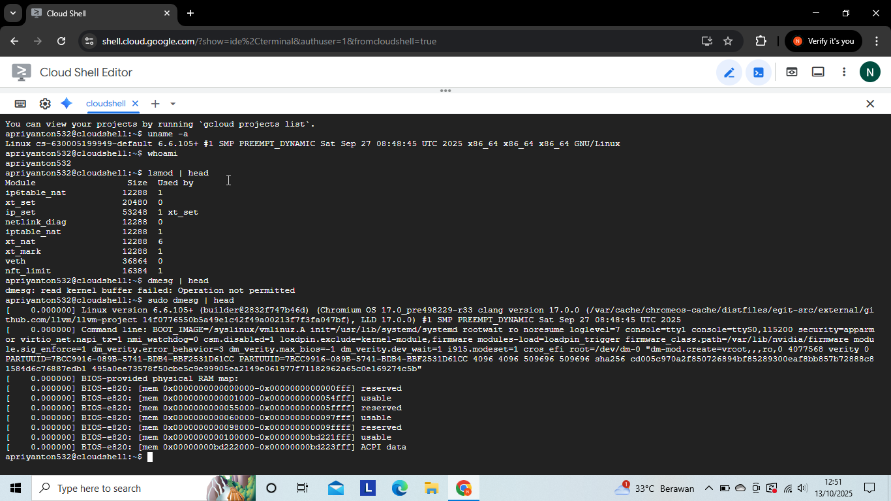
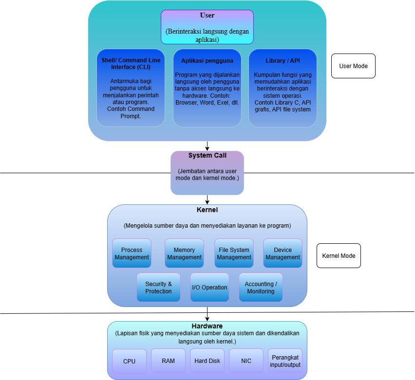

# Laporan Praktikum Minggu 1
Topik: Arsitektur Sistem Operasi

---

## Identitas
- **Nama**  : Nanang Apriyanto  
- **NIM**   : 250202957 
- **Kelas** : 1IKRA
---

## Tujuan
Tujuan praktikum minggu ini.   
1. Mahasiswa mampu menjelaskan peran sistem operasi dalam arsitektur komputer.
2. Mahasiswa mampu mengidentifikasi komponen utama OS (kernel, system call, device driver, file system).
3. Mahasiswa mampu membandingkan model arsitektur OS (monolithic, layered, microkernel).
4. Mahasiswa mampu menggambarkan diagram sederhana arsitektur OS dengan alat bantu digital (draw.io / mermaid).
---

## Dasar Teori
•  Sistem operasi berperan sebagai pengatur utama seluruh aktivitas komputer. OS memastikan setiap aplikasi dapat menggunakan sumber daya seperti CPU, memori, dan perangkat penyimpanan secara terkoordinasi tanpa saling mengganggu. Selain itu, sistem operasi juga berfungsi sebagai penghubung antara pengguna, aplikasi, dan perangkat keras. 

•  Kernel adalah bagian inti dari sistem operasi yang menjalankan fungsi penting seperti manajemen proses, pengaturan memori, sistem file, dan pengendalian perangkat. Kernel bekerja di kernel mode, yang memiliki akses penuh ke sumber daya sistem, sedangkan aplikasi berjalan di user mode untuk menjaga keamanan dan stabilitas. 

•  System call menjadi jembatan antara aplikasi dan kernel. Melalui mekanisme ini, program di user mode dapat meminta layanan dari kernel mode seperti membuka file, membuat proses baru, atau mengakses perangkat keras dengan aman. 

•  Arsitektur sistem operasi merupakan cara untuk membagi fungsi sistem menjadi beberapa komponen yang lebih terstruktur. Model seperti monolithic kernel, microkernel, dan layered architecture menunjukkan pendekatan berbeda dalam mencapai efisiensi, modularitas, serta kemudahan pemeliharaan sistem.

---

## Langkah Praktikum
1. Langkah-langkah yang dilakukan.

  - Membuat akun git

 (1. Pergi ke browser kemudian ketik perintah **github.com**)

 (2. Ketika sudah masuk website klik **sign up**)

 (3. Kemudian isi data data yang di perlukan seperti **email,password, serta username**, lalu beri centang **Receive**, kemudian create)

 (4. Kemudian setelah itu github akan melakukan verifikasi, kemudian masukan kode yang di berikan kepada email yang di daftarkan.)

  - Setelah membuat akun Git, pergi ke link yang sudah disediakan.
  - Kemudian melakukan **fork**, kemudian pada saat memberikan nama, di beri tambahan **NIM** pada os-202501 (os-202501-NIM).
  - Kemudian setelah selesai, bisa membuka folder **docs** untuk melihat panduan tugas yang di berikan, kemudian buka file **01_bab1_arsitektur_os.md**.
  
  >Pengerjaan tugas : Di Praktikum ini saya menggunakan website **https://shell.cloud.google.com** untuk menjalankan perintah/code linux yang ada pada file 01_bab1_arsitektur_os.md, Kemudian menggunakan **draw.io** untuk membuat diagram arsitektur.


  (1. Buka website **https://shell.cloud.google.com** pada browser.)

  (2. Kemudian setelah itu ketik perintah/code linux yang ada pada file 01_bab1_arsitektur_os.md)

  (3. Kemudian akan muncul hasil dari perintah/code yang di jalankan)

  (4. Gunakan **draw.io** untuk membuat diagram arsitektur.)

  (5. Kemudian setelah selesai bisa menambahkan hasil dari perintah/code linux yang di jalankan tadi, serta diagram arsitektur pada praktikum/week1-intro-arsitektur-os/screenshots/)

2. Perintah yang dijalankan.  
```bash
uname -a
whoami
lsmod | head
dmesg | head
sudo dmesg | head
```
3. File dan kode yang dibuat.  

laporan.md,
diagram-os.png,
screenshots-hasil.png

4. Commit message yang digunakan. 

Update laporan.md

---

## Kode / Perintah
Tuliskan potongan kode atau perintah utama:
```bash
uname -a
whoami
lsmod | head
dmesg | head
```

---

## Hasil Eksekusi
Hasil percobaan atau diagram:




---

## Analisis
- Jelaskan makna hasil pecobaan.
  
--> **uname –a** : Perintah ini digunakan untuk menampilkan informasi lengkap tentang sistem Linux. Berdasarkan hasil yang didapat, dapat diketahui bahwa sistem operasi yang digunakan adalah Linux dengan hostname cs-630005199949-default, versi kernel 6.6.10, dan arsitektur prosesor x86_64 atau 64-bit.

--> **whoami** : Perintah ini digunakan untuk menampilkan nama pengguna yang sedang aktif di terminal. Berdasarkan hasil apriyanton532, dapat disimpulkan bahwa pengguna yang sedang login ke sistem adalah apriyanton532.

--> **lsmod | head** : Perintah lsmod digunakan untuk melihat daftar modul kernel yang sedang aktif di sistem, sedangkan perintah | head berfungsi agar hanya menampilkan sebagian awal dari daftar modul tersebut, sehingga hasilnya lebih ringkas dan mudah dibaca. Jadi perintah lsmod | head di gunakan untuk menampilkan daftar ringkas modul kernel yang aktif di sistem Linux.  
Untuk contoh hasil percobaan : Modul ip6table_nat berfungsi untuk membantu mengatur alamat jaringan agar perangkat bisa saling terhubung lewat koneksi IPv6. xt_set dan ip_set digunakan oleh sistem keamanan (firewall) untuk menyimpan daftar alamat IP atau port yang diizinkan maupun diblokir. xt_mark memberi tanda pada data jaringan agar sistem tahu bagaimana cara menanganinya, sedangkan veth dipakai untuk membuat sambungan antara perangkat jaringan virtual.

--> **Dmesg | head**: Perintah dmesg di gunakan untuk menampilkan  catatan tentang hal hal yang dilakukan kernel sejak komputer dinyalakan. Kemudian | head berfungsi agar hanya menampilkan sebagian awal dari daftar modul tersebut. Jadi Sudo dmesg | head memiliki makna Menampilkan beberapa pesan awal dari log kernel agar hasilnya ringkas dan mudah dibaca. Saat menjalankan perintah dmesg | head, bisa di lihat pesan-pesan awal yang muncul ketika sistem Linux baru saja dinyalakan. Di baris pertama terlihat versi kernel yang digunakan, yaitu Linux 6.6.10 yang dibuat dengan Clang 17.0.0. Setelah itu, sistem membaca informasi tentang memori dari BIOS untuk tahu berapa banyak RAM yang tersedia. Kernel juga mengambil data dari ACPI, yaitu informasi tentang perangkat keras dan pengaturan daya dari BIOS. Setelah semua itu, sistem mulai menyiapkan memori dan sistem file agar komputer bisa berjalan dengan baik.    
(**Keterangan** : Dikarenakan perintah tersebut membutuhkan izin (root) untuk mengakses bagian penting dari sistem, maka saya menambahkan perintah sudo agar perintah dapat dijalankan dengan hak administrator dan semua pesan kernel bisa ditampilkan secara lengkap.)

- Hubungkan hasil dengan teori (fungsi kernel, system call, arsitektur OS). 

Dari hasil percobaan itu, kelihatan banget gimana kernel berperan sebagai inti utama di sistem operasi. Pada saat menjalankan perintah uname -a, whoami, lsmod | head, dmesg | head, sistem langsung nunjukin bahwa kernel yang bertugas mengenali hardware, atur pemakaian memori, dan berisi modul-modul penting agar semuanya bisa jalan. Ini seperti teori yang bilang kernel itu seperti jembatan antara hardware dan program-program yang dipakai user. Tiap kali mengetik perintah di terminal, sebenarnya lagi kirim permintaan ke kernel lewat system call supaya tugasnya dieksekusi. Berdasarkan hasilnya, hubungannya sama arsitektur OS keliatan dari cara kernel mengatur kerja antar komponen sistem. Biar semuanya lancar dan saling terkait dengan baik.

- Apa perbedaan hasil di lingkungan OS berbeda (Linux vs Windows)?  

Perbedaan hasil di lingkungan OS yang berbeda, seperti Linux vs Windows, sebenarnya ada di cara kedua sistem itu berurusan dengan kernel dan menunjukan informasi sistem. Di Linux, perintah seperti uname -a, whoami, lsmod | head, dmesg | head, langsung menampilkan detail tentang sistem, user, dan proses kernel. karena Linux memberikan akses langsung ke kernel lewat terminal.

Sementara di Windows, pada saat saya mencoba menjalankan perintah perintah tersebut itu di Command Prompt atau Windows PowerShell, Windows menunjukan bahwa tidak mengenali sama sekali perintah tersebut. Karena perintah tersebut khusus buat sistem berbasis Linux. Pengecualiannya untuk whoami, Windows mengenali perintah tersebut. Karena sistem sudah menyediakan untuk menampilkan nama user yang sedang login, fungsinya sama seperti di Linux untuk perintah whoami

---

## Kesimpulan
1. Praktikum ini menunjukkan bagaimana sistem operasi berperan sebagai penghubung antara pengguna, aplikasi, kernel, dan perangkat keras, serta bagaimana tiap komponen saling berinteraksi dalam menjalankan sistem komputer.

2. Hasil pengamatan melalui perintah Linux seperti **uname -a, whoami, lsmod, dan dmesg** memperlihatkan bahwa kernel mengatur modul dan mengelola komunikasi antara perangkat lunak serta perangkat keras.

3. Praktikum ini juga memberikan pemahaman mengenai bedanya arsitektur OS, monolithic kernel, microkernel, dan layered architecture. Masing-masing punya kelebihan sendiri soal efisiensi, keamanan, dan modularitas.
---
## Tugas

**Perbedaan Monolithic Kernel, Microkernel dan Layered Architecture**

Kernel adalah bagian paling penting yang menghubungkan perangkat lunak dengan perangkat keras. Ada beberapa pendekatan dalam merancang kernel, di antaranya adalah **Monolithic Kernel**, **Microkernel**, dan **Layered Architecture**.

**1. Monolithic Kernel**

Monolithic kernel adalah kernel di mana seluruh komponen inti sistem operasi berjalan di dalam satu ruang memori kernel. Komponen seperti manajemen memori, manajemen proses, sistem berkas, dan driver perangkat keras digabung menjadi satu kesatuan di dalam kernel. Sehingga proses komunikasi antar bagian sistem berlangsung secara langsung dan cepat.

**Kelebihan:** Performa sistem sangat tinggi karena tidak ada banyak lapisan atau proses komunikasi yang rumit, efisien digunakan untuk sistem yang memprioritaskan kecepatan.

**Kekurangan:** Jika ada satu bagian yang mengalami kerusakan (bug), bisa menyebabkan seluruh sistem crash, struktur kode yang besar dan kompleks membuat pemeliharaan jadi lebih sulit.

**Contoh OS:** **Linux, Unix, BSD**

**2. Microkernel**

Berbeda dengan monolithic, microkernel justru meminimalkan fungsi-fungsi yang dijalankan di ruang kernel. Hanya fitur paling dasar seperti manajemen memori, manajemen proses, dan komunikasi antar proses yang dimasukkan ke dalam kernel. Sementara fitur lain seperti driver, sistem file, dan layanan jaringan dijalankan di ruang pengguna (user space).

**Kelebihan:** Stabilitas lebih tinggi. Kalau ada driver yang error, sistem inti tetap aman,lebih mudah dalam pengujian dan pengembangan karena struktur terpisah.

**Kekurangan:** Performa bisa menurun karena seringnya terjadi komunikasi antar proses, Desain lebih rumit, terutama dalam menangani proses komunikasi.

**Contoh OS: Minix, QNX, seL4, Mach**

**3. Layered Architecture**

Sesuai namanya, model ini membagi sistem operasi menjadi beberapa lapisan yang tersusun secara hierarkis. Tiap lapisan memiliki tugas dan tanggung jawab masing-masing. Lapisan paling bawah berhubungan langsung dengan perangkat keras, sementara lapisan di atasnya menangani antarmuka sistem dan pengguna. Sehingga struktur sistem jadi lebih terorganisir.

**Kelebihan:** Mudah dikembangkan dan dikelola karena fungsinya jelas dan terpisah, debugging lebih gampang karena isolasi antar lapisan.

**Kekurangan:** Kinerja bisa menurun karena permintaan harus melewati banyak lapisan, tidak fleksibel saat dibutuhkan akses langsung antar lapisan.

**Contoh: THE Operating System (oleh Edsger Dijkstra), UNIX (versi awal)**


**Jadi**, Monolithic kernel, microkernel, dan layered architecture adalah tiga model utama dalam arsitektur sistem operasi, yang mempunyai kelebihan serta kekurangannya masing-masing. Monolithic kernel unggul dari segi performa karena seluruh komponen berjalan dalam satu ruang kernel, tapi lebih berisiko karena jika satu bagian bermasalah, seluruh sistem bisa ikut terganggu. Microkernel memang unggul dalam keamanan dan modularitas, namun overhead komunikasi antar proses membuatnya kurang efisien untuk sistem berskala besar seperti desktop atau server. Sementara itu, layered architecture memiliki struktur yang rapi, tetapi dianggap terlalu kaku dan sulit diterapkan pada sistem modern yang kompleks. Karena ketiga model memiliki kekurangan masing-masing saat diterapkan secara penuh, **maka model yang paling relevan untuk sistem modern adalah hybrid kernel**. Hybrid kernel dikenal dengan menggabungkan kelebihan monolithic dengan kelebihan microkernel, sehingga lebih seimbang. Inilah sebabnya banyak sistem seperti Windows dan macOS menggunakan model ini, karena hybrid kernel dianggap paling sesuai untuk kebutuhan sistem modern yang menuntut performa tinggi, fleksibilitas, dan stabilitas sekaligus.

---
## Quiz
1. Sebutkan tiga fungsi utama sistem operasi.

   **Jawaban:**
- Mengatur semua bagian dalam dari komputer, seperti CPU, memori dan perangkat lainnya supaya semua perangkat bisa berjalan secara bersamaan tanpa saling mengganggu.
- Menjalankan serta mengatur berbagai program maupun aplikasi yang sedang di buka oleh pengguna, sehingga menjalankan aplikasi secara bersamaan tanpa mengalami masalah.
- Sebagai penghubung antara pengguna dan komputer.

2. Jelaskan perbedaan antara kernel mode dan user mode.  
   **Jawaban:**

Kernel mode adalah mode yang di mana sistem operasi punya akses penuh ke seluruh komponen komputer, seperti CPU, memori, dan perangkat keras lainnya. Di mode ini, sistem bisa melakukan tugas - tugas penting seperti mengatur file, ngontrol perangkat, dan mengatur pembagian memori antar program. Karena punya hak akses paling tinggi, kernel mode juga dipakai buat bagian inti sistem operasi device driver. 
Sementara itu  user mode digunakan untuk menjalankan aplikasi biasa, seperti browser, game,dll. Di mode ini, aksesnya lebih terbatas supaya program tidak bisa langsung merubah atau mengganggu sistem operasi. Jika ada aplikasi yang mau melakukan hal penting, misalnya membaca file atau mengirim data ke perangkat, aplikasi tersebut harus harus meminta izin terlebih dahulu lewat system call, lalu sistem operasi yang akan melanjutkannya di kernel mode.

Jadi, kernel mode dan user mode mempunyai peran yang berbeda tetapi saling melengkapi dalam menjaga kinerja dan keamanan sistem. Kernel mode berfungsi sebagai otak utama yang mengatur semua sumber daya komputer dengan akses penuh, sedangkan user mode jadi tempat aplikasi berjalan dengan batasan tertentu agar tidak merusak sistem. Dengan pembagian ini, komputer bisa tetap stabil, aman, dan efisien walaupun banyak program berjalan secara bersamaan.  

3. Sebutkan contoh OS dengan arsitektur monolithic dan microkernel.  
   **Jawaban:**
- OS yang menggunakan arsitektur monolichic : Linux (misalnya Ubuntu, Debian, Fedora, dll), MS-DOS dan Unix (versi tradisional seperti System V) 
- OS yang menggunakan arsitektur microkernel : Minix, QNX, L4 dan HURD (GNU)  

---

## Refleksi Diri
Tuliskan secara singkat:
- Apa bagian yang paling menantang minggu ini? pada saat prakteknya, ketika saya menjalankan perintah/code linux muncul kesalahan pada saat menjalankan perintah di CLI.
- Bagaimana cara Anda mengatasinya?  Tetap fokus, kemudian mencari sumber sumber mengenai praktikum di internet seperti youtube dan google untuk mencari informasi ataupun tutorial video, kemudian mengerjakan tugas bersama teman.
---

**Credit:**  
_Template laporan praktikum Sistem Operasi (SO-202501) – Universitas Putra Bangsa_
