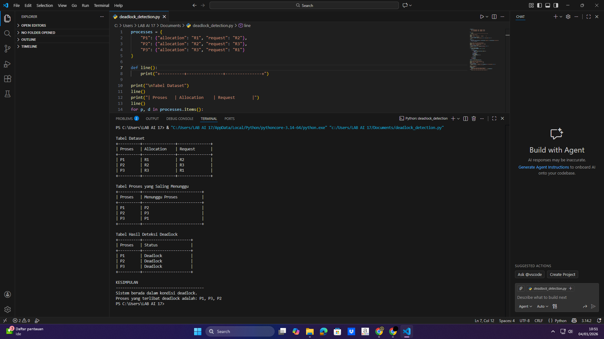

# Laporan Praktikum Minggu 11
Topik: Simulasi dan Deteksi Deadlock

---

## Identitas
- **Nama**  : Nanang Apriyanto  
- **NIM**   : 250202957 
- **Kelas** : 1IKRA

---

## Tujuan
Tujuan praktikum minggu ini:  
> 1. Mahasiswa mampu membuat program sederhana untuk mendeteksi deadlock.
> 2. Mahasiswa mampu menjalankan simulasi deteksi deadlock dengan dataset uji.
> 3. Mahasiswa mampu menyajikan hasil analisis deadlock dalam bentuk tabel.
> 4. Mahasiswa mampu memberikan interpretasi hasil uji secara logis dan sistematis.
> 5. Mahasiswa mampu menyusun laporan praktikum sesuai format yang ditentukan.
---

## Dasar Teori

Deadlock adalah kondisi ketika beberapa proses saling menunggu resource yang sedang digunakan proses lain, sehingga tidak ada satu pun proses yang bisa melanjutkan eksekusi. Kondisi ini menyebabkan proses berhenti secara permanen.

Deadlock hanya dapat terjadi jika empat syarat muncul secara bersamaan, yaitu mutual exclusion (Saling Mengecualikan), hold and wait (Menahan Sambil Menunggu), no preemption (Tidak Bisa Diambil Secara Paksa), dan circular wait (Menunggu Secara Melingkar).

Penanganan deadlock dapat dilakukan melalui tiga pendekatan utama, yaitu pencegahan, penghindaran, serta deteksi dan pemulihan. Pada pendekatan deteksi, sistem tetap mengizinkan deadlock terjadi lalu memeriksa apakah ada proses yang terlibat.

---

## Langkah Praktikum
1. Langkah-langkah yang dilakukan. 

1.) **Menyiapkan Dataset**

   Dataset sederhana yang berisi:
   - Daftar proses  
   - Resource Allocation  
   - Resource Request / Need

   | Proses | Allocation | Request |
   |:--:|:--:|:--:|
   | P1 | R1 | R2 |
   | P2 | R2 | R3 |
   | P3 | R3 | R1 |

2.) Membuka aplikasi Visual Studio Code

3.) Melakukan **Implementasi Algoritma Deteksi Deadlock**

   Program minimal harus:
   - Membaca data proses dan resource.  
   - Menentukan apakah sistem berada dalam kondisi deadlock.  
   - Menampilkan proses mana saja yang terlibat deadlock.

**(Keterangan: Di Minggu ini saya menggunakan bahasa pemrograman python di Visual Studio Code untuk mengimplementasikan Algoritma Deteksi Deadlock.)**

4.) Melakukan **Eksekusi & Validasi**

   - Jalankan program dengan dataset uji.  
   - Validasi hasil deteksi dengan analisis manual/logis.  
   - Simpan hasil eksekusi dalam bentuk screenshot.

5.) Melakukan **Analisis Hasil**

   - Sajikan hasil deteksi dalam tabel (proses deadlock / tidak).  
   - Jelaskan mengapa deadlock terjadi atau tidak terjadi.  
   - Kaitkan hasil dengan teori deadlock (empat kondisi).

6.) Melakukan commit ketika laporan sudah selesai. 


2. Perintah yang dijalankan.
```bash
processes = {
    "P1": {"allocation": "R1", "request": "R2"},
    "P2": {"allocation": "R2", "request": "R3"},
    "P3": {"allocation": "R3", "request": "R1"}
}

def line():
    print("+----------+---------------+---------------+")

print("\nTabel Dataset")
line()
print("| Proses   | Allocation    | Request       |")
line()
for p, d in processes.items():
    print(f"| {p:<8} | {d['allocation']:<13} | {d['request']:<13} |")
line()

wait_for = {
    p1: [p2 for p2 in processes if processes[p1]["request"] == processes[p2]["allocation"]]
    for p1 in processes
}

print("\nTabel Proses yang Saling Menunggu")
print("+----------+---------------------------+")
print("| Proses   | Menunggu Proses           |")
print("+----------+---------------------------+")
for p, w in wait_for.items():
    print(f"| {p:<8} | {', '.join(w) if w else '-':<25} |")
print("+----------+---------------------------+")

def detect_deadlock(graph):
    visited, stack, deadlock = set(), [], set()

    def dfs(n):
        if n in stack:
            deadlock.update(stack[stack.index(n):])
            return
        if n in visited:
            return
        visited.add(n)
        stack.append(n)
        for x in graph.get(n, []):
            dfs(x)
        stack.pop()

    for n in graph:
        dfs(n)
    return deadlock

deadlock = detect_deadlock(wait_for)

print("\nTabel Hasil Deteksi Deadlock")
print("+----------+----------------------+")
print("| Proses   | Status               |")
print("+----------+----------------------+")
for p in processes:
    print(f"| {p:<8} | {'Deadlock' if p in deadlock else 'Tidak Deadlock':<20} |")
print("+----------+----------------------+")

print("\nKESIMPULAN")
print("-" * 40)
if deadlock:
    print("Sistem berada dalam kondisi deadlock.")
    print("Proses yang terlibat deadlock adalah:", ", ".join(deadlock))
else:
    print("Sistem tidak berada dalam kondisi deadlock.")
```

3. File dan kode yang dibuat. 

laporan.md, deadlock_detection.py, dataset_deadlock.csv, hasil_deteksi.png

4. Commit message yang digunakan. --> **Minggu 11 - Deadlock Detection**

---

## Kode / Perintah
Potongan kode atau perintah utama:
```bash
processes = {
    "P1": {"allocation": "R1", "request": "R2"},
    "P2": {"allocation": "R2", "request": "R3"},
    "P3": {"allocation": "R3", "request": "R1"}
}

def line():
    print("+----------+---------------+---------------+")

print("\nTabel Dataset")
line()
print("| Proses   | Allocation    | Request       |")
line()
for p, d in processes.items():
    print(f"| {p:<8} | {d['allocation']:<13} | {d['request']:<13} |")
line()

wait_for = {
    p1: [p2 for p2 in processes if processes[p1]["request"] == processes[p2]["allocation"]]
    for p1 in processes
}

print("\nTabel Proses yang Saling Menunggu")
print("+----------+---------------------------+")
print("| Proses   | Menunggu Proses           |")
print("+----------+---------------------------+")
for p, w in wait_for.items():
    print(f"| {p:<8} | {', '.join(w) if w else '-':<25} |")
print("+----------+---------------------------+")

def detect_deadlock(graph):
    visited, stack, deadlock = set(), [], set()

    def dfs(n):
        if n in stack:
            deadlock.update(stack[stack.index(n):])
            return
        if n in visited:
            return
        visited.add(n)
        stack.append(n)
        for x in graph.get(n, []):
            dfs(x)
        stack.pop()

    for n in graph:
        dfs(n)
    return deadlock

deadlock = detect_deadlock(wait_for)

print("\nTabel Hasil Deteksi Deadlock")
print("+----------+----------------------+")
print("| Proses   | Status               |")
print("+----------+----------------------+")
for p in processes:
    print(f"| {p:<8} | {'Deadlock' if p in deadlock else 'Tidak Deadlock':<20} |")
print("+----------+----------------------+")

print("\nKESIMPULAN")
print("-" * 40)
if deadlock:
    print("Sistem berada dalam kondisi deadlock.")
    print("Proses yang terlibat deadlock adalah:", ", ".join(deadlock))
else:
    print("Sistem tidak berada dalam kondisi deadlock.")

```

---

## Hasil Eksekusi
Screenshot hasil percobaan:


---

## Analisis
Hasil proses deadlock deteksi dalam tabel:

| Proses | Allocation | Request | Menunggu Proses |  Status  | Keterangan                                                                                         |
| :----: | :--------: | :-----: | :-------------: | :------: | :------------------------------------------------------------------------------------------------- |
| **P1** |     R1     |    R2   |        P2       | Deadlock | P1 sudah memegang R1 tetapi tidak bisa lanjut karena R2 yang dibutuhkan masih dipegang P2.         |
| **P2** |     R2     |    R3   |        P3       | Deadlock | P2 sudah memegang R2 tetapi tetap menunggu R3 yang sedang digunakan P3.                            |
| **P3** |     R3     |    R1   |        P1       | Deadlock | P3 sudah memegang R3 tetapi menunggu R1 yang masih digunakan P1. |

Dari tabel Terdapat tiga proses: P1, P2, dan P3 dan ada tiga sumber daya: Resource 1 (R1), Resource 2 (R2), dan
Resource 3 (R3). 
Pada tabel diatas terjadi sebuah deadlock, deadlock terjadi karena setiap proses sedang memegang satu resource sambil menunggu resource lain yang ternyata sedang dipakai oleh proses berikutnya, sehingga terbentuk lingkaran saling tunggu. P1 sudah memegang resource pertama (R1), tetapi tidak bisa melanjutkan karena masih menunggu resource kedua (R2) yang sedang digunakan P2. Sementara itu, P2 memegang R2 namun masih menunggu R3 yang sedang dipegang P3. Di sisi lain, P3 memegang R3 tetapi tetap menunggu R1 yang masih dipegang P1. Akibatnya terbentuk rantai tunggu P1 → P2 → P3 → kembali ke P1. Karena tidak ada satu pun proses yang bisa lanjut dan melepaskan sumber daya terlebih dahulu, semua proses berhenti, sehingga sistem terjebak dalam kondisi deadlock. Kemudian deadlock tersebut terjadi karena empat kondisi deadlock.

1. Mutual Exclusion (Saling Mengecualikan)
Deadlock terjadi karena setiap resource yang hanya bisa digunakan oleh satu proses pada satu waktu. Dalam kasus ini, R1 hanya dipakai P1, R2 hanya dipakai P2, dan R3 hanya dipakai P3, sehingga proses lain yang membutuhkan harus menunggu.

2. Hold and Wait (Menahan Sambil Menunggu)
Setiap proses sudah memegang satu resource, tetapi masih menunggu resource lain. P1 memegang R1 sambil menunggu R2, P2 memegang R2 sambil menunggu R3, dan P3 memegang R3 sambil menunggu R1. Tidak ada yang melepaskan resource yang sudah dipegang.

3. No Preemption (Tidak Bisa Diambil Secara Paksa)
Resource yang sedang digunakan suatu proses tidak dapat diambil secara paksa oleh proses lain. Jadi P1 memegang R1 namun masih menunggu R2. P2 memegang R2 tetapi masih menunggu R3. P3 memegang R3 tetapi masih menunggu R1.

4. Circular Wait (Menunggu Secara Melingkar)
terbentuknya rantai tunggu melingkar antar proses. Pada kasus ini terbentuknya rantai tunggu melingkar antar proses. Karena keempat kondisi ini terjadi secara bersamaan, maka sistem masuk ke keadaan deadlock dan semua proses berhenti.

Kondisi deadlock tersebut dapat dicegah dengan menghilangkan salah satu dari empat kondisi penyebab deadlock. Pertama, pencegahan dapat dilakukan dengan menghilangkan hold and wait, yaitu proses hanya diperbolehkan memperoleh resource apabila seluruh resource yang dibutuhkan tersedia secara bersamaan. Sebagai contoh, P1 baru dapat menjalankan eksekusi jika R1 dan R2 sama-sama tersedia, sehingga tidak ada proses yang menahan satu resource sambil menunggu resource lain.

Kedua, deadlock dapat dihindari dengan menghilangkan circular wait, yaitu dengan menetapkan urutan prioritas resource, misalnya R1 < R2 < R3. Proses hanya diperbolehkan meminta resource sesuai urutan tersebut. Dengan demikian, P3 yang telah memegang R3 tidak diperbolehkan meminta R1, sehingga siklus rantai tunggu melingkar antar proses tidak pernah terbentuk.

Ketiga, sistem dapat menerapkan preemption, yaitu resource yang sedang digunakan suatu proses dapat diambil sementara dan diberikan kepada proses lain. Sebagai contoh, ketika P2 membutuhkan R3 untuk menyelesaikan eksekusi, sistem dapat mengambil R3 dari P3 dan memberikannya kepada P2 agar aliran eksekusi tetap berjalan.


--- 

## Kesimpulan

Kondisi deadlock terjadi karena terpenuhinya seluruh syarat deadlock, yaitu mutual exclusion, hold and wait, no preemption, dan circular wait. Selama keempat kondisi ini masih muncul secara bersamaan dalam sistem, maka deadlock tetap berpotensi terjadi.

Deadlock dapat dicegah dengan memutus salah satu dari empat kondisi tersebut, misalnya dengan menghilangkan hold and wait, pemberian prioritas urutan permintaan resource, atau penerapan mekanisme preemption sehingga resource dapat dialokasikan ulang ketika diperlukan.

---

## Quiz
1. Apa perbedaan antara deadlock prevention, avoidance, dan detection?

**Jawaban:** Perbedaan antara deadlock prevention, deadlock avoidance, dan deadlock detection terletak pada waktu dan cara penanganan deadlock. Deadlock prevention menangani deadlock sebelum terjadi dengan membatasi kondisi penyebabnya sehingga deadlock tidak mungkin muncul. Deadlock avoidance juga dilakukan sebelum terjadi, namun dengan cara mengevaluasi kondisi sistem agar tetap berada pada keadaan aman sebelum alokasi resource diberikan. Sementara itu, deadlock detection menangani deadlock setelah terjadi melalui proses pendeteksian dan pemulihan sistem.

2. Mengapa deteksi deadlock tetap diperlukan dalam sistem operasi?

**Jawaban:**

Deteksi deadlock tetap diperlukan dalam sistem operasi karena tidak semua sistem dapat menerapkan mekanisme pencegahan deadlock secara ketat tanpa mengorbankan efisiensi penggunaan sumber daya. Dengan adanya deteksi deadlock, sistem operasi dapat mengetahui keberadaan deadlock ketika kondisi tersebut terjadi, kemudian melakukan penanganan yang sesuai agar sistem tetap berjalan dengan baik. Mekanisme ini memungkinkan sistem tetap beroperasi secara fleksibel dan efisien meskipun terdapat risiko deadlock.

3. Apa kelebihan dan kekurangan pendekatan deteksi deadlock?

**Jawaban:**

Kelebihan :
Pendekatan deteksi deadlock memberikan keleluasaan bagi sistem operasi dalam menggunakan sumber daya karena tidak melakukan pembatasan secara ketat pada tahap awal. Dengan demikian, sistem dapat berjalan lebih fleksibel, terutama ketika kebutuhan penggunaan sumber daya berubah-ubah. Selain itu, mekanisme deteksi deadlock relatif lebih mudah diterapkan dibandingkan dengan pendekatan pencegahan atau penghindaran deadlock yang memerlukan perencanaan alokasi sumber daya sejak awal.

Kekurangan : 
Pendekatan ini memiliki kekurangan karena deadlock dapat terjadi terlebih dahulu sebelum sistem mendeteksinya, sehingga beberapa proses dapat mengalami penundaan eksekusi. Proses pendeteksian deadlock juga menimbulkan beban komputasi tambahan, khususnya pada sistem dengan jumlah proses dan sumber daya yang besar. Oleh karena itu, kinerja sistem dapat menurun apabila deteksi deadlock dilakukan terlalu sering.

---

## Refleksi Diri
Tuliskan secara singkat:
- Apa bagian yang paling menantang minggu ini? Memahami penerapan konsep deadlock ke dalam program.
- Bagaimana cara Anda mengatasinya? Mencari serta mempelajari materi yang ingin di pelajari lebih dalam yaitu konsep deadlock di google dan youtube serta sumber/referensi yang terkait agar memperoleh pemahaman yang lebih jelas mengenai konsep deadlock dalam program.

---

## Referensi
1. Silberschatz, A., Galvin, P., Gagne, G. Operating System Concepts, 10th Ed.
2. Tanenbaum, A. Modern Operating Systems, 4th Ed.
3. OSTEP – Deadlock Detection.

---

**Credit:**  
_Template laporan praktikum Sistem Operasi (SO-202501) – Universitas Putra Bangsa_
