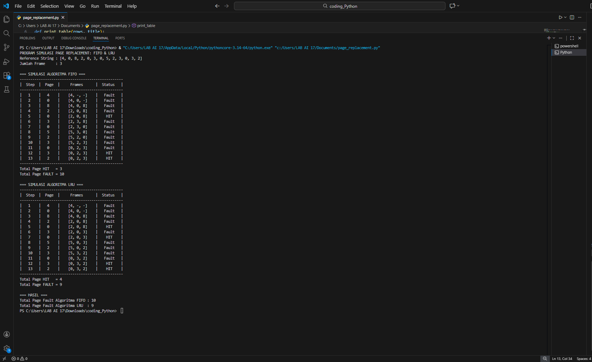

# Laporan Praktikum Minggu 14
Topik: Penyusunan Laporan Praktikum Format IMRAD

---

## Identitas
- **Nama**  : Nanang Apriyanto  
- **NIM**   : 250202957  
- **Kelas** : 1IKRA

---

## Tujuan
Tujuan praktikum minggu ini:   
> 1. Mahasiswa mampu menyusun laporan praktikum dengan struktur ilmiah (Pendahuluan–Metode–Hasil–Pembahasan–Kesimpulan).
> 2. Mahasiswa mampu menyajikan hasil uji dalam bentuk tabel dan grafik yang jelas.
> 3. Mahasiswa mampu menuliskan analisis hasil dengan argumentasi yang logis.
> 4. Mahasiswa mampu menyusun sitasi dan daftar pustaka dengan format yang konsisten.
> 5. Mahasiswa mampu mengunggah draft laporan ke repositori dengan rapi dan tepat waktu.

---

## Langkah Praktikum
1. Langkah-langkah yang dilakukan.  
   1.) **Menentukan Topik Laporan**

   Pilih 1 topik dari praktikum sebelumnya (mis. Minggu 9/10/11/13) dan tetapkan tujuan eksperimen yang ingin disampaikan.    

   2.) **Menyiapkan Bahan**

   - Kode/program yang digunakan.
   - Dataset/parameter uji (jika ada).
   - Bukti hasil eksekusi (screenshot) atau grafik.

   3.) **Menulis Laporan dengan Struktur IMRAD**

   Tulis `praktikum/week14-laporan-imrad/laporan.md` dengan struktur minimal berikut:
   - **Pendahuluan (Introduction):** latar belakang, rumusan masalah/tujuan.
   - **Metode (Methods):** lingkungan uji, langkah eksperimen, parameter/dataset, cara pengukuran.
   - **Hasil (Results):** tabel/grafik hasil uji, ringkasan temuan.
   - **Pembahasan (Discussion):** interpretasi hasil, keterbatasan, perbandingan teori/ekspektasi.
   - **Kesimpulan:** 2–4 poin ringkas menjawab tujuan.

   4.) **Menyajikan Tabel/Grafik**

   - Tabel harus diberi judul/keterangan singkat.
   - Jika menggunakan grafik: jelaskan sumbu dan arti grafik.

   5.) Menambahkan **Sitasi dan Daftar Pustaka**

   - Cantumkan referensi minimal 2 sumber.
   - Gunakan format konsisten (mis. daftar bernomor).

2. Perintah yang dijalankan. 
```bash
pages = [4, 0, 8, 2, 0, 3, 0, 5, 2, 3, 0, 3, 2]

frame_size = 3


def print_table(rows, title):
    line = "-" * 49 
    print("\n" + title)
    print(line)
    print(f"| {'Step':^6} | {'Page':^6} | {'Frames':^15} | {'Status':^9} |")
    print(line)
    for r in rows:
        # gabungkan frame jadi format [a, b, c]
        frames_str = f"[{r['f1']}, {r['f2']}, {r['f3']}]"
        print(f"| {r['step']:^6} | {r['page']:^6} | {frames_str:^15} | {r['status']:^9} |")
    print(line)


def fifo(pages, frame_size):
    frames = []         
    index_fifo = 0     
    faults = 0         
    hits = 0           
    rows = []          

    for step, page in enumerate(pages, start=1):

        if page in frames:
            status = "HIT"
            hits += 1

        else:
            status = "Fault"
            faults += 1

            if len(frames) < frame_size:
                frames.append(page)

            else:
                frames[index_fifo] = page
                index_fifo = (index_fifo + 1) % frame_size  

        show = frames + ["-"] * (frame_size - len(frames))

        rows.append({
            "step": step,
            "page": page,
            "f1": show[0],
            "f2": show[1],
            "f3": show[2],
            "status": status
        })

    print_table(rows, "=== SIMULASI ALGORITMA FIFO ===")
    print(f"Total Page HIT   = {hits}")
    print(f"Total Page FAULT = {faults}")
    return faults


def lru(pages, frame_size):
    frames = []         
    last_used = {}      
    faults = 0
    hits = 0
    rows = []

    for step, page in enumerate(pages, start=1):

        if page in frames:
            status = "HIT"
            hits += 1

        else:
            status = "Fault"
            faults += 1

           
            if len(frames) < frame_size:
                frames.append(page)

            
            else:
                lru_page = min(last_used, key=last_used.get)  
                frames[frames.index(lru_page)] = page         
                del last_used[lru_page]                       

        last_used[page] = step

        show = frames + ["-"] * (frame_size - len(frames))

        rows.append({
            "step": step,
            "page": page,
            "f1": show[0],
            "f2": show[1],
            "f3": show[2],
            "status": status
        })

    print_table(rows, "=== SIMULASI ALGORITMA LRU ===")
    print(f"Total Page HIT   = {hits}")
    print(f"Total Page FAULT = {faults}")
    return faults

print("PROGRAM SIMULASI PAGE REPLACEMENT: FIFO & LRU")
print("Reference String :", pages)
print("Jumlah Frame     :", frame_size)

fifo_faults = fifo(pages, frame_size)

lru_faults = lru(pages, frame_size)

print("\n=== HASIL ===")
print(f"Total Page Fault Algoritma FIFO : {fifo_faults}")
print(f"Total Page Fault Algoritma LRU  : {lru_faults}")
``` 
3. File dan kode yang dibuat.  
   Laporan.md, hasil_simulasi.png, page_replacement.py, reference_string.txt
4. Commit message yang digunakan. -> **Minggu 14 - Draft Laporan IMRAD**

---

## Kode / Perintah
Potongan kode atau perintah utama:
```bash
pages = [4, 0, 8, 2, 0, 3, 0, 5, 2, 3, 0, 3, 2]

frame_size = 3


def print_table(rows, title):
    line = "-" * 49 
    print("\n" + title)
    print(line)
    print(f"| {'Step':^6} | {'Page':^6} | {'Frames':^15} | {'Status':^9} |")
    print(line)
    for r in rows:
        # gabungkan frame jadi format [a, b, c]
        frames_str = f"[{r['f1']}, {r['f2']}, {r['f3']}]"
        print(f"| {r['step']:^6} | {r['page']:^6} | {frames_str:^15} | {r['status']:^9} |")
    print(line)


def fifo(pages, frame_size):
    frames = []         
    index_fifo = 0     
    faults = 0         
    hits = 0           
    rows = []          

    for step, page in enumerate(pages, start=1):

        if page in frames:
            status = "HIT"
            hits += 1

        else:
            status = "Fault"
            faults += 1

            if len(frames) < frame_size:
                frames.append(page)

            else:
                frames[index_fifo] = page
                index_fifo = (index_fifo + 1) % frame_size  

        show = frames + ["-"] * (frame_size - len(frames))

        rows.append({
            "step": step,
            "page": page,
            "f1": show[0],
            "f2": show[1],
            "f3": show[2],
            "status": status
        })

    print_table(rows, "=== SIMULASI ALGORITMA FIFO ===")
    print(f"Total Page HIT   = {hits}")
    print(f"Total Page FAULT = {faults}")
    return faults


def lru(pages, frame_size):
    frames = []         
    last_used = {}      
    faults = 0
    hits = 0
    rows = []

    for step, page in enumerate(pages, start=1):

        if page in frames:
            status = "HIT"
            hits += 1

        else:
            status = "Fault"
            faults += 1

           
            if len(frames) < frame_size:
                frames.append(page)

            
            else:
                lru_page = min(last_used, key=last_used.get)  
                frames[frames.index(lru_page)] = page         
                del last_used[lru_page]                       

        last_used[page] = step

        show = frames + ["-"] * (frame_size - len(frames))

        rows.append({
            "step": step,
            "page": page,
            "f1": show[0],
            "f2": show[1],
            "f3": show[2],
            "status": status
        })

    print_table(rows, "=== SIMULASI ALGORITMA LRU ===")
    print(f"Total Page HIT   = {hits}")
    print(f"Total Page FAULT = {faults}")
    return faults

print("PROGRAM SIMULASI PAGE REPLACEMENT: FIFO & LRU")
print("Reference String :", pages)
print("Jumlah Frame     :", frame_size)

fifo_faults = fifo(pages, frame_size)

lru_faults = lru(pages, frame_size)

print("\n=== HASIL ===")
print(f"Total Page Fault Algoritma FIFO : {fifo_faults}")
print(f"Total Page Fault Algoritma LRU  : {lru_faults}")

```

---

## Hasil Eksekusi
Screenshot hasil percobaan:


---

## Topik Laporan 
**Manajemen Memori – Page Replacement (FIFO & LRU)**


---

## 1. Pendahuluan (Introduction)

### 1.1 Latar Belakang  

Dalam sistem komputer modern, keterbatasan memori fisik menjadi tantangan utama ketika sistem harus menjalankan banyak proses secara bersamaan. Untuk mengatasi hal ini, sistem operasi menerapkan mekanisme virtual memory yang memungkinkan program dengan ukuran ruang alamat besar tetap dapat dijalankan dengan memanfaatkan penyimpanan sekunder. Melalui teknik paging, hanya bagian program yang sedang dibutuhkan yang berada di memori utama, sedangkan bagian lainnya disimpan di disk dan dimuat kembali ketika diperlukan. Pendekatan ini memungkinkan pemanfaatan memori menjadi lebih fleksibel dan efisien.
“With demand paging, the size of the logical address space is no longer constrained by physical memory.” (Silberschatz, Galvin, Gagne, 2018) 

Dalam lingkungan virtual memory, ketika sebuah proses mengakses page yang tidak berada di memori utama, akan terjadi page fault. Jika semua frame telah terisi, maka sistem operasi harus melakukan page replacement dengan memilih satu page untuk dikeluarkan dari memori. Proses ini dapat melibatkan operasi baca dan tulis ke disk, terutama jika page yang digantikan telah dimodifikasi, sehingga berpotensi meningkatkan waktu akses memori secara signifikan. Oleh karena itu, pemilihan algoritma page replacement menjadi faktor penting dalam menjaga kinerja sistem. “Notice that, if no frames are free, two page transfers (one for the page-out and one for the page-in) are required.” (Silberschatz, Galvin, Gagne, 2018)

Salah satu algoritma page replacement yang paling sederhana adalah First-In First-Out (FIFO), yang mengganti page berdasarkan urutan kedatangannya di memori. Page yang pertama kali dimuat akan menjadi kandidat pertama untuk digantikan, tanpa mempertimbangkan apakah page tersebut masih sering digunakan atau tidak. Walaupun algoritma ini mudah diimplementasikan, FIFO berpotensi menggantikan page yang masih aktif digunakan sehingga dapat meningkatkan jumlah page fault. “FIFO keeps track of the order in which pages were loaded into memory by keeping them in a linked list.” (Tanenbaum, Bos, 2015)

Sebagai pendekatan yang lebih adaptif, algoritma Least Recently Used (LRU) mengganti page yang paling lama tidak diakses. Algoritma ini didasarkan pada prinsip lokalitas, yaitu bahwa page yang baru digunakan cenderung akan digunakan kembali dalam waktu dekat, sehingga pemilihan page berdasarkan riwayat penggunaan dapat menurunkan kemungkinan terjadinya page fault. Namun, LRU memerlukan mekanisme tambahan untuk mencatat atau memperkirakan waktu akses terakhir setiap page, sehingga implementasinya lebih kompleks dibandingkan FIFO. “When a page fault occurs, throw out the page that has been unused for the longest time.” (Tanenbaum, Bos, 2015)

### 1.2 Rumusan Masalah
1. Bagaimana perbedaan kinerja FIFO dan LRU dalam pengelolaan page replacement?
2. Bagaimana perbedaan jumlah page fault dan page hit antara algoritma FIFO dan LRU pada kondisi pengujian yang sama? 
3. Bagaimana implementasi FIFO dan LRU memengaruhi efisiensi memori dan transfer halaman? 
4. Apa keterbatasan simulasi dalam mencerminkan perilaku algoritma pada kondisi nyata?

### 1.3 Tujuan
1. Menganalisis perbedaan kinerja algoritma FIFO dan LRU dalam pengelolaan page replacement pada memori dengan jumlah frame terbatas.
2. Mengukur dan membandingkan jumlah page fault serta page hit yang dihasilkan oleh FIFO dan LRU pada reference string yang sama.
3. Mengevaluasi pengaruh implementasi FIFO dan LRU terhadap efisiensi pemanfaatan memori dan beban transfer halaman dari disk ke memori.
4. Mengidentifikasi keterbatasan simulasi dalam menggambarkan perilaku algoritma page replacement pada kondisi sistem nyata dengan pola akses yang lebih kompleks.

---

## 2. Metode (Methods)

### 2.1 Lingkungan Uji

#### 2.1.1 Perangkat Keras (Hardware)

- System Manufacturer   : Acer
- System Model          : Veriton X
- System Type           : x64-based PC
- Processor             : Intel(R) Core(TM) i5-14400, 2500 Mhz, 10 Core(s), 16 Logical Processor(s)
- RAM                   : 8,00 GB
- ROM                   : 512 GB

#### 2.1.2 Perangkat Lunak (Software)

- OS Edition : Windows 11 Home Single Language
- OS Version : 24H2
- Visual Studio Code

#### 2.1.3 Bahasa Pemrograman
Python 2.14.2

### 2.2 Langkah Eksperimen

1. **Persiapan Dataset dan Lingkungan**        
   1.) Menentukan reference string 4, 0, 8, 2, 0, 3, 0, 5, 2, 3, 0, 3, 2.     
   2.) Menetapkan jumlah frame memori : 3 frame     
   3.) Membuka aplikasi Visual Studio Code.  
   4.) Membuat file program simulasi dengan type **py** berdasarkan reference string dan jumlah frame memori yang telah dibuat.

2. **Simulasi Algoritma FIFO**    
   1.) Menginisialisasi array atau list sebagai frame memori.     
   2.) Memproses setiap halaman pada reference string secara berurutan.    
   3.) Mengecek apakah halaman sudah berada di dalam frame (page hit).  
         - Jika halaman tidak ditemukan, mencatat sebagai page fault dan memasukkan halaman ke frame.    
         - Jika frame penuh, mengganti halaman yang paling awal masuk sesuai prinsip FIFO.      
   4.) Menampilkan dan mencatat isi frame pada setiap langkah.    
   5.) Menghitung total page fault setelah seluruh data diproses.

3. **Simulasi Algoritma LRU**    
   1.) Menginisialisasi kembali frame memori.   
   2.) Memproses setiap halaman pada reference string.   
         - Jika halaman ditemukan di frame, mencatat sebagai page hit dan memperbarui urutan akses.   
         - Jika halaman tidak ditemukan, mencatat sebagai page fault.      
         - Jika frame penuh, mengganti halaman yang paling lama tidak diakses.   
   4.) Menampilkan dan mencatat isi frame setiap langkah.      
   5.) Menghitung total page fault.

4. **Eksekusi Program**    
   1.) Menjalankan program melalui terminal VS Code.  
   2.) Mengamati keluaran berupa isi frame, status page hit/page fault, dan total page fault untuk FIFO dan LRU.  
   3,) Memastikan tidak ada error saat program dijalankan.

5. **Validasi dan Dokumentasi**  
   1.) Memeriksa apakah hasil simulasi sesuai dengan teori FIFO dan LRU.   
   2.) Membandingkan jumlah page fault antara kedua algoritma.    
   3.) Menyimpan screenshot hasil output di VS Code sebagai dokumentasi eksperimen.

### 2.3 Parameter
Parameter dalam eksperimen ini mencakup jumlah frame memori sebesar tiga frame dan reference string sebagai beban kerja sistem. Kinerja algoritma FIFO dan LRU dievaluasi berdasarkan jumlah page hit, page fault, dan total page fault.

### 2.4 Dataset
   
  `` 4, 0, 8, 2, 0, 3, 0, 5, 2, 3, 0, 3, 2 ``

   Dataset yang digunakan berupa reference string yang merepresentasikan pola akses halaman. Dataset yang sama diterapkan pada kedua algoritma untuk menjamin konsistensi dan objektivitas hasil pengujian.

### 2.5 Cara Pengukuran
1. **Persiapan Pengukuran**   
   1.) Program membaca reference string dan jumlah frame memori sebagai input simulasi.      
   2.) Frame memori diinisialisasi dalam keadaan kosong.    
   3.) Variabel penghitung page hit dan page fault diatur ke nilai awal nol.

2. **Pengukuran Kinerja Algoritma FIFO**      
   1.) Program memproses setiap halaman pada reference string secara berurutan menggunakan algoritma FIFO.     
   2.) Setiap halaman diperiksa apakah sudah berada di dalam frame.     
         - Jika halaman sudah berada di dalam frame, maka dicatat sebagai page hit FIFO.   
         - Jika halaman tidak berada di dalam frame, maka dicatat sebagai page fault FIFO.               
         - Jika terjadi page fault dan frame penuh, halaman yang pertama kali masuk ke memori digantikan sesuai prinsip FIFO.     
   4.) Setiap kejadian page hit dan page fault dicatat selama proses simulasi.      
   5.) Setelah seluruh halaman diproses, menghitung total page fault FIFO sebagai nilai kinerja FIFO.

3. **Pengukuran Kinerja Algoritma LRU**      
   1.) Frame memori dikosongkan kembali.  
   2.) Reference string yang sama diproses ulang menggunakan algoritma LRU.      
         - Jika halaman berada di dalam frame, maka dicatat sebagai page hit LRU dan waktu akses diperbarui.      
         - Jika halaman tidak berada di dalam frame, maka dicatat sebagai page fault LRU.    
         - Jika terjadi page fault dan frame penuh, halaman yang paling lama tidak diakses digantikan sesuai prinsip LRU.      
   5.) Setiap kejadian page hit dan page fault dicatat.     
   6.) Setelah seluruh halaman diproses, dihitung total page fault LRU sebagai nilai kinerja LRU.

4. **Penentuan Hasil Pengukuran**, Nilai total page fault digunakan sebagai indikator utama untuk mengukur dan membandingkan kinerja algoritma FIFO dan LRU.

---

## 3. Hasil (Results)

### 3.1 Tabel Hasil Uji

-> **Tabel Simulasi FIFO**       
Menunjukkan urutan penggantian halaman berdasarkan FIFO. Kolom “Frames” memperlihatkan isi memori setiap langkah, dan “Status” menunjukkan page fault atau hit. Tabel ini berisi ringkasan simulasi algoritma FIFO, memperlihatkan bagaimana halaman dimuat dan diganti di memori serta mencatat status page hit atau page fault pada setiap langkah.

| Step | Page |   Frames  | Status |
| :--: | :--: | :-------: | :----: |
|   1  |   4  | [4, –, –] |  Fault |
|   2  |   0  | [4, 0, –] |  Fault |
|   3  |   8  | [4, 0, 8] |  Fault |
|   4  |   2  | [2, 0, 8] |  Fault |
|   5  |   0  | [2, 0, 8] |   Hit  |
|   6  |   3  | [2, 3, 8] |  Fault |
|   7  |   0  | [2, 3, 0] |  Fault |
|   8  |   5  | [5, 3, 0] |  Fault |
|   9  |   2  | [5, 2, 0] |  Fault |
|  10  |   3  | [5, 2, 3] |  Fault |
|  11  |   0  | [0, 2, 3] |  Fault |
|  12  |   3  | [0, 2, 3] |   Hit  |
|  13  |   2  | [0, 2, 3] |   Hit  |


-> **Tabel Simulasi LRU**    
Menunjukkan penggantian halaman berdasarkan algoritma LRU. Halaman yang paling lama tidak digunakan diganti. Tabel ini berisi simulasi algoritma LRU, menggambarkan penggantian halaman yang paling lama tidak digunakan dan mencatat page hit atau page fault secara berurutan.


| Step | Page |   Frames  | Status |
| :--: | :--: | :-------: | :----: |
|   1  |   4  | [4, –, –] |  Fault |
|   2  |   0  | [4, 0, –] |  Fault |
|   3  |   8  | [4, 0, 8] |  Fault |
|   4  |   2  | [2, 0, 8] |  Fault |
|   5  |   0  | [2, 0, 8] |   Hit  |
|   6  |   3  | [2, 0, 3] |  Fault |
|   7  |   0  | [2, 0, 3] |   Hit  |
|   8  |   5  | [5, 0, 3] |  Fault |
|   9  |   2  | [5, 0, 2] |  Fault |
|  10  |   3  | [5, 3, 2] |  Fault |
|  11  |   0  | [0, 3, 2] |  Fault |
|  12  |   3  | [0, 3, 2] |   Hit  |
|  13  |   2  | [0, 3, 2] |   Hit  |


-> **Tabel Total Page Fault dan Page Hit**  
Menampilkan rekap jumlah page hit dan page fault dari kedua algoritma. Tabel ini merangkum jumlah page hit dan page fault dari kedua algoritma.

| Algoritma | Jumlah Akses Halaman | Page Hit | Page Fault |
| :-------- | :------------------: | :------: | :--------: |
| FIFO      |          13          |     3    |     10     |
| LRU       |          13          |     4    |      9     |

   
### 3.2 Ringkasan Temuan
Berdasarkan hasil simulasi dengan 13 halaman dan 3 frame memori, algoritma FIFO menghasilkan 10 page fault dan 3 page hit, sedangkan algoritma LRU menghasilkan 9 page fault dan 4 page hit. Hasil ini menunjukkan bahwa LRU lebih efisien dalam mengelola memori karena menghasilkan jumlah page fault yang lebih rendah. "The LRU algorithm keeps recently used pages in memory for a longer time, which helps reduce the number of page faults compared to algorithms that do not consider page usage history" (Silberschatz, Galvin, Gagne, 2018).

Perbedaan tersebut terjadi karena FIFO mengganti halaman berdasarkan urutan kedatangan tanpa mempertimbangkan pola penggunaan, sedangkan LRU mengganti halaman yang paling lama tidak diakses. "Page replacement strategies that take locality of reference into account provide better memory management performance than methods based solely on arrival order"(Tanenbaum, Bos, 2015). Dengan demikian, LRU terbukti memberikan kinerja yang lebih baik dibandingkan FIFO pada skenario pengujian ini.

---

## 4. Pembahasan (Discussion)

### 4.1 Interpretasi Hasil

Berdasarkan hasil simulasi, algoritma FIFO menghasilkan 10 page fault, sedangkan LRU menghasilkan 9 page fault dari 13 referensi halaman. Hasil ini menunjukkan bahwa FIFO kurang adaptif terhadap pola penggunaan halaman. “FIFO keeps track of the order in which pages were loaded into memory by keeping them in a linked list.” (Tanenbaum & Bos, 2015). Dengan demikian, FIFO melakukan penggantian halaman hanya berdasarkan urutan kedatangan, tanpa mempertimbangkan frekuensi maupun riwayat akses, sehingga halaman yang masih aktif berpotensi tergantikan dan meningkatkan jumlah page fault.

Sebaliknya, algoritma LRU mengganti halaman yang paling lama tidak diakses, sehingga halaman yang masih sering digunakan dapat dipertahankan di memori lebih lama. “When a page fault occurs, throw out the page that has been unused for the longest time.” (Tanenbaum & Bos, 2015). Penerapan prinsip ini pada eksperimen menghasilkan jumlah page fault yang lebih rendah dibanding FIFO, yang menunjukkan bahwa pemanfaatan informasi riwayat akses membuat LRU lebih efektif untuk pola akses yang memiliki lokalitas temporal.

Dalam sistem virtual memory, setiap page fault memerlukan proses pemindahan halaman antara disk dan memori utama yang menimbulkan overhead kinerja. “Notice that, if no frames are free, two page transfers (one for the page-out and one for the page-in) are required.” (Silberschatz, Galvin, & Gagne, 2018). Oleh karena itu, lebih sedikitnya page fault pada LRU berarti berkurangnya biaya transfer halaman dan meningkatnya efisiensi sistem secara keseluruhan.

Selain prinsip dasarnya, kinerja algoritma page replacement juga dipengaruhi oleh pola akses aplikasi. Meskipun LRU umumnya lebih efisien, lonjakan akses terhadap halaman yang jarang digunakan tetap dapat meningkatkan page fault sementara. Hal ini menegaskan bahwa tidak ada algoritma yang optimal untuk semua kondisi, sehingga evaluasi perlu dilakukan berdasarkan karakteristik beban kerja yang nyata.

### 4.2 Keterbatasan

Salah satu keterbatasan praktikum ini adalah jumlah frame memori yang sangat terbatas, yaitu hanya tiga frame, sehingga hasil simulasi belum sepenuhnya merepresentasikan sistem dengan kapasitas memori yang lebih besar. Kondisi ini menyebabkan halaman yang masih sering digunakan berpotensi tetap tergantikan, khususnya pada algoritma FIFO, sehingga jumlah page fault meningkat. “The number of page frames allocated to a process can significantly affect the number of page faults.” (Silberschatz, Galvin, & Gagne, 2018).

Selain itu, reference string yang digunakan bersifat sederhana dan tetap, sehingga algoritma LRU tampak lebih unggul karena memanfaatkan pola lokalitas akses. Pada pola akses yang lebih acak atau kurang berulang, perbedaan kinerja antara FIFO dan LRU dapat menjadi kurang signifikan. “Page replacement strategies that take locality of reference into account provide better memory management performance than methods based solely on arrival order.” (Tanenbaum & Bos, 2015).

Simulasi ini juga hanya menggunakan satu reference string dengan 13 referensi halaman, sehingga hasilnya lebih bersifat ilustratif dibandingkan representatif terhadap berbagai kondisi sistem nyata. Selain itu, simulasi tidak memperhitungkan waktu aktual transfer halaman antara disk dan memori, sehingga evaluasi hanya terbatas pada jumlah page fault, bukan pada dampaknya terhadap kinerja sistem. “Notice that, if no frames are free, two page transfers (one for the page-out and one for the page-in) are required.” (Silberschatz, Galvin, & Gagne, 2018).

### 4.3 Perbandingan Teori/Ekspektasi.
LRU menghasilkan jumlah page fault yang lebih rendah dibanding FIFO karena algoritma ini mempertahankan halaman yang baru saja digunakan, sedangkan FIFO hanya mempertimbangkan urutan kedatangan halaman. 

Dalam kerangka virtual memory, setiap page fault menimbulkan biaya kinerja akibat proses pemindahan halaman dari disk ke memori. Oleh karena itu, algoritma yang secara teoritis mampu mengurangi page fault, seperti LRU, juga diharapkan memberikan performa sistem yang lebih baik dibanding FIFO.

Meskipun demikian, perbedaan hasil yang tidak terlalu besar menunjukkan bahwa kondisi simulasi membatasi realisasi penuh dari keunggulan teoritis LRU. Jumlah frame yang sedikit dan pola akses yang sederhana mengurangi dampak lokalitas referensi, meskipun kecenderungan hasil tetap sejalan dengan teori. “Programs tend to access a relatively small portion of their address space at any time, a behavior known as locality.” (OSTEP, Virtual Memory & Page Replacement)

---

## 5. Kesimpulan
Algoritma LRU lebih efektif dibanding FIFO dalam mengelola page replacement karena menghasilkan jumlah page fault lebih sedikit pada reference string yang sama.

Jumlah page hit dan page fault berbeda antara FIFO dan LRU, dengan LRU mempertahankan halaman yang baru diakses lebih lama sehingga meningkatkan efisiensi memori.

Implementasi algoritma memengaruhi beban transfer halaman dari disk ke memori; LRU yang lebih responsif terhadap pola akses cenderung mengurangi frekuensi transfer dibanding FIFO.

Simulasi terbatas pada jumlah frame dan pola reference string sederhana, sehingga hasilnya hanya representatif secara ilustratif dan mungkin berbeda pada sistem nyata dengan pola akses kompleks.

---

## Quiz
1. Mengapa format IMRAD membantu membuat laporan praktikum lebih ilmiah dan mudah dievaluasi?   
**Jawaban:**   
Format IMRAD membantu membuat laporan praktikum lebih ilmiah dan mudah dievaluasi karena menyajikan informasi secara terstruktur dan logis. Dengan struktur ini, hasil uji dapat dipahami, direplikasi, dan dinilai secara akademik, sehingga hubungan antara tujuan, metode, hasil, dan analisis dapat ditelusuri secara jelas, memungkinkan penilaian yang sistematis terhadap validitas prosedur, keandalan data, dan ketepatan interpretasi, serta mengurangi subjektivitas dalam proses evaluasi.

2. Apa perbedaan antara bagian Hasil dan Pembahasan?  
   **Jawaban:**   
   Perbedaan antara bagian Hasil dan Pembahasan terletak pada fungsi ilmiahnya.
   Bagian Hasil berfokus pada penyajian data dan temuan secara objektif, seperti angka, tabel, grafik, atau hasil pengamatan, tanpa disertai penafsiran atau opini. Sementara itu, Pembahasan berfungsi untuk menafsirkan dan menganalisis hasil tersebut, menjelaskan maknanya, mengaitkannya dengan teori atau tujuan praktikum, serta membahas kemungkinan penyebab dan implikasinya.

3. Mengapa sitasi dan daftar pustaka penting, bahkan untuk laporan praktikum?  
   **Jawaban:**   
Karena menunjukkan bahwa informasi, metode, dan konsep yang digunakan berasal dari sumber ilmiah yang dapat dipertanggungjawabkan. Pencantuman rujukan juga membantu mencegah plagiarisme dan memungkinkan pembaca menelusuri kembali sumber yang digunakan. Dengan demikian, laporan praktikum menjadi lebih dapat dipercaya, lebih objektif, dan memiliki dasar ilmiah yang kuat.

---

## Refleksi Diri

- Apa bagian yang paling menantang minggu ini?  Pada saat melakukan penyusunan laporan IMRAD

- Bagaimana cara Anda mengatasinya?  Mencari sumber tentang penyusunan IMRAD, membuat kerangka laporan terlebih dahulu, kemudian menulis tiap bagian satu per satu sambil memeriksa kesesuaian antara data, tabel, dan analisis pada topik minggu sebelumnya yang dipilih.

---

## Referensi (Daftar Pustaka)
1. Silberschatz, A., Galvin, P. B., & Gagne, G. (2018). *Operating system concepts* (10th ed.). Hoboken, NJ, USA: John Wiley & Sons.
2. Tanenbaum, A. S., & Bos, H. (2015). *Modern operating systems* (4th ed.). Boston, MA, USA: Pearson Education.
3. OSTEP, Virtual Memory & Page Replacement

---

**Credit:**  
_Template laporan praktikum Sistem Operasi (SO-202501) – Universitas Putra Bangsa_
