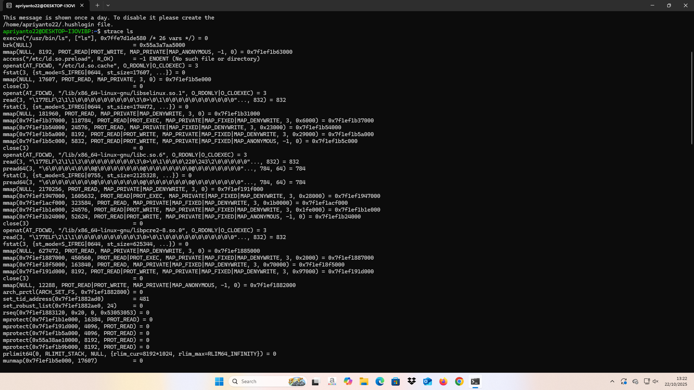
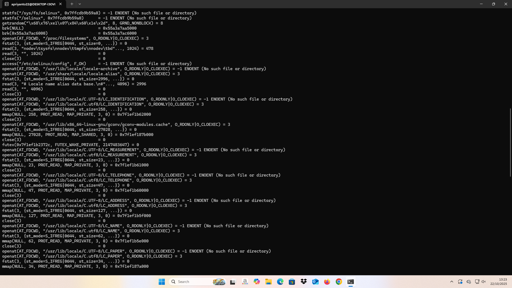
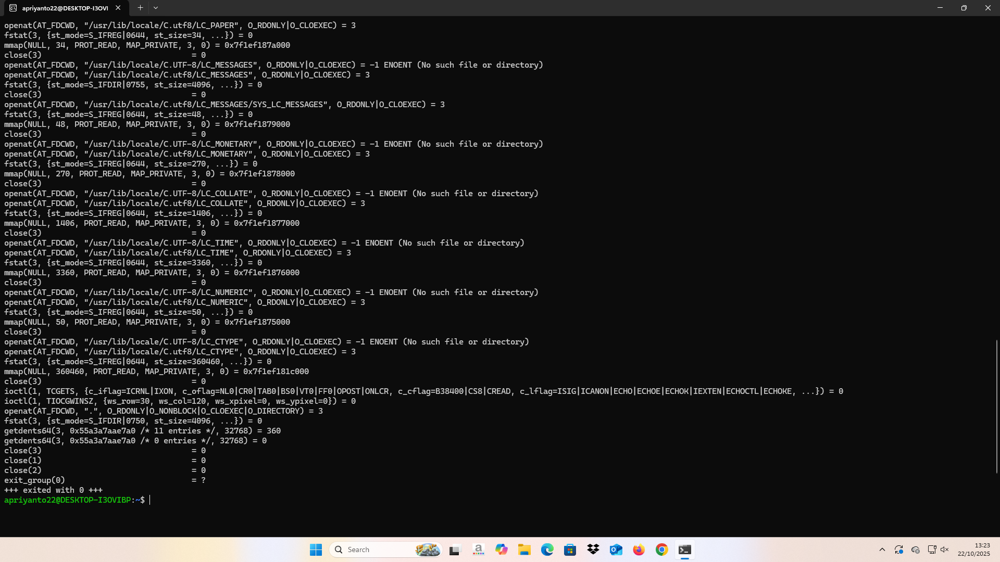
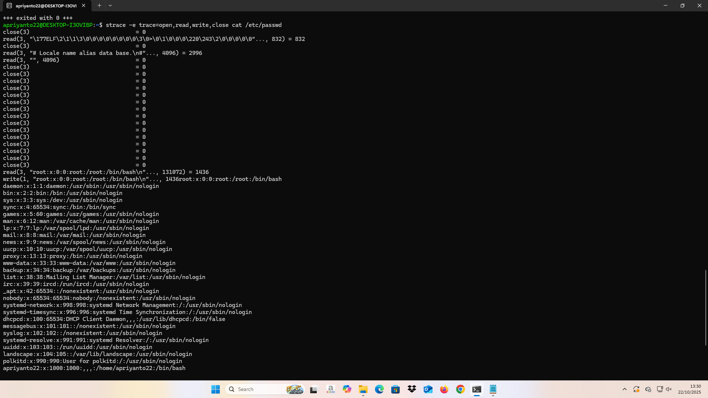
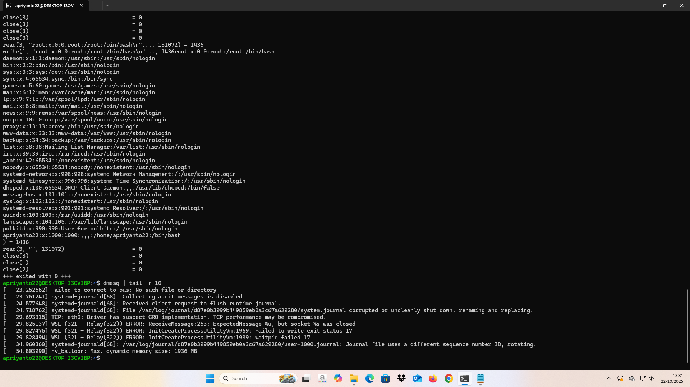
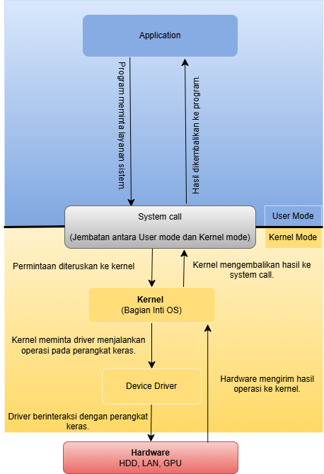

# Laporan Praktikum Minggu 2
Topik: Struktur System Call dan Fungsi Kernel

---

## Identitas
- **Nama**  : Nanang Apriyanto  
- **NIM**   : 250202957  
- **Kelas** : 1IKRA

---

## Tujuan
Tujuan praktikum minggu ini.

> 1. Mahasiswa mampu menjelaskan konsep dan fungsi system call dalam sistem operasi.
> 2. Mahasiswa mampu mengidentifikasi jenis-jenis system call dan fungsinya.
> 3. Mahasiswa mampu mengamati alur perpindahan mode user ke kernel saat system call terjadi.
> 4. Mahasiswa mampu menggunakan perintah Linux untuk menampilkan dan menganalisis system call.

---

## Dasar Teori
1. System call berfungsi sebagai penghubung antara program dan kernel, supaya aplikasi bisa meminta layanan sistem seperti membaca file atau menjalankan proses tanpa langsung berhubungan dengan perangkat keras.

2. Struktur system call terdiri dari user mode, system call interface, dan kernel mode yang bekerja sama agar permintaan dari aplikasi bisa dijalankan dengan aman dan efisien oleh sistem operasi.

3. Kernel adalah inti sistem operasi yang mengatur proses, memori, dan perangkat keras supaya semua program bisa berjalan teratur tanpa saling mengganggu.

4. Setiap system call memiliki fungsi tertentu, seperti membuka file, membuat proses, dan berkomunikasi antar-proses, agar interaksi antara software dan hardware berjalan lancar dan konsisten.

5. Kernel berjalan di mode istimewa (privileged mode) untuk menjalankan tugas penting, sedangkan system call menjadi jalur aman bagi program di user mode agar bisa berinteraksi dengan kernel tanpa mengganggu sistem.
---

## Langkah Praktikum
1. Langkah-langkah yang dilakukan.

   1.) Gunakan Linux (Ubuntu/WSL).

   2.) **Analisis System Call**,
   Jalankan perintah:
   ```bash
   strace ls
   ```
   > Catat 5–10 system call pertama yang muncul dan jelaskan fungsinya.  
   Simpan hasil analisis ke `results/syscall_ls.txt`.

   3.) **Menelusuri System Call File I/O**,
   Jalankan:
   ```bash
   strace -e trace=open,read,write,close cat /etc/passwd
   ```
   > Analisis bagaimana file dibuka, dibaca, dan ditutup oleh kernel.

   4.) **Mode User vs Kernel**
   Jalankan:
   ```bash
   dmesg | tail -n 10
   ```
   > Amati log kernel yang muncul. Apa bedanya output ini dengan output dari program biasa?

   5.) Buat diagram yang menggambarkan alur eksekusi system call dari program user hingga kernel dan kembali lagi ke user mode menggunakan draw.io. Dan simpan di:
     ```
     praktikum/week2-syscall-structure/screenshots/syscall-diagram.png
     ```
   
   6.) Kemudian melakukan commit dan push ketika sudah selesai.

2. Perintah yang dijalankan.  
```bash
strace ls
strace -e trace=open,read,write,close cat /etc/passwd
dmesg | tail -n 10
```
3. File dan kode yang dibuat.  

laporan.md,
syscall-diagram.png,
syscall_ls-stracels1.png,
syscall_ls-stracels2.png,
syscall_ls-stracels3.png,
syscall_ls-strace-e1.png,
syscall_ls-strace-e2-dmesg.png,
dmesg.txt,
strace-e.txt,
strace_ls.txt,
syscall_ls.txt.

4. Commit message yang digunakan. 

Minggu 2 - Struktur System Call dan Kernel Interaction

---

## Kode / Perintah
Tuliskan potongan kode atau perintah utama:
```bash
strace ls
strace -e trace=open,read,write,close cat /etc/passwd
dmesg | tail -n 10
```

---

## Hasil Eksekusi








---

## Analisis Eksperimen

- Eksperimen 1 – Analisis System Call

5–10 system call pertama yang muncul beserta fungsinya.

```bash
apriyanto22@DESKTOP-I3OVIBP:~$ strace ls
execve("/usr/bin/ls", ["ls"], 0x7ffe7d1de580 /* 26 vars */) = 0
brk(NULL)                               = 0x55a3a7aa5000
mmap(NULL, 8192, PROT_READ|PROT_WRITE, MAP_PRIVATE|MAP_ANONYMOUS, -1, 0) = 0x7f1ef1b63000
access("/etc/ld.so.preload", R_OK)      = -1 ENOENT (No such file or directory)
openat(AT_FDCWD, "/etc/ld.so.cache", O_RDONLY|O_CLOEXEC) = 3
fstat(3, {st_mode=S_IFREG|0644, st_size=17607, ...}) = 0
mmap(NULL, 17607, PROT_READ, MAP_PRIVATE, 3, 0) = 0x7f1ef1b5e000
close(3)                                = 0
openat(AT_FDCWD, "/lib/x86_64-linux-gnu/libselinux.so.1", O_RDONLY|O_CLOEXEC) = 3
read(3, "\177ELF\2\1\1\0\0\0\0\0\0\0\0\0\3\0>\0\1\0\0\0\0\0\0\0\0\0\0\0"..., 832) = 832
```

1. execve()
   --> Berfungsi untuk menjalankan program baru. Pada tahap ini kernel mulai memproses perintah ls, memuat program ke dalam memori, serta menyiapkan semua hal yang dibutuhkan agar program bisa berjalan, seperti parameter dan lingkungan kerjanya. Setelah itu, proses ls resmi dijalankan oleh sistem.
2. brk()
   --> Berfungsi untuk menambah atau mengatur ruang memori yang dipakai oleh program. Kernel menyiapkan area di memori (heap) agar program ls dapat menyimpan data sementara, seperti variabel atau struktur data yang dibutuhkan selama program berjalan.
3. mmap()
   --> Berfungsi untuk memetakan file atau data ke dalam memori. Dengan cara ini, program bisa mengakses isi file langsung dari memori tanpa harus membaca dari hard disk berulang kali, sehingga proses menjadi lebih cepat dan efisien.
4. access()
   --> Berfungsi untuk memeriksa apakah sebuah file bisa diakses oleh program. Kernel akan mengecek apakah file yang dicari ada, dan apakah program memiliki izin untuk membacanya, menulis, atau menjalankannya. Jika file tidak ditemukan atau tidak memiliki izin, kernel akan memberi tahu program.
5. openat()
   --> Berfungsi untuk membuka file atau folder agar dapat digunakan oleh program. Kernel menggunakan system call ini untuk mengakses file penting seperti daftar library sistem yang dibutuhkan agar program dapat berjalan dengan baik.
6. fstat()
   --> Berfungsi untuk mengecek informasi detail dari file yang sudah dibuka, seperti ukuran file, jenis file, serta izin aksesnya. Tujuannya agar kernel dapat memastikan bahwa file tersebut valid dan aman untuk dibaca atau digunakan oleh program.
7. mmap()
   --> Berfungsi untuk menyalin isi file ke memori agar data bisa dibaca dengan cepat tanpa harus membuka file dari disk berkali-kali. Teknik ini juga membantu menghemat waktu saat program membutuhkan banyak file sistem.
8. close()
   --> Berfungsi untuk menutup file yang sudah tidak digunakan lagi. Kernel melakukan ini untuk menghemat sumber daya dan mencegah sistem terlalu banyak file terbuka secara bersamaan.
9. openat()
   --> Berfungsi untuk membuka file library sistem. Kernel melakukan ini agar program ls bisa menggunakan fungsi-fungsi yang sudah tersedia di dalam library tanpa harus menulis ulang kode tersebut.
10. read()
    --> Berfungsi untuk membaca isi file atau library yang telah dibuka. Kernel memastikan bahwa isi file dapat dibaca dengan benar, misalnya dengan memeriksa format file sebelum digunakan oleh program ls, sehingga program bisa berjalan tanpa error.

- Eksperimen 2 – Menelusuri System Call File I/O

Analisis bagaimana file dibuka, dibaca, dan ditutup oleh kernel.


`apriyanto22@DESKTOP-I3OVIBP:~$ strace -e trace=open,read,write,close cat /etc/passwd
close(3)                                = 0
read(3, "\177ELF\2\1\1\3\0\0\0\0\0\0\0\0\3\0>\0\1\0\0\0\220\243\2\0\0\0\0\0"..., 832) = 832
close(3)                                = 0
read(3, "# Locale name alias data base.\n#"..., 4096) = 2996
read(3, "", 4096)                       = 0
close(3)                                = 0
close(3)                                = 0
close(3)                                = 0
close(3)                                = 0
close(3)                                = 0
close(3)                                = 0
close(3)                                = 0
close(3)                                = 0
close(3)                                = 0
close(3)                                = 0
close(3)                                = 0
close(3)                                = 0
close(3)                                = 0
close(3)                                = 0
close(3)                                = 0
read(3, "root:x:0:0:root:/root:/bin/bash\n"..., 131072) = 1436
write(1, "root:x:0:0:root:/root:/bin/bash\n"..., 1436root:x:0:0:root:/root:/bin/bash
daemon:x:1:1:daemon:/usr/sbin:/usr/sbin/nologin
bin:x:2:2:bin:/bin:/usr/sbin/nologin
sys:x:3:3:sys:/dev:/usr/sbin/nologin
sync:x:4:65534:sync:/bin:/bin/sync
games:x:5:60:games:/usr/games:/usr/sbin/nologin
man:x:6:12:man:/var/cache/man:/usr/sbin/nologin
lp:x:7:7:lp:/var/spool/lpd:/usr/sbin/nologin
mail:x:8:8:mail:/var/mail:/usr/sbin/nologin
news:x:9:9:news:/var/spool/news:/usr/sbin/nologin
uucp:x:10:10:uucp:/var/spool/uucp:/usr/sbin/nologin
proxy:x:13:13:proxy:/bin:/usr/sbin/nologin
www-data:x:33:33:www-data:/var/www:/usr/sbin/nologin
backup:x:34:34:backup:/var/backups:/usr/sbin/nologin
list:x:38:38:Mailing List Manager:/var/list:/usr/sbin/nologin
irc:x:39:39:ircd:/run/ircd:/usr/sbin/nologin
_apt:x:42:65534::/nonexistent:/usr/sbin/nologin
nobody:x:65534:65534:nobody:/nonexistent:/usr/sbin/nologin
systemd-network:x:998:998:systemd Network Management:/:/usr/sbin/nologin
systemd-timesync:x:996:996:systemd Time Synchronization:/:/usr/sbin/nologin
dhcpcd:x:100:65534:DHCP Client Daemon,,,:/usr/lib/dhcpcd:/bin/false
messagebus:x:101:101::/nonexistent:/usr/sbin/nologin
syslog:x:102:102::/nonexistent:/usr/sbin/nologin
systemd-resolve:x:991:991:systemd Resolver:/:/usr/sbin/nologin
uuidd:x:103:103::/run/uuidd:/usr/sbin/nologin
landscape:x:104:105::/var/lib/landscape:/usr/sbin/nologin
polkitd:x:990:990:User for polkitd:/:/usr/sbin/nologin
apriyanto22:x:1000:1000:,,,:/home/apriyanto22:/bin/bash
) = 1436
read(3, "", 131072)                     = 0
close(3)                                = 0
close(1)                                = 0
close(2)                                = 0
+++ exited with 0 +++
apriyanto22@DESKTOP-I3OVIBP:~$`

1. File Dibuka oleh Kernel `open()`

Saat perintah cat /etc/passwd dijalankan. Program itu tidak membuka file secara langsung. Tetapi minta tolong ke kernel lewat system call `open()`. Kernel lalu mengecek apakah file ada. Kemudian memeriksa apakah pengguna punya izin membaca. Kalau semua sesuai. Kernel buka file dan memberikan nomor identitas khusus namanya file descriptor ,kemudian diberi nomor 3. Kemudian dapat dipastikan kernel menjalankan `open()` karena file /etc/passwd berhasil dibaca pada langkah berikutnya.

2. File Dibaca oleh Kernel `read()`

Setelah file terbuka. Program minta kernel baca isinya pakai system call read(). Kemudian kernel ambil isi file dari penyimpanan. Lalu mengirimkan ke program agar bisa ditampilkan di layar. Pada hasil perintah di praktikum menunjukan `read(3, "root:x:0:0:root:/root:/bin/bash\n"..., 131072) = 1436` yang artinya kernel membaca isi file sebanyak 1436 byte dari file descriptor nomor 3. Data yang dibaca itu dikirim ke program cat. Kemudian isi file /etc/passwd bisa muncul di terminal.

3. File Ditutup oleh Kernel `close()`

Setelah program selesai membaca dan menampilkan isi file, kernel menutup file lewat system call `close()`. Langkah ini dilakukan supaya sumber daya sistem yang dipakai untuk membuka file bisa dikembalikan dan tidak membebani sistem. Pada hasil eksekusi terdapat baris `close 3 = 0`. Itu tandanya file descriptor nomor 3 tutup dengan benar. Dengan menutup file. Kernel pastikan semua proses selesai dengan baik, kemudian sistem tetap jalan efisien. Tanpa buang memori atau sumber daya yang tidak perlu.

- Eksperimen 3 – Mode User vs Kernel

Apa bedanya output ini dengan output dari program biasa?
```bash
apriyanto22@DESKTOP-I3OVIBP:~$ dmesg | tail -n 10
[   23.252562] Failed to connect to bus: No such file or directory
[   23.761241] systemd-journald[68]: Collecting audit messages is disabled.
[   24.577648] systemd-journald[68]: Received client request to flush runtime journal.
[   24.718762] systemd-journald[68]: File /var/log/journal/d87e0b3999b449859eb0a3c67a629280/system.journal corrupted or uncleanly shut down, renaming and replacing.
[   29.693315] TCP: eth0: Driver has suspect GRO implementation, TCP performance may be compromised.
[   29.825137] WSL (321 - Relay(322)) ERROR: ReceiveMessage:253: ExpectedMessage %u, but socket %s was closed
[   29.827475] WSL (321 - Relay(322)) ERROR: InitCreateProcessUtilityVm:1969: Failed to write exit status 17
[   29.828494] WSL (321 - Relay(322)) ERROR: InitCreateProcessUtilityVm:1989: waitpid failed 17
[   34.960360] systemd-journald[68]: /var/log/journal/d87e0b3999b449859eb0a3c67a629280/user-1000.journal: Journal file uses a different sequence number ID, rotating.
[   54.803990] hv_balloon: Max. dynamic memory size: 1936 MB
apriyanto22@DESKTOP-I3OVIBP:~$
```

Output log kernel itu mencatat berbagai kegiatan yang dilakukan sistem operasi di komputer. Mencakup cara kerja sistem atau kejadian-kejadian di dalamnya. Informasi semacam itu biasanya dipakai untuk memeriksa atau memperbaiki sistem ketika muncul masalah. Misalnya, pada log muncul pesan seperti `[24.718762] systemd-journald[68]: File /var/log/journal/... corrupted or uncleanly shut down, renaming and replacing.`, yang berarti sistem menemukan file log yang rusak dan memperbaikinya secara otomatis. Selain itu, ada juga pesan seperti `[29.693315] TCP: eth0: Driver has suspect GRO implementation, TCP performance may be compromised.`, yang menunjukkan adanya peringatan dari kernel terhadap kemungkinan masalah pada performa jaringan. Lalu sistem memperbaikinya sendiri secara otomatis. Di sisi lain, output dari program biasa langsung menampilkan hasil perintah yang pengguna jalankan. Hal itu jadi lebih mudah dipahami. Karena isinya memang informasi yang pengguna inginkan. jadi, log kernel menggambarkan apa yang berlangsung di balik layar sistem. Sementara output program biasa memberikan hasil sesuai permintaan pengguna.

---

## Analisis
- Jelaskan makna hasil percobaan.  

--> **strace ls** : strace ls menampilkan semua aktivitas di balik layar saat perintah dijalankan, dari hasil strace ls, bisa dilihat kalau waktu saya menjalankan perintah ls, program itu ngobrol sama kernel lewat beberapa system call seperti execve, openat, read, getdents64, dan close.
System call ini dipakai buat buka folder, baca isinya, terus nunjukin daftar file di layar. Semua proses itu lewat kernel, bukan langsung ke perangkat keras.
Di akhir muncul tulisan +++ exited with 0 +++, yang artinya perintahnya berhasil dijalankan tanpa ada error.

--> **strace -e trace=open,read,write,close cat /etc/passwd** : Perintah ini dipakai untuk melihat apa aja yang dilakukan sistem pada saat menjalankan cat /etc/passwd. File /etc/passwd itu isinya daftar semua user yang ada di komputer Linux. Dari hasilnya kelihatan kalau program cat berhubungan sama kernel lewat beberapa system call penting, yaitu open, read, write, dan close.
System call open dipakai untuk membuka file, read untuk membaca isi file, write untuk menampilkan hasil bacaan ke layar, dan close untuk menutup file setelah selesai. Semua proses itu lewat kernel karena program gak bisa langsung nyentuh file atau hardware sendiri.
Di akhir muncul tulisan +++ exited with 0 +++, yang artinya perintahnya berhasil dijalankan tanpa ada error.

--> **dmesg | tail -n 10** : dipakai untuk melihat sepuluh pesan terakhir dari aktivitas kernel. Dari hasilnya terlihat bahwa sistem sempat gagal terhubung ke D-Bus, ada log yang rusak tapi langsung diperbaiki oleh sistem, dan ada peringatan kecil pada jaringan eth0. Selain itu, muncul juga pesan dari WSL yang menandakan ada sedikit gangguan saat proses berjalan. Di bagian akhir, kernel memberi tahu bahwa batas penggunaan memori maksimalnya 1936 MB. Secara keseluruhan, sistem masih berjalan normal dan stabil walaupun ada beberapa peringatan ringan.

- Hubungkan hasil dengan teori (fungsi kernel, system call, arsitektur OS). 

Ketika menjalankan perintah strace ls, system call seperti open, read, write, dan close mulai muncul di layar. Hal itu menunjukkan program tidak berurusan langsung dengan perangkat keras tetapi semuanya dilakukan melalui kernel sebagai perantara. Perintah dmesg | tail -n 10 menampilkan aktivitas kernel terbaru, Misalnya, ada pengaturan memori kemudian kesalahan ringan yang tidak terlalu serius. Semua itu membuktikan kernel terus memantau dan mengatur sistem supaya berjalan dengan lancar. Dari hasil seperti ini, jelas terlihat setiap perintah yang dijalankan melibatkan komunikasi program dengan kernel. program berkomunikasi dengan kernel lewat system call untuk membuka file, membaca isinya, menampilkan hasil di layar, lalu menutup file. Jadi, system call memang berperan sebagai jembatan antara program dan kernel. Ketika user memberikan perintah, yang mengendalikan akses ke hardware adalah kernel. Dengan begitu, seluruh bagian arsitektur OS seperti user, aplikasi, kernel, dan hardware bisa bekerja sama secara teratur.

- Apa perbedaan hasil di lingkungan OS berbeda (Linux vs Windows)?  

Perbedaan hasil pada lingkungan OS berbeda. Di Linux, untuk hasil perintah pada praktikum bisa dilihat pada **Hasil Eksekusi**. Dari hasil tersebut terlihat tampilan detail aktivitas sistem di balik layar, termasuk system call yang digunakan program untuk berinteraksi dengan kernel. Di Linux, perintah pada praktikum ini juga langsung menampilkan detail tentang sistem, pengguna, dan proses kernel, karena Linux memberikan akses langsung ke kernel melalui terminal. Hal semacam itu bisa terjadi sebab Linux bersifat terbuka dan prosesnya sering dijalankan melalui terminal. 

Sementara itu, di Windows sebagian besar proses dilakukan melalui tampilan grafis (GUI). Karena itu, pengguna tidak bisa melihat secara langsung bagaimana sistem berkomunikasi dengan kernel (system call). Pada saat saya mencoba menjalankan perintah pada praktikum ini di Command Prompt atau Windows PowerShell saya menjalankan perintah **`strace ls`** muncul pesan **`'strace' is not recognized as an internal or external command, operable program or batch file.`** yang atinya perintah tersebut tidak dikenali. Karena perintah tersebut bukan bagian dari sistem atau perintah bawaan Windows dan perintah tersebut memang khusus untuk Linux.

---


## Kesimpulan
1. Praktikum ini menunjukkan bahwa system call adalah penghubung utama antara program dan sistem operasi. Melalui system call, program bisa meminta bantuan sistem operasi untuk melakukan hal-hal seperti membuka file, membaca data, atau menjalankan proses baru dengan cara yang aman.

2. Dari percobaan menggunakan perintah seperti strace dan dmesg, terlihat bagaimana sistem operasi meneruskan perintah dari user mode ke kernel mode agar bisa dijalankan oleh kernel. Proses ini memastikan setiap perintah dijalankan dengan teratur dan tidak mengganggu sistem.

3. Praktikum ini juga membantu memahami bahwa kernel adalah bagian inti dari sistem operasi yang mengatur semua sumber daya komputer. Kernel memastikan aplikasi, sistem operasi, dan perangkat keras bisa saling berkomunikasi dengan baik dan membuat komputer tetap stabil.

---

## Tugas
- Tabel Observasi hasil eksperimen strace dan dmesg:

1. Tabel observasi hasil eksperimen strace: 

| No | System Call                              | Fungsi              | Penjelasan                                                                                                                                                                    | Perintah                                                                |
| -- | --------------------------------------------------- | --------------------------- | -------------------------------------------------------------------------------------------------------------------------------------------------------------------------------------- | ----------------------------------------------------------------------- |
| 1  | `execve("/usr/bin/ls", ["ls"], …)`                  | Menjalankan program         | Berfungsi untuk menjalankan program baru. Kernel memuat perintah `ls` ke dalam memori dan menyiapkan semua yang dibutuhkan agar program bisa berjalan.                                 | `strace ls`                                                             |
| 2  | `open("/etc/passwd", O_RDONLY)`                     | Membuka file                | Berfungsi untuk membuka file yang akan digunakan oleh program. Pada `ls` digunakan untuk membuka file library sistem, sedangkan pada `cat` digunakan untuk membuka file `/etc/passwd`. | `strace ls` dan `strace -e trace=open,read,write,close cat /etc/passwd` |
| 3  | `brk(NULL)`                                         | Menyiapkan memori           | Berfungsi untuk menambah atau mengatur ruang memori (heap) agar program dapat menyimpan data sementara seperti variabel dan struktur data.                                             | `strace ls`                                                             |
| 4  | `mmap(NULL, ..., PROT_READ..., 0)`                  | Mengatur/memetakan memori   | Berfungsi untuk menempatkan file atau data ke dalam memori agar dapat diakses lebih cepat tanpa membaca langsung dari disk setiap kali.                                                | `strace ls`                                                             |
| 5  | `access("/etc/ld.so.preload", R_OK)`                | Mengecek file konfigurasi   | Berfungsi untuk memeriksa apakah file konfigurasi library tersedia dan dapat diakses oleh program. Jika tidak ditemukan, ini adalah hal yang normal.                                   | `strace ls`                                                             |
| 6  | `openat(AT_FDCWD, "/etc/ld.so.cache", O_RDONLY...)` | Membuka file library sistem | Berfungsi untuk membuka daftar library yang dibutuhkan oleh program agar dapat dijalankan dengan benar.                                                                                | `strace ls`                                                             |
| 7  | `fstat(3, …)`                                       | Mengecek informasi file     | Berfungsi untuk memeriksa ukuran, jenis, dan izin file agar kernel yakin bahwa file tersebut valid dan aman digunakan.                                                                 | `strace ls`                                                             |
| 8  | `getdents64(3, ..., 32768)`                         | Membaca isi folder          | Berfungsi untuk membaca daftar nama file yang ada di dalam folder tempat perintah dijalankan.                                                                                          | `strace ls`                                                             |
| 9  | `read(3, "...", ...)`                               | Membaca isi file            | Berfungsi untuk membaca data dari file yang telah dibuka. Pada `ls`, digunakan untuk membaca data library; sedangkan pada `cat`, digunakan untuk membaca isi file `/etc/passwd`.       | `strace ls` dan `strace -e trace=open,read,write,close cat /etc/passwd` |
| 10 | `write(1, "output", ...)`                           | Menampilkan ke layar        | Berfungsi untuk menampilkan hasil ke terminal. Pada `ls`, menampilkan nama file di folder; pada `cat`, menampilkan isi file `/etc/passwd`.                                             | `strace ls` dan `strace -e trace=open,read,write,close cat /etc/passwd` |
| 11 | `close(3)`                                          | Menutup file                | Berfungsi untuk menutup file yang sudah tidak digunakan agar sumber daya sistem tidak terbuang.                                                                                        | `strace ls` dan `strace -e trace=open,read,write,close cat /etc/passwd` |
| 12 | `close(1)`                                          | Menutup output terminal     | Berfungsi untuk menutup saluran keluaran (stdout) setelah semua data berhasil ditampilkan ke layar.                                                                                    | `strace -e trace=open,read,write,close cat /etc/passwd`                 |
| 13 | `close(2)`                                          | Menutup error output        | Berfungsi untuk menutup saluran error (stderr) setelah program selesai berjalan.                                                                                                       | `strace -e trace=open,read,write,close cat /etc/passwd`                 |
| 14 | `openat(AT_FDCWD, ".", ...O_DIRECTORY)`             | Membuka folder saat ini     | Berfungsi untuk membuka folder tempat perintah `ls` dijalankan agar sistem dapat membaca isi direktori tersebut.                                                                       | `strace ls`                                                             |
| 15 | `exit_group(0)`                                     | Mengakhiri program          | Berfungsi untuk menandakan bahwa program telah selesai dijalankan dan keluar dengan status normal (tanpa error).                                                                       | `strace ls` dan `strace -e trace=open,read,write,close cat /etc/passwd` |

Dari tabel hasil observasi hasil eksperimen strace, dapat disimpulkan bahwa setiap perintah yang dijalankan di Linux seperti ls dan `-e trace=open,read,write,close cat /etc/passwd` membutuhkan bantuan kernel melalui system call agar bisa berjalan. Perintah ls memerlukan lebih banyak system call karena harus membuka direktori dan membaca isinya, sedangkan `-e trace=open,read,write,close cat /etc/passwd` hanya menggunakan beberapa system call utama untuk membuka, membaca, dan menampilkan isi file.

2. Tabel observasi hasil eksperimen dmesg :

| No | Waktu (detik sejak boot) | Pesan Kernel                                                                                             | Arti                       | Penjelasan                                                                                                                              |
| -- | ------------------------ | -------------------------------------------------------------------------------------------------------- | ------------------------------------ | --------------------------------------------------------------------------------------------------------------------------------------- |
| 1  | `[23.252562]`            | `Failed to connect to bus: No such file or directory`                                                    | Gagal terhubung ke sistem komunikasi | Sistem belum bisa tersambung ke layanan komunikasi antarproses (D-Bus) karena belum aktif saat komputer dinyalakan.                     |
| 2  | `[23.761241]`            | `systemd-journald[68]: Collecting audit messages is disabled.`                                           | Pencatatan keamanan dimatikan        | Sistem memberi tahu bahwa fitur pencatatan aktivitas keamanan tidak diaktifkan. Ini hanya pemberitahuan, bukan kesalahan.               |
| 3  | `[24.577648]`            | `systemd-journald[68]: Received client request to flush runtime journal.`                                | Menyimpan log sementara              | Sistem sedang menyimpan catatan sementara ke file log permanen agar tidak hilang.                                                       |
| 4  | `[24.718762]`            | `systemd-journald[68]: File ...system.journal corrupted or uncleanly shut down, renaming and replacing.` | File log rusak diganti               | Sistem menemukan file catatan kegiatan (log) yang rusak karena tidak ditutup dengan benar, lalu otomatis menggantinya dengan file baru. |
| 5  | `[29.693315]`            | `TCP: eth0: Driver has suspect GRO implementation, TCP performance may be compromised.`                  | Kinerja jaringan menurun             | Sistem mendeteksi bahwa driver jaringan tidak berjalan maksimal, sehingga koneksi jaringan bisa sedikit lebih lambat.                   |
| 6  | `[29.825137]`            | `WSL (321 - Relay(322)) ERROR: ReceiveMessage... socket ... was closed`                                  | Masalah koneksi internal WSL         | Sistem Windows Subsystem for Linux (WSL) gagal mengirim pesan karena koneksi tertutup lebih cepat dari seharusnya.                      |
| 7  | `[29.827475]`            | `WSL ... Failed to write exit status 17`                                                                 | Gagal mencatat status proses         | Sistem WSL gagal mencatat status akhir dari proses yang dijalankan, tetapi tidak memengaruhi kinerja secara keseluruhan.                |
| 8  | `[29.828494]`            | `WSL ... waitpid failed 17`                                                                              | Gagal menunggu proses selesai        | Sistem WSL tidak bisa menunggu proses yang sedang berjalan karena prosesnya sudah berhenti lebih dulu.                                  |
| 9  | `[34.960360]`            | `systemd-journald[68]: ...user-1000.journal... rotating.`                                                | Membuat ulang file log pengguna      | Sistem membuat file log baru untuk pengguna karena data log lama tidak sinkron.                                                         |
| 10 | `[54.803990]`            | `hv_balloon: Max. dynamic memory size: 1936 MB`                                                          | Informasi batas memori               | Sistem memberi tahu batas maksimum memori yang bisa digunakan oleh Linux di dalam WSL, yaitu sekitar 1936 MB.                           |

Dari tabel hasil observasi hasil eksperimen dmesg, hasil dmesg menunjukkan aktivitas kernel yang normal dengan beberapa peringatan ringan pada driver grafis dan log sistem. Sistem tetap stabil karena kernel melakukan pemulihan otomatis.


**Kesimpulan Umum dari Semua Eksperimen**

| Perintah/code                     | Tujuan                                              | Hasil Pengamatan                                                                                                                                            |
| -------------------------------- | --------------------------------------------------- | ----------------------------------------------------------------------------------------------------------------------------------------------------------- |
| **1 (`strace ls`)**              | Melihat bagaimana kernel menjalankan perintah dasar | Kernel memproses perintah `ls` melalui berbagai system call seperti membuka file, membaca direktori, dan menampilkan hasil ke layar. Semua berjalan normal. |
| **2 (`strace cat /etc/passwd`)** | Melihat system call terkait operasi file            | Kernel melakukan open, read, write, close untuk membaca isi file `/etc/passwd`. Proses berjalan lancar tanpa error.                                         |
| **3 (`dmesg... -n 10`)**                  | Melihat aktivitas log kernel sistem                 | Kernel mencatat aktivitas driver, log sistem, dan pembersihan cache. Beberapa error ringan muncul tapi sistem tetap stabil.                                 |


- Mengapa system call penting untuk keamanan OS?

System call itu bisa dibilang sebagai perantara aman antara program yang kita jalankan dan bagian inti sistem operasi (kernel space). Kernel ini seperti “otak” dari komputer yang ngatur semua hal penting, mulai dari memori, file, sampai perangkat keras. Nah, karena kernel itu sensitif banget, program biasa nggak boleh langsung nyentuh atau ngatur kernel,kalau bisa nanti sistemnya bisa rusak.

Di sinilah system call berperan. Setiap kali program butuh melakukan sesuatu yang berhubungan dengan sistem, misalnya buka file, kirim data ke internet, atau buat proses baru, dia harus meminta izin lewat system call. OS lalu akan memeriksa apakah permintaan itu aman dan pengguna punya izin yang cukup. Kalau iya, baru dijalankan. Kalau nggak, langsung ditolak.Selain itu, system call juga bikin OS bisa mencatat aktivitas program, serta memisahkan ruang kerja antar program biar satu program nggak bisa ganggu atau ambil data dari program lain. 

jadi dapat simpulkan bahwa system call penting untuk keamanan OS karena menjadi jalur resmi dan terkontrol antara program pengguna dan kernel. Dengan adanya system call, setiap permintaan dari program harus melewati proses pengecekan izin dan validasi oleh sistem operasi, sehingga mencegah akses langsung ke bagian inti yang sensitif. Mekanisme ini membuat OS mampu mengatur siapa yang boleh melakukan apa, mendeteksi aktivitas mencurigakan, dan menjaga isolasi antar program.

- Bagaimana OS memastikan transisi user–kernel berjalan aman?

Transisi antara user mode dan kernel mode itu bisa dibilang sebagai proses berpindahnya kendali dari program biasa ke bagian inti sistem operasi dengan cara yang aman. Soalnya, kernel ini bagian paling penting dari OS yang ngatur semua hal dasar di komputer, seperti memori, file, dan perangkat keras. Nah, biar nggak ada program sembarangan yang bisa langsung masuk dan ngacak-ngacak sistem, OS ngatur proses transisi ini lewat mekanisme khusus. Saat program butuh bantuan kernel misalnya mau buka file atau kirim data, ia akan memanggil system call, yang memicu trap atau software interrupt. Nah, di sini CPU otomatis ganti dari user mode ke kernel mode dan ngarah ke alamat khusus yang udah ditentukan OS, bukan alamat sembarangan. Setelah itu, OS bakal ngecek dulu semua permintaan dan izin dari program, buat pastiin nggak ada yang mencurigakan atau berbahaya. Kalau udah aman dan selesai dijalankan, sistem bakal balikin lagi kontrolnya ke user mode, supaya program nggak bisa terus beroperasi di level kernel. Dengan alur seperti ini, OS bisa memastikan transisi antara user dan kernel berjalan aman, teratur, dan bebas dari risiko penyalahgunaan.

- Contoh system call yang sering digunakan di Linux : 

`open()`  --> Membuka file supaya bisa dibaca atau ditulis.

`read()`  --> Membaca isi dari file.

`write()` --> Menulis data ke dalam file.

`close()` --> Menutup file setelah selesai digunakan.

`fork()`  --> Membuat salinan dari proses yang sedang berjalan.

`exec()`  --> Mengganti proses yang sedang berjalan dengan program lain.

`wait()`  --> Menunggu proses lain yang dibuat sebelumnya sampai selesai.

`exit()`  --> Menghentikan proses yang sedang berjalan.

`mkdir()` –-> membuat folder baru di dalam sistem file.

`rmdir()` –-> menghapus folder yang sudah ada.

---

## Quiz
1. Apa fungsi utama system call dalam sistem operasi?

**Jawaban:**

System call memiliki fungsi utama yaitu sebagai jembatan penghubung antara program aplikasi dan inti sistem operasi (kernel). Pada saat program butuh bantuan, misalnya buat buka file, pakai memori, atau akses hardware, permintaan tersebut di lakukan di system call supaya penggunaan sumber daya sistem bisa berlangsung dengan aman, efisien, dan tetap dikontrol sama operasi sistemnya.

2. Sebutkan 4 kategori system call yang umum digunakan.

  **Jawaban:**

  1.) **Pengendalian proses**, atau yang dikenal sebagai **process control**, digunakan untuk mengatur jalannya program-program. seperti membuat program baru, menghentikan. atau menunggu program lain selesai.

  2.) **Pengelolaan file (file management)** digunakan untuk membuat, membuka, membaca, menulis, atau menghapus file.

  3.) **Pengelolaan perangkat (device management)** dipakai saat komputer berurusan sama perangkat seperti printer atau disk atau keyboard. Contohnya, kirim data ke printer supaya cetak atau membaca dari disk.

  4.) **Pemeliharaan informasi (information maintenance)**, digunakan untuk mengatur atau mengambil informasi sistem, Seperti cek waktu, data pengguna yang terdaftar, atau liat proses apa saja yang lagi jalan di belakang layar.

3. Mengapa system call tidak bisa dipanggil langsung oleh user program?

  **Jawaban:**
  
  System call tidak bisa dipanggil langsung sama user program karena tidak punya akses ke bagian-bagian krusial komputer seperti memori   atau hardware. Kalau program bisa mengakses bagian tersebut sendiri, sistem bisa jadi rusak dan tidak aman lagi. Karena itu, semua permintaan dari program harus lewat system call dulu agar sistem operasi bisa memeriksa semuanya serta memastikan semuanya berjalan dengan aman dan rapi.

---

## Refleksi Diri
Tuliskan secara singkat:
- Apa bagian yang paling menantang minggu ini? Pada saat pengerjaannya, karena ada beberapa yang belum paham dari hasil perintah di praktikum ini, kemudian hasil dari perintahnya juga cukup panjang.
- Bagaimana cara Anda mengatasinya?  Tetap tenang, fokus, mencari sumber sumber mengenai system call di internet seperti youtube, google.

---
## Referensi
1. Abraham Silberschatz, Peter Baer Galvin, Greg Gagne. *Operating System Concepts*, 10th Edition, Wiley, 2018.  
2. Andrew S. Tanenbaum, Herbert Bos. *Modern Operating Systems*, 4th Edition, Pearson, 2015.
3. Linux Manual Pages (`man 2 syscalls`, `man strace`).
---
**Credit:**  
_Template laporan praktikum Sistem Operasi (SO-202501) – Universitas Putra Bangsa_
