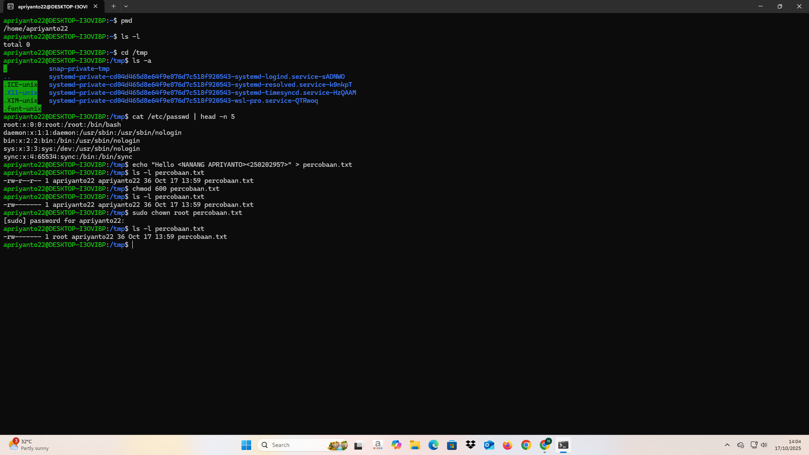

# Laporan Praktikum Minggu 3
Topik: Manajemen File dan Permission di Linux

---

## Identitas
- **Nama**  : Nanang Apriyanto  
- **NIM**   : 250202957  
- **Kelas** : 1IKRA

---

## Tujuan
Tujuan praktikum minggu ini.  
 
> 1. Mahasiswa mampu menggunakan perintah ls, pwd, cd, cat untuk navigasi file dan direktori.
> 2. Mahasiswa mampu menggunakan chmod dan chown untuk manajemen hak akses file.
> 3. Mahasiswa mampu menjelaskan hasil output dari perintah Linux dasar.
> 4. Mahasiswa mampu menyusun laporan praktikum dengan struktur yang benar.
> 5. Mahasiswa mampu mengunggah dokumentasi hasil ke Git Repository tepat waktu.

---

## Dasar Teori
- Linux menyimpan semua data dalam bentuk file yang tersusun seperti pohon folder, dimulai dari direktori utama (/). Setiap file punya informasi seperti nama, ukuran, dan pengaturan izin aksesnya.

- Permission adalah aturan yang menentukan siapa saja yang boleh membaca, mengubah, atau menjalankan file. Ada tiga jenis izin, yaitu read (r) untuk membaca, write (w) untuk mengubah, dan execute (x) untuk menjalankan file.

- Setiap file di Linux memiliki tiga kategori pengguna, yaitu pemilik (owner), kelompok (group), dan pengguna lain (others). Setiap kategori bisa memiliki izin yang berbeda sesuai kebutuhan.

- Linux menyediakan beberapa perintah penting untuk mengatur file, seperti chmod untuk mengubah izin akses, chown untuk mengubah pemilik file, dan ls -l untuk melihat detail file beserta izinnya.

- Pengaturan file dan izin akses dilakukan agar sistem tetap aman dan stabil. Dengan adanya izin ini, pengguna tidak bisa sembarangan membuka, mengubah, atau menghapus file yang bukan miliknya. Kernel juga akan memeriksa izin ini setiap kali ada yang mencoba mengakses file.
  
---

## Langkah Praktikum
1. **Langkah-langkah yang dilakukan.** 

  1.) Pada praktikum ini saya menggunakan Linux Ubuntu.

  2.) Navigasi Sistem File

   Jalankan perintah berikut:
   ```bash
   pwd
   ls -l
   cd /tmp
   ls -a
   ```
   - Jelaskan hasil tiap perintah.
   - Catat direktori aktif, isi folder, dan file tersembunyi (jika ada).

  3.) Membaca File

   Jalankan perintah:
   ```bash
   cat /etc/passwd | head -n 5
   ```
   - Jelaskan isi file dan struktur barisnya (user, UID, GID, home, shell).

  4.) Permission & Ownership**
   Buat file baru:
   ```bash
   echo "Hello <NAME><NIM>" > percobaan.txt
   ls -l percobaan.txt
   chmod 600 percobaan.txt
   ls -l percobaan.txt
   ```
   - Analisis perbedaan sebelum dan sesudah chmod.  
   - Ubah pemilik file (jika memiliki izin sudo):
   ```bash
   sudo chown root percobaan.txt
   ls -l percobaan.txt
   ```
   - Catat hasilnya.

  5.) Dokumentasi
   - Ambil screenshot hasil terminal dan simpan di:
     ```
     praktikum/week3-linux-fs-permission/screenshots/
     ```
   - Tambahkan analisis hasil pada `laporan.md`.

  6.) Kemudian melakukan commit dan push ketika sudah selesai.

2. **Perintah yang dijalankan.**  
```bash
   pwd
   ls -l
   cd /tmp
   ls -a
   cat /etc/passwd | head -n 5
   echo "Hello <NANANG APRIYANTO><250202957>" > percobaan.txt
   ls -l percobaan.txt
   chmod 600 percobaan.txt
   sudo chown root percobaan.txt
   ```
3. **File dan kode yang dibuat.**
laporan.md, screenshots_hasil_perintah.png, perintah_code_week3.txt
4. **Commit message yang digunakan --> Minggu 3 - Linux File System & Permission**

---

## Kode / Perintah
Potongan kode atau perintah utama:
1. Eksperimen 1 – Navigasi Sistem File 
```bash
   pwd
   ls -l
   cd /tmp
   ls -a
```
2. Eksperimen 2 – Membaca File
```bash
   cat /etc/passwd | head -n 5
```
3.Eksperimen 3 – Permission & Ownership
```bash
   echo "Hello <NANANG APRIYANTO><250202957>" > percobaan.txt
   ls -l percobaan.txt
   chmod 600 percobaan.txt
   sudo chown root percobaan.txt
```

---

## Hasil Eksekusi


---
## Analisis Eksperimen
- Eksperimen 1 – Navigasi Sistem File

**--> Jelaskan hasil tiap perintah.**
> `pwd`
```bash
apriyanto22@DESKTOP-I3OVIBP:~$ pwd
/home/apriyanto22
```

   Perintah pwd digunakan untuk mengetahui posisi pengguna sedang berada di folder mana. Dari hasil yang muncul yaitu `/home/apriyanto22`, contohnya pada hasil di atas saya/pengguna sedang ada di folder utama milik pengguna bernama apriyanto22. Folder ini disebut home directory, dan setiap pengguna di sistem Linux memiliki folder seperti ini untuk menyimpan file, tugas, atau pengaturan masing-masing.

>`ls -l`
```bash
apriyanto22@DESKTOP-I3OVIBP:~$ ls -l
total 0
```

Perintah ls -l berfungsi untuk menampilkan isi folder secara lengkap, termasuk nama file, ukuran, izin akses, pemilik, serta tanggal terakhir file tersebut diubah. Hasil yang terlihat adalah `“total 0”`, yang berarti tidak ada file atau folder di dalam direktori tersebut. Ini menunjukkan bahwa folder /home/apriyanto22 masih kosong dan belum ada file apa pun yang dibuat. Jika pengguna membuat file baru, maka hasil ls -l akan menampilkan daftar file tersebut beserta informasinya secara detail.

>`cd /tmp`
```bash
apriyanto22@DESKTOP-I3OVIBP:~$ cd /tmp
apriyanto22@DESKTOP-I3OVIBP:/tmp$
```
Perintah cd digunakan untuk berpindah ke folder lain. Tidak ada output yang dihasilkan dari perintah ini, namun setelah menjalankan perintah tersebut maka akan langsung masuk ke folder tesebut. Di sini saya mengetik cd /tmp, jadi saya pindah ke folder /tmp, yaitu tempat sistem menyimpan file sementara. Folder ini dipakai oleh program dan sistem saat menjalankan proses tertentu, misalnya saat instalasi atau membuka aplikasi. 

> `ls -a`
```bash
apriyanto22@DESKTOP-I3OVIBP:/tmp$ ls -a
.           snap-private-tmp
..          systemd-private-cd04d465d8e64f9e876d7c518f920543-systemd-logind.service-sADNWO
.ICE-unix   systemd-private-cd04d465d8e64f9e876d7c518f920543-systemd-resolved.service-k0nkpT
.X11-unix   systemd-private-cd04d465d8e64f9e876d7c518f920543-systemd-timesyncd.service-HzQAAM
.XIM-unix   systemd-private-cd04d465d8e64f9e876d7c518f920543-wsl-pro.service-QTRwoq
.font-unix
apriyanto22@DESKTOP-I3OVIBP:/tmp$
```

Perintah `ls -a` digunakan untuk menampilkan semua isi folder, termasuk file atau folder yang tersembunyi (yang namanya diawali dengan titik “.”). Hasilnya menunjukkan beberapa folder seperti `.ICE-unix`, `.X11-unix`, `.XIM-unix`, `.font-unix`, `systemd-private-...`, dan `snap-private-tmp`. Semua folder itu bukan buatan pengguna, tapi otomatis dibuat oleh **sistem Linux**. Fungsinya untuk membantu program dan layanan sistem supaya bisa berjalan dengan baik, misalnya untuk tampilan grafis atau komunikasi antar program.

**--> Direktori aktif, isi folder, dan file tersembunyi (jika ada).**

-> Untuk direktori yang aktif 

`/home/apriyanto22`

`/tmp`

-> Isi folder
```bash
.           snap-private-tmp
..          systemd-private-cd04d465d8e64f9e876d7c518f920543-systemd-logind.service-sADNWO
.ICE-unix   systemd-private-cd04d465d8e64f9e876d7c518f920543-systemd-resolved.service-k0nkpT
.X11-unix   systemd-private-cd04d465d8e64f9e876d7c518f920543-systemd-timesyncd.service-HzQAAM
.XIM-unix   systemd-private-cd04d465d8e64f9e876d7c518f920543-wsl-pro.service-QTRwoq
.font-unix
```
-> File tersembunyi
```
.  
..  
.ICE-unix  
.X11-unix  
.XIM-unix  
.font-unix  
```

- Eksperimen 2 – Membaca File
```bash
apriyanto22@DESKTOP-I3OVIBP:/tmp$ cat /etc/passwd | head -n 5
root:x:0:0:root:/root:/bin/bash
daemon:x:1:1:daemon:/usr/sbin:/usr/sbin/nologin
bin:x:2:2:bin:/bin:/usr/sbin/nologin
sys:x:3:3:sys:/dev:/usr/sbin/nologin
sync:x:4:65534:sync:/bin:/bin/sync
```

--> Jelaskan isi file dan struktur barisnya (user, UID, GID, home, shell).

-> Isi file

`root` → akun superuser (administrator utama sistem).

`daemon` → digunakan oleh proses sistem yang berjalan di latar belakang (service).

`bin` → untuk program biner atau perintah bawaan sistem.

`sys` → dipakai oleh proses sistem internal.

`sync` → akun khusus yang menjalankan perintah sinkronisasi file sistem.

 -> **Struktur Baris File**

| No | **User** | **UID** | **GID** | **Home**  | **Shell**         |
| -- | -------- | ------- | ------- | --------- | ----------------- |
| 1  | root     | 0       | 0       | /root     | /bin/bash         |
| 2  | daemon   | 1       | 1       | /usr/sbin | /usr/sbin/nologin |
| 3  | bin      | 2       | 2       | /bin      | /usr/sbin/nologin |
| 4  | sys      | 3       | 3       | /dev      | /usr/sbin/nologin |
| 5  | sync     | 4       | 65534   | /bin      | /bin/sync         |

- Eksperimen 3 – Permission & Ownership
```bash
apriyanto22@DESKTOP-I3OVIBP:/tmp$ echo "Hello <NANANG APRIYANTO><250202957>" > percobaan.txt
apriyanto22@DESKTOP-I3OVIBP:/tmp$ ls -l percobaan.txt
-rw-r--r-- 1 apriyanto22 apriyanto22 36 Oct 17 13:59 percobaan.txt
apriyanto22@DESKTOP-I3OVIBP:/tmp$ chmod 600 percobaan.txt
apriyanto22@DESKTOP-I3OVIBP:/tmp$ ls -l percobaan.txt
-rw------- 1 apriyanto22 apriyanto22 36 Oct 17 13:59 percobaan.txt
apriyanto22@DESKTOP-I3OVIBP:/tmp$
```
--> Perbedaan sebelum dan sesudah chmod.

-> Sebelum chmod
```bash
apriyanto22@DESKTOP-I3OVIBP:/tmp$ ls -l percobaan.txt
-rw-r--r-- 1 apriyanto22 apriyanto22 36 Oct 17 13:59 percobaan.txt
apriyanto22@DESKTOP-I3OVIBP:/tmp$ 
```
Pada saat sebelum chmod: `rw-r--r--`

Hak akses bagian pemilik file (owner) memiliki izin untuk membaca dan mengubah file tersebut, namun tidak memiliki izin untuk mengeksekusinya.
Sedangkan kelompok (group) dan pengguna lain (others) hanya memiliki izin membaca file, tetapi tidak dapat menulis maupun mengeksekusinya.

-> Sesudah chmod
```bash
apriyanto22@DESKTOP-I3OVIBP:/tmp$ chmod 600 percobaan.txt
apriyanto22@DESKTOP-I3OVIBP:/tmp$ ls -l percobaan.txt
-rw------- 1 apriyanto22 apriyanto22 36 Oct 17 13:59 percobaan.txt
apriyanto22@DESKTOP-I3OVIBP:/tmp$
```
Pada saat sesudah chmod: `rw-------`
Hak akses bagian pemilik file (owner) masih memiliki izin untuk membaca dan mengubah file, namun tidak memiliki izin mengeksekusi.
Sedangkan kelompok (group) dan pengguna lain (others) tidak memiliki izin apa pun terhadap file ini (tidak bisa membaca, menulis, maupun mengeksekusi).

**Jadi** Perbedaannya terletak pada hak akses untuk group dan others.
Sebelum chmod, mereka masih bisa membaca file, tetapi setelah chmod 600, hanya pemilik file yang bisa mengaksesnya.

--> Ubah pemilik file
```bash
apriyanto22@DESKTOP-I3OVIBP:/tmp$ sudo chown root percobaan.txt
[sudo] password for apriyanto22:
apriyanto22@DESKTOP-I3OVIBP:/tmp$ ls -l percobaan.txt
-rw------- 1 root apriyanto22 36 Oct 17 13:59 percobaan.txt
apriyanto22@DESKTOP-I3OVIBP:/tmp$
```
Dari percobaan di atas, saya telah berhasil mengubah pemilik file menjadi root.

---
## Analisis
- Jelaskan makna hasil percobaan. 

--> Perintah `pwd` itu dipakai buat ngecek kita lagi di folder mana sekarang. Dari outputnya kelihatan kalau posisi user ada di folder /home/apriyanto22. 

--> Perintah `ls -l` berguna untuk lihat daftar file dan folder di direktori saat ini beserta detailnya. Detail itu termasuk izin akses, pemilik, ukuran file, dan waktu modifikasi. kemudian di hasil menunjukan tulisan `total 0`. Artinya di folder `/home/apriyanto22` belum ada isi file atau folder apa pun.

--> Perintah `cd /tmp` dipakai untuk masuk ke folder yang beda. Pada hasil perintah menunjukan bahwa user masuk ke `/tmp`. Folder /tmp ini tempat sistem penyimpanan file-file sementara.

--> Perintah `ls -a` digunakan untuk menunjukan semua isi folder termasuk yang tersembunyi. File tersembunyi itu biasanya dimulai dengan titik. Dari hasilnya kelihatan ada banyak folder sistem seperti `.ICE-unix` dan `.X11-unix.` Itu tandanya folder /tmp sedang dipakai sistem untuk menjalankan beberapa proses sementara.

--> Perintah `cat /etc/passwd | head -n 5` dipakai untuk melihat sebagian isi file /etc/passwd. File tersebut menyimpan daftar nama pengguna di komputer. Hasilnya nunjukin user seperti root, daemon, dan bin. File ini penting karena berisi info detail tiap user, termasuk nama, ID pengguna, dan folder utamanya.

--> Perintah `echo "Hello <NANANG APRIYANTO><250202957>" > percobaan.txt` di gunakan untuk membuat file baru dengan nama percobaan.txt. Setelah dijalankan, file tersebut berhasil dibuat di folder /tmp.

--> Perintah `ls -l percobaan.txt` dipakai untuk cek detail info file itu. Detailnya meliputi pemilik, grup, ukuran, dan izin akses. Kemudian bisa di lihat hasilnya `rw-r--r--`. Itu berarti pemilik bisa membaca dan menulis file tersebut. Sementara pengguna lain cuma bisa baca saja.

--> Perintah `chmod 600 percobaan.txt` buat batasi akses file supaya lebih aman. Setelah dijalankan, hak aksesnya berubah jadi `-rw-------`. Artinya hanya pemilik yang bisa membaca dan menulis file tersebut. Orang lain sama sekali tidak bisa buka file itu.

--> Perintah `sudo chown root percobaan.txt` dipakai untuk ganti pemilik file jadi root. Root itu administrator sistem. Setelah diganti, file cuma bisa diakses penuh oleh root. Pengguna biasa tidak punya hak lagi untuk ubah atau akses file tersebut.


Dari hasil percobaan yang dilakukan, dapat dipahami bahwa sistem operasi Linux memiliki cara kerja yang teratur dalam mengelola file dan menjaga keamanannya. Perintah pwd, cd, dan ls digunakan untuk mengetahui posisi serta isi folder yang sedang dibuka, sedangkan cat dan echo berfungsi untuk membaca dan membuat file baru. Perintah ls -l membantu melihat detail file seperti ukuran, pemilik, dan izin aksesnya. Kemudian chmod digunakan untuk mengubah izin agar file lebih aman dengan membatasi siapa yang boleh membaca atau menulis, dan chown dipakai untuk mengganti pemilik file agar hanya pengguna tertentu, seperti root, yang dapat mengaksesnya. Dari semua percobaan tersebut, dapat disimpulkan bahwa setiap perintah memiliki peran penting dalam pengelolaan file dan keamanan sistem di Linux, sehingga pengguna dapat mengontrol akses dan melindungi file agar tidak disalahgunakan oleh pihak lain.

- Hubungkan hasil dengan teori (fungsi kernel, system call, arsitektur OS).  

Dari hasil percobaan itu, terlihat jelas bahwa semua perintah yang dijalankan seperti pwd, ls, cd, cat, echo, chmod, dan chown semuanya bergantung pada layanan kernel lewat system call. Contoh perintah ls -l. Perintah tersebut memakai system call seperti open(), read(), dan write() untuk membuka direktori, membaca apa yang ada di dalamnya, serta menampilkan semuanya ke layar. Ini menandakan bahwa program di user mode tidak bisa langsung berurusan dengan perangkat keras. Mereka harus lewat kernel sebagai jembatan. Kernel sendiri yang mengatur akses ke sumber daya macam file, memori, dan perangkat.

Selain itu, perintah chmod dan chown menunjukkan peran kernel dalam mengelola sistem berkas serta keamanan. Kernel melakukannya dengan mengubah izin akses dan kepemilikan file. Tujuannya agar hanya pengguna tertentu yang bisa membaca, menulis, atau mengeksekusi file itu. Secara keseluruhan, percobaan ini menggambarkan arsitektur sistem operasi yang bekerja dalam lapisan. Lapisan itu mulai dari user mode untuk aplikasi. Lalu ada system call interface. Hingga kernel mode sebagai inti OS.

- Apa perbedaan hasil di lingkungan OS berbeda (Linux vs Windows)?  

Perbedaan hasil terlihat jelas antara Linux dan Windows karena keduanya memiliki arsitektur dan cara kerja sistem operasi yang berbeda. Pada Linux, hasil perintah yang dijalankan melalui terminal menampilkan aktivitas sistem secara detail, termasuk informasi pengguna, direktori, izin akses, serta proses kernel yang terjadi di balik layar. Hal ini disebabkan karena Linux bersifat open-source dan memberi akses langsung ke kernel melalui terminal dan system call. Contohnya, perintah seperti ls, chmod, dan chown bisa langsung dijalankan untuk melihat isi direktori, mengubah izin, dan mengganti kepemilikan file, serta hasilnya ditampilkan secara transparan.

Sementara pada Windows, sebagian besar proses dijalankan melalui antarmuka grafis (GUI), sehingga pengguna tidak dapat melihat langsung bagaimana sistem berinteraksi dengan kernel. Windows tidak memiliki akses system call terbuka seperti Linux. Jika mencoba menjalankan perintah Linux seperti pwd, sistem akan menampilkan pesan `'pwd' is not recognized as an internal or external command,
operable program or batch file.`, karena perintah tersebut bukan bagian dari Windows. Dengan kata lain, Linux memberikan hasil yang lebih teknis dan mendetail tentang aktivitas sistem, sedangkan Windows lebih tertutup dan berfokus pada kemudahan penggunaan melalui tampilan grafis.

---
## Kesimpulan
- Dari praktikum ini, saya belajar cara berpindah folder, melihat isi direktori, dan membaca file di Linux menggunakan perintah dasar seperti pwd, ls, cd, dan cat. Perintah-perintah ini membantu memahami bagaimana sistem file di Linux bekerja.

- Perintah chmod dan chown berfungsi untuk mengatur siapa yang boleh membuka, mengubah, atau menjalankan file. Dengan begitu, keamanan sistem tetap terjaga karena setiap file hanya bisa diakses oleh orang yang memiliki izin.

- Percobaan juga menunjukkan bahwa Linux memberi akses lebih terbuka untuk melihat proses di dalam sistem. Semua perintah berjalan melalui kernel, sehingga pengguna bisa melihat dan mengatur sistem dengan lebih bebas dibandingkan Windows.

---
## Tugas
1. **Tabel Observasi**

| No | Perintah yang Dijalankan                                     | Fungsi                                            | Hasil / Output                                                                              | Penjelasan                                                                                                                                                                                                                                 |                                                                                                                                                                                                                                     |
| -- | ------------------------------------------------------------ | ------------------------------------------------- | ------------------------------------------------------------------------------------------- | ------------------------------------------------------------------------------------------------------------------------------------------------------------------------------------------------------------------------------------------ | ----------------------------------------------------------------------------------------------------------------------------------------------------------------------------------------------------------------------------------- |
| 1  | `pwd`                                                        | Menampilkan lokasi folder aktif                   | `/home/apriyanto22`                                                                         | Perintah ini menunjukkan posisi kita/pengguna sedang berada di dalam folder utama pengguna bernama `apriyanto22`. Dengan ini, pengguna tahu posisi dia di direktori tersebut.                                                                 |                                                                                                                                                                                                                                     |
| 2  | `ls -l`                                                      | Menampilkan isi folder secara detail              | `total 0`                                                                                   | Hasil menunjukkan folder `/home/apriyanto22` masih kosong karena belum ada file atau folder lain di dalamnya. Format detail biasanya menampilkan izin, pemilik, grup, dan ukuran file, tapi karena kosong, hanya muncul tulisan `total 0`. |                                                                                                                                                                                                                                     |
| 3  | `cd /tmp`                                                    | Berpindah ke folder lain                          | *(tidak ada output)*                                                                        | Perintah ini digunakan untuk berpindah ke direktori `/tmp`, yaitu folder sementara yang digunakan sistem untuk menyimpan file sementara dari berbagai proses.                                                                              |                                                                                                                                                                                                                                     |
| 4  | `ls -a`                                                      | Menampilkan semua file, termasuk yang tersembunyi | `.  ..  .ICE-unix  .X11-unix  .XIM-unix  .font-unix  snap-private-tmp  systemd-private-...` | Hasil ini menunjukkan bahwa di dalam `/tmp` ada banyak file sistem yang bersifat sementara, termasuk file tersembunyi yang diawali dengan tanda titik (.), misalnya `.ICE-unix` dan `.X11-unix`.                                           |                                                                                                                                                                                                                                     |
| 5  | `cat /etc/passwd.....`                                        | Menampilkan data pengguna sistem                                                            | `root:x:0:0:root:/root:/bin/bash` dan seterusnya                                                                                                                                                                                           | Perintah ini menampilkan lima baris pertama dari file `/etc/passwd`, yaitu daftar akun pengguna yang ada di sistem Linux. Misalnya akun `root`, `daemon`, dan `bin`, yang masing-masing berfungsi untuk menjalankan layanan sistem. |
| 6  | `echo "Hello <NANANG APRIYANTO><250202957>" > percobaan.txt` | Membuat file dan menulis teks                     | *(tidak ada output)*                                                                        | Perintah ini membuat file baru bernama `percobaan.txt` dan langsung menuliskan teks “Hello <NANANG APRIYANTO><250202957>” di dalamnya. Jika file sudah ada, isinya akan diganti dengan teks baru.                                          |                                                                                                                                                                                                                                     |
| 7  | `ls -l percobaan.txt`                                        | Melihat detail file                               | `-rw-r--r-- 1 apriyanto22 apriyanto22 36 Oct 17 13:59 percobaan.txt`                        | Hasil menunjukkan file `percobaan.txt` berhasil dibuat. Pemilik (`apriyanto22`) bisa membaca dan menulis file, sementara pengguna lain hanya bisa membacanya.                                                                              |                                                                                                                                                                                                                                     |
| 8  | `chmod 600 percobaan.txt`                                    | Mengubah izin akses file                          | *(tidak ada output)*                                                                        | Setelah menjalankan perintah ini, izin file berubah sehingga hanya pemilik yang bisa membaca dan menulis file tersebut. Pengguna lain tidak bisa membuka atau mengubah isi file sama sekali.                                               |                                                                                                                                                                                                                                     |
| 9  | `ls -l percobaan.txt`                                        | Melihat detail file                                | `-rw------- 1 apriyanto22 apriyanto22 36 Oct 17 13:59 percobaan.txt`                        | Tampak bahwa izin file sudah berubah menjadi hanya untuk pemilik (`rw-------`). Ini berarti file lebih aman karena tidak bisa diakses oleh orang lain.                                                                                     |                                                                                                                                                                                                                                     |
| 10 | `sudo chown root percobaan.txt`                              | Mengubah pemilik file                             | *(meminta password sudo)*                                                                   | Dengan perintah ini, file `percobaan.txt` sekarang dimiliki oleh pengguna `root`. Sistem meminta password karena hanya pengguna dengan hak administrator yang boleh mengganti kepemilikan file.                                            |                                                                                                                                                                                                                                     |
| 11 | `ls -l percobaan.txt`                                        | Melihat detail file                   | `-rw------- 1 root apriyanto22 36 Oct 17 13:59 percobaan.txt`                               | Hasil menunjukkan bahwa pemilik file sekarang `root`, sementara grupnya tetap `apriyanto22`. Artinya, file hanya bisa diakses penuh oleh `root`, dan pengguna biasa tidak lagi bisa membukanya.                                            |                                                                                              

3. **Jelaskan fungsi tiap perintah dan arti kolom permission (rwxr-xr--).**
- Fungsi tiap perintah pada praktikum minggu ini


1.) **`pwd`** --> Menunjukkan **lokasi direktori saat ini**, yaitu `/home/apriyanto22`, sehingga pengguna tahu di mana posisinya di sistem.

2.) **`ls -l`** --> Menampilkan **daftar file dan folder secara detail**, termasuk izin, pemilik, grup, ukuran, dan tanggal. Di awal, folder `/home/apriyanto22` kosong, sehingga hasilnya `total 0`. Jadi belum ada file atau folder di direktori tersebut, sehingga tidak muncul daftar file lain.

3.) **`cd /tmp`** --> Pengguna masuk ke direktori `/tmp`, yang biasanya dipakai untuk menyimpan file sementara.

4.) **`ls -a`** --> Menampilkan **semua file dan folder** di `/tmp`, termasuk yang tersembunyi (nama diawali titik `.`), seperti `.ICE-unix`, `.X11-unix`.

5.) **`cat /etc/passwd | head -n 5`** --> Menampilkan **5 baris pertama dari file `/etc/passwd`**, yang berisi informasi akun pengguna di sistem, seperti root, daemon, bin, sys, dan sync.

6.) **`echo "Hello <NANANG APRIYANTO><250202957>" > percobaan.txt`** --> Membuat file baru **`percobaan.txt`** dan menulis teks `"Hello <NANANG APRIYANTO><250202957>"` ke dalamnya, di direktori **/tmp**.

7.) **`ls -l percobaan.txt`** --> Menampilkan detail file `percobaan.txt`. yang berisi : permission adalah `-rw-r--r--`, pemilik dan grup adalah `apriyanto22`, ukuran file 36 byte, dan tanggal pembuatan 17 Okt.

8.) **`chmod 600 percobaan.txt`** --> Mengubah **izin file** menjadi `-rw-------`, sehingga **hanya pemilik (apriyanto22) yang bisa membaca dan menulis**, sedangkan grup dan pengguna lain tidak memiliki hak akses/izin.

9.) **`sudo chown root percobaan.txt`** --> Mengubah **pemilik file** menjadi `root` sementara grup tetap `apriyanto22`. Hak akses/izin akses tidak berubah, sehingga hanya pemilik baru (root) yang bisa membaca dan menulis file.

- Arti kolom permission (rwxr-xr--):

    Kode permission di Linux biasanya terdiri dari 9 karakter yang dibagi menjadi 3 Bagian hak akses masing-masing 3 karakter:

    `rwx|r-x|r--`

    - **Bagian 1: Owner (pemilik file)** --> `rwx`

     -`r` = read --> memiliki hak akses membaca isi file

     -`w` = write --> memiliki hak akses mengubah file

     -`x` = execute --> memiliki hak akses mengeksekusi file 

     jadi, pemilik file (owner) memiliki izin membaca, mengubah serta menjalankan file tersebut.

    - **Bagian 2: Group (kelompok)** --> `r-x`

     -`r` = read --> memiliki hak akses membaca isi file

     -`-` = write --> tidak bisa menulis file

     -`x` = execute --> memiliki hak akses mengeksekusi file

     Jadi, kelompok (group) memiliki izin membaca serta mengeksekusi file tersebut, namun tidak memiliki izin untuk menulis file tersebut.

    - **Bagian 3: Others (pengguna lainnya)** --> `r--`

     -`r` = read -->  memiliki hak akses membaca file

     -`-` = write --> tidak memiliki hak akses menulis file

     -`-` = execute --> tidak memiliki hak akses mengeksekusi file

     Jadi, pengguna lain (others) hanya memiliki izin membaca file tersebut, namun tidak memiliki izin untuk menulis file serta mengeksekusi file tersebut.

3. **Analisis peran chmod dan chown dalam keamanan sistem Linux.**

    **Perintah `chmod`**
    
    Fungsi `chmod` untuk mengatur siapa saja yang boleh membuka, mengubah, atau menjalankan sebuah file atau folder di Linux. Perannya dalam keamanan adalah:

    1.) Membatasi akses supaya file penting tidak bisa diubah atau dijalankan sembarangan.

    2.) Mencegah malware atau program berbahaya dijalankan.

    3.) Memastikan setiap pengguna hanya bisa mengakses file yang seharusnya mereka gunakan.

    4.) Menjaga integritas data agar file tetap aman dan tidak rusak karena akses yang tidak sah.

    **Perintah `chown`**

    Fungsi `chown` dipakai untuk menentukan siapa pemilik file/folder. Perannya dalam keamanan adalah:

    1.) Mengatur siapa yang punya kontrol penuh atas file.

    2.) Melindungi file sistem penting dari akses pengguna biasa.

    3.) Mencegah orang yang tidak berwenang mencoba meningkatkan aksesnya untuk mengontrol file atau sistem lebih dari yang seharusnya yang bisa membahayakan sistem.

    4.) Memudahkan manajemen multi-user agar setiap file dikontrol oleh pemilik yang tepat.

    **Jadi** dapat disimpulkan bahwa peran chmod dan chown dalam keamanan sistem Linux adalah untuk mengendalikan akses dan kepemilikan file agar sistem tetap aman dan terhindar dari penyalahgunaan.

   ---
## Quiz
1. Apa fungsi dari perintah `chmod`? 
    
    **Jawaban:**  
   Perintah chmod berfungsi untuk mengubah hak akses terhadap file atau direktori di lingkungan sistem operasi Linux maupun Unix.
2. Apa arti dari kode permission `rwxr-xr--`?  
   **Jawaban:**  

    Kode permission di Linux biasanya terdiri dari 9 karakter yang dibagi menjadi 3 Bagian hak akses masing-masing 3 karakter:
   `rwx|r-x|r--`
   1. Bagian pertama `rwx`--> hak akses untuk pemilik file **(owner)** 
   2. Bagian kedua `r-x` --> hak akses untuk kelompok **(group)** 
   3. Bagian ketiga `r--` --> hak akses untuk pengguna lain **(others)**

   Setiap huruf/karakter dan numberik memiliki arti hak akses yang berbeda
   - `r`/4 → read (memiliki izin agar bisa membaca file)
   - `w`/2 → write (memiliki izin agar bisa menulis file)
   - `x`/1 → execute (memiliki izin agar bisa mengeksekusi file)
   - `-`/0 → tidak memiliki izin membaca, menulis ataupun mengeksekusi file (untuk mengetahui izin yang tidak di miliki tergantung letak karakter tersebut, contohnya jika karakter tersebut terletak di tengah maka kategori tersebut tersebut tidak punya izin menulis file, namun memiliki izin membaca serta mengeksekusi file tersebut).
    

   Arti dari kode permission `rwxr-xr--`:
   Bagian pemilik file (owner) memiliki izin membaca, mengubah serta menjalankan file tersebut. Lalu untuk Bagian kelompok (group) memiliki izin membaca serta mengeksekusi file tersebut, namun tidak memiliki izin untuk menulis file tersebut. Kemudian Bagian pengguna lain (others) hanya memiliki izin membaca file tersebut, jadi **others** tidak bisa menulis ataupun mengeksekusi file tersebut.
3. Jelaskan perbedaan antara `chown` dan `chmod`.  
   **Jawaban:**  
   Perintah chown digunakan untuk mengubah **pemilik** atau grup sebuah file atau folder, agar file tersebut dimiliki oleh user tertentu ataupun grup tertentu. misalnya, ada sebuah file `tugas.txt` yang awalnya dimiliki oleh user Rian, kita bisa menggunakan `chown Anto tugas.txt` untuk menjadikan file tersebut dimiliki oleh user Anto, sedangkan `chmod` digunakan oleh pemilik file untuk mengubah **hak akses (permission)** file agar menentukan izin yang bisa dilakukan oleh pemilik, anggota grup, atau pengguna lain. Jadi, perintah `chown` digunakan untuk mengubah pemilik dari sebuah file, sedangkan `chmod` digunakan untuk mengubah hak akses/izin apa saja yang bisa dilakukan oleh pengguna ketika ingin mengakses file tersebut yang dikelola oleh pemilik file.

---

## Refleksi Diri
Tuliskan secara singkat:
- Apa bagian yang paling menantang minggu ini? Pada saat menjalankan hasil perintah praktikum ini. Di karenakan ada hasil perintah yang tidak saya mengerti.
- Bagaimana cara Anda mengatasinya? Mencari sumber referensi terkait praktikum ini di Internet seperti google dan youtube. Kemudian memahami materi praktikum minggu ini. Lalu mengulang praktik lagi terkait praktikum minggu ini sampai paham.

---
## F. Referensi
1. Abraham Silberschatz, Peter Baer Galvin, Greg Gagne. *Operating System Concepts*, 10th Edition, Wiley, 2018.  
2. Andrew S. Tanenbaum, Herbert Bos. *Modern Operating Systems*, 4th Edition, Pearson, 2015.  
3. Linux Manual Pages (`man chmod`, `man chown`, `man ls`).  
4. OSTEP – *Operating Systems: Three Easy Pieces*, 2018.  

---
**Credit:**  
_Template laporan praktikum Sistem Operasi (SO-202501) – Universitas Putra Bangsa_
