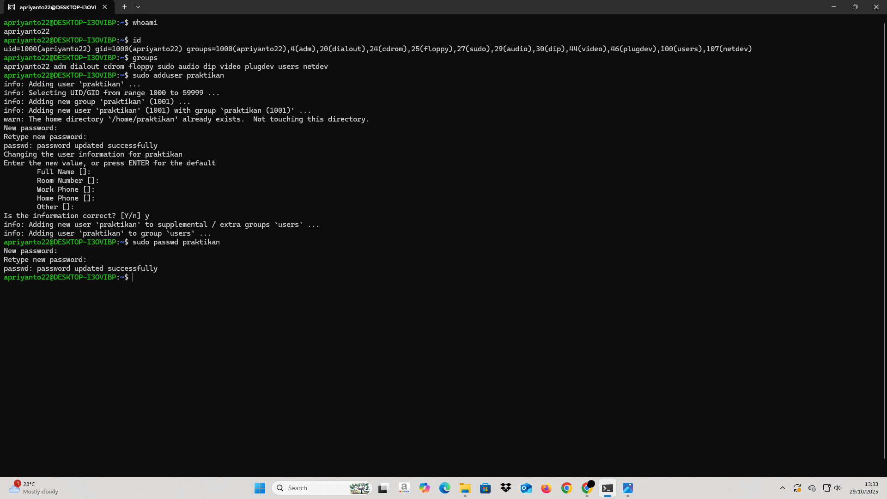
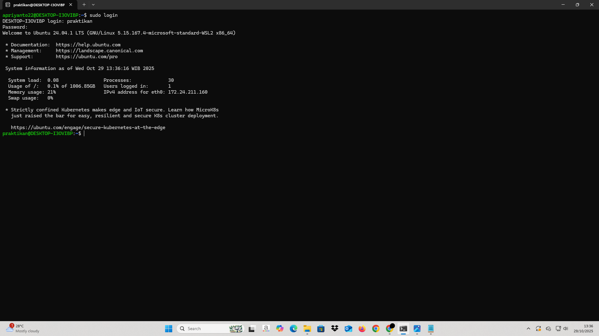
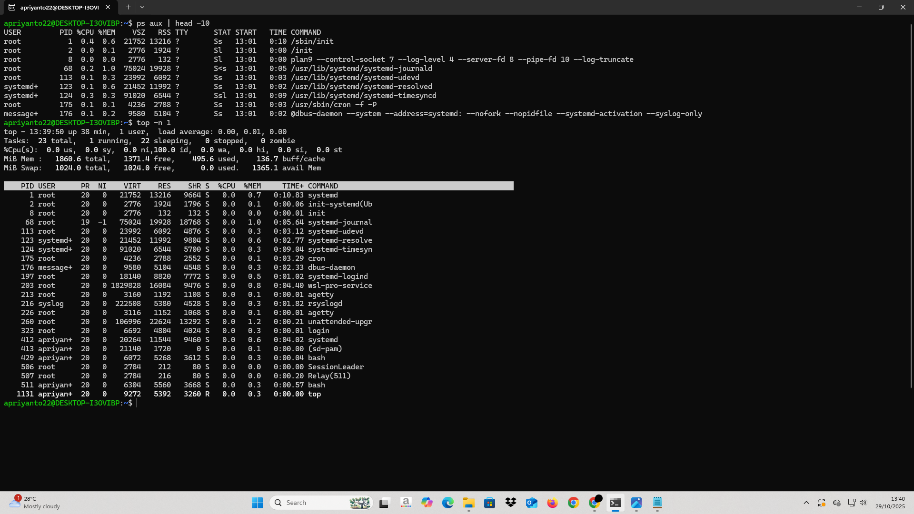
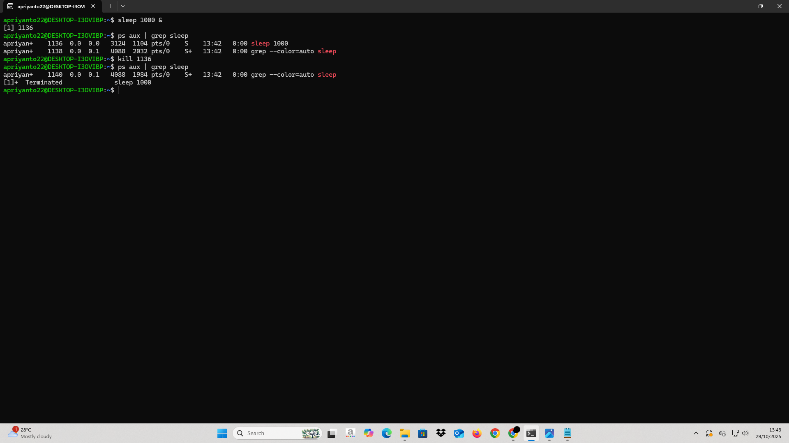
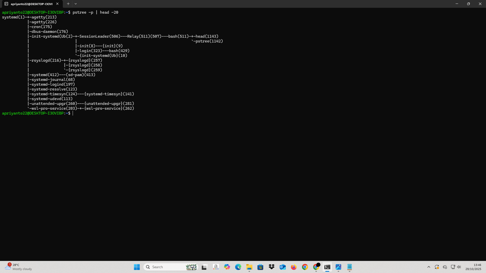

# Laporan Praktikum Minggu 4
Topik:  Manajemen Proses dan User di Linux

---

## Identitas
- **Nama**  : Nanang Apriyanto  
- **NIM**   : 250202957
- **Kelas** : 1IKRA

---

## Tujuan
Tujuan praktikum minggu ini :

> 1. Mahasiswa mampu menjelaskan konsep proses dan user dalam sistem operasi Linux.
> 2. Mahasiswa mampu menampilkan daftar proses yang sedang berjalan dan statusnya.
> 3. Mahasiswa mampu menggunakan perintah untuk membuat dan mengelola user.
> 4. Mahasiswa mampu menghentikan atau mengontrol proses tertentu menggunakan PID.
> 5. Mahasiswa mampu menjelaskan kaitan antara manajemen user dan keamanan sistem.

---

## Dasar Teori
- Proses adalah program yang sedang dijalankan oleh sistem. Setiap proses memiliki ID sendiri (PID), status, dan menggunakan sumber daya seperti memori dan CPU. Sistem operasi bertugas membuat, menjalankan, dan menghentikan proses agar semua tugas di komputer bisa berjalan dengan baik.

- Sistem operasi juga mengatur bagaimana proses berjalan secara bergantian, berkomunikasi, dan bisa dikontrol. Proses dapat berada dalam keadaan berjalan, menunggu, atau sudah berhenti. Untuk melihat dan mengatur proses, dapat digunakan perintah seperti `ps`, `top`, dan `kill`.

- Linux merupakan sistem multiuser, artinya banyak pengguna bisa memakai sistem yang sama. Setiap pengguna memiliki ID dan group tertentu. Pengaturan user dan group dilakukan agar setiap pengguna hanya bisa mengakses file atau sumber daya yang sesuai dengan haknya.

- User root adalah pengguna dengan hak tertinggi. Karena bisa mengubah semua bagian sistem, penggunaan root perlu hati-hati. Linux menggunakan sistem izin atau permission agar keamanan tetap terjaga dan pengguna lain tidak bisa sembarangan mengubah data penting.

- Saat Linux dinyalakan, proses pertama yang dijalankan adalah init atau systemd. Proses ini akan menyalakan layanan lain dan menjadi induk bagi semua proses lainnya. Hubungan antarproses ini bisa dilihat menggunakan perintah pstree.

---

## Langkah Praktikum
1. Langkah-langkah yang dilakukan. 

  1.) Pada praktikum ini saya menggunakan Linux Ubuntu.

  2.) Identitas User
 
   Jalankan perintah berikut:
   ```bash
   whoami
   id
   groups
   ```
  -  Jelaskan setiap output dan fungsinya.
  - Buat user baru (jika memiliki izin sudo):
  ```bash
   sudo adduser praktikan
   sudo passwd praktikan
   ```

   - Uji login ke user baru.

  3.) Monitoring Proses Jalankan:
```bash
ps aux | head -10
top -n 1
```
   - Jelaskan kolom penting seperti PID, USER, %CPU, %MEM, COMMAND.
   - Simpan tangkapan layar top ke:
`praktikum/week4-proses-user/screenshots/top.png`

  4.) Kontrol Proses

- Jalankan program latar belakang:
```bash
sleep 1000 &
ps aux | grep sleep
```
- Catat PID proses sleep.

- Hentikan proses:
`kill <PID>`
- Pastikan proses telah berhenti dengan `ps aux | grep sleep`.

  5.)  Analisis Hierarki Proses Jalankan:
```bash
pstree -p | head -20
```
- Amati hierarki proses dan identifikasi proses induk (init/systemd).
- Catat hasilnya dalam laporan. 

  6.) Kemudian melakukan commit dan push ketika sudah selesai.

2. Perintah yang dijalankan.  
```bash
whoami
id
groups
sudo adduser praktikan
sudo passwd praktikan
sudo login
ps aux | head -10
top -n 1
sleep 1000 &
ps aux | grep sleep
kill <PID>
pstree -p | head -20
   ```
3. File dan kode yang dibuat.  
laporan.md, top.png, Eksperimen_1.png, Eksperimen_1_2.png, Eksperimen_2.png, Eksperimen_3.png, Eksperimen_4.png, Eksperimen_1.txt, Eksperimen_2.txt, Eksperimen_3.txt, Eksperimen_4.txt, top.txt
4. Commit message yang digunakan.

**Minggu 4 - Manajemen Proses & User**

---

## Kode / Perintah
- **Eksperimen 1 – Identitas User**
   ```bash
   whoami
   id
   groups
   sudo adduser praktikan
   sudo passwd praktikan
   ```

- **Eksperimen 2 – Monitoring Proses**
   ```bash
   ps aux | head -10
   top -n 1
   ```
- **Eksperimen 3 – Kontrol Proses**
   ```bash
    sleep 1000 &
    ps aux | grep sleep
    kill 1136
    ps aux | grep sleep
    ```
- **Eksperimen 4 – Analisis Hierarki Proses**
   ```bash
   pstree -p | head -20
   ```
---

## Hasil Eksekusi
Screenshot hasil percobaan :






---
## Analisis Eksperimen
1. **Eksperimen 1 – Identitas User**
```bash
apriyanto22@DESKTOP-I3OVIBP:~$ whoami
apriyanto22
apriyanto22@DESKTOP-I3OVIBP:~$ id
uid=1000(apriyanto22) gid=1000(apriyanto22) groups=1000(apriyanto22),4(adm),20(dialout),24(cdrom),25(floppy),27(sudo),29(audio),30(dip),44(video),46(plugdev),100(users),107(netdev)
apriyanto22@DESKTOP-I3OVIBP:~$ groups
apriyanto22 adm dialout cdrom floppy sudo audio dip video plugdev users netdev
apriyanto22@DESKTOP-I3OVIBP:~$
```
- *Jelaskan setiap output dan fungsinya.*


| Perintah | Output              | Fungsi                                                              | Penjelasan                                                                                                                                                                                                                                                                                   |
| -------- | ------------------- | ------------------------------------------------------------------- | -------------------------------------------------------------------------------------------------------------------------------------------------------------------------------------------------------------------------------------------------------------------------------------------- |
| `whoami`   | `apriyanto22`         | Menampilkan nama user yang sedang aktif login di terminal                 | Menampilkan nama user yang sedang login di komputer. Contoh: hasil perintah `whoami` adalah `apriyanto22`, artinya user aktif di terminal adalah apriyanto22.                                                                                                                                   |
| `id`       | `uid=1000(apriyanto22) gid=1000(apriyanto22) groups=1000(apriyanto22),4(adm),20(dialout), 24(cdrom),25(floppy),27(sudo),29(audio),30(dip), 44(video),46(plugdev),100(users),107(netdev)  `| Untuk mengetahui nomor ID pengguna, ID grup utama, dan grup-grup yang diikuti.  | Menunjukkan nomor ID user (UID), ID grup utama (GID), serta daftar grup yang diikuti user. Contoh: hasil `id` adalah `uid=1000(apriyanto22) gid=1000(apriyanto22) groups=1000(apriyanto22),4(adm),20(dialout),...`, artinya user ini termasuk beberapa grup yang memberi hak akses tertentu. |
| `groups`   | `apriyanto22 adm dialout cdrom floppy sudo audio dip video plugdev users netdev` | Untuk mengetahui semua grup yang diikuti pengguna dan hak akses yang dimiliki tiap grup. | Menampilkan semua grup tempat user termasuk. Contoh: hasil `groups` adalah `apriyanto22 adm sudo audio ...`, artinya user ini memiliki hak akses tambahan melalui grup-grup tersebut.                                                                                                        |

2. **Eksperimen 2 – Monitoring Proses**
- *Jelaskan kolom penting seperti PID, USER, %CPU, %MEM, COMMAND.*


| Kolom       | Penjelasan                                                                                                                                         |
| ----------- | -------------------------------------------------------------------------------------------------------------------------------------------------- |
| **USER**    | Nama pengguna yang menjalankan proses. seperti `root` (admin) atau akun pengguna biasa. Menunjukkan siapa yang memulai proses tersebut.               |
| **PID**     | Nomor unik untuk setiap proses. Digunakan sistem untuk membedakan setiap proses dan bisa dipakai untuk memantau atau menghentikan proses tertentu. |
| **%CPU**    | Persentase penggunaan prosesor oleh proses. Angka ini menunjukkan seberapa banyak proses memakai daya CPU saat ini.                                |
| **%MEM**    | Persentase penggunaan memori RAM oleh proses . Berguna untuk mengetahui proses mana yang menggunakan banyak memori komputer.                        |
| **VSZ**     | Jumlah total memori virtual yang dialokasikan untuk proses (dalam KB). Menunjukkan berapa banyak memori yang "dicadangkan" proses.                 |
| **RSS**     | Jumlah memori fisik (RAM) yang benar-benar digunakan proses (dalam KB). Menunjukkan seberapa banyak memori nyata yang dipakai.                     |
| **TTY**     | Terminal yang digunakan untuk menjalankan proses. Bisa berupa terminal virtual (`pts/0`) atau tidak terhubung ke terminal (`?`).                   |
| **STAT**    | Status proses saat ini. Misalnya `S` = sedang tidur, `R` = berjalan, `T` = dihentikan, `<` = prioritas tinggi, `+` = proses di foreground.         |
| **START**   | Waktu proses mulai berjalan. Bisa dipakai untuk melihat kapan proses pertama kali dijalankan.                                                      |
| **TIME**    | Total waktu CPU yang digunakan proses sejak dijalankan. Menunjukkan berapa lama proses menggunakan CPU sampai saat ini.                            |
| **COMMAND** | Nama program atau perintah yang dijalankan oleh proses. Bisa berupa aplikasi, service, atau skrip yang berjalan di sistem.                         |

3. **Eksperimen 3 – Kontrol Proses**
```bash 
apriyanto22@DESKTOP-I3OVIBP:~$ sleep 1000 &
[1] 1136
```
PID Proses ada di baris ke 2 pada hasil output tersebut. PID dari proses sleep tersebut adalah **1136**

4. **Eksperimen 4 – Analisis Hierarki Proses**
```bash
systemd(1)-+-agetty(213)
           |-agetty(226)
           |-cron(175)
           |-dbus-daemon(176)
           |-init-systemd(Ub(2)-+-SessionLeader(506)---Relay(511)(507)---bash(511)-+-head(1143)
           |                    |                                                  `-pstree(1142)
           |                    |-init(8)---{init}(9)
           |                    |-login(323)---bash(429)
           |                    `-{init-systemd(Ub}(10)
           |-rsyslogd(216)-+-{rsyslogd}(257)
           |               |-{rsyslogd}(258)
           |               `-{rsyslogd}(259)
           |-systemd(412)---(sd-pam)(413)
           |-systemd-journal(68)
           |-systemd-logind(197)
           |-systemd-resolve(123)
           |-systemd-timesyn(124)---{systemd-timesyn}(141)
           |-systemd-udevd(113)
           |-unattended-upgr(260)---{unattended-upgr}(281)
           `-wsl-pro-service(203)-+-{wsl-pro-service}(262)
```
- *Amati hierarki proses dan identifikasi proses induk (init/systemd).*


| Proses           | PID  | Jenis / Fungsi              | Keterangan / Induk-Proses |
| ---------------- | ---- | --------------------------- | ------------------------- |
| systemd          | 1    | Proses induk utama          | Root dari semua proses    |
| agetty           | 213  | Login terminal              | Anak systemd              |
| agetty           | 226  | Login terminal              | Anak systemd              |
| cron             | 175  | Menjalankan tugas terjadwal | Anak systemd              |
| dbus-daemon      | 176  | Komunikasi antar aplikasi   | Anak systemd              |
| init-systemd(Ub) | 2    | Induk sesi pengguna         | Anak systemd              |
| SessionLeader    | 506  | Sesi pengguna               | Anak init-systemd         |
| bash             | 511  | Shell pengguna              | Anak SessionLeader        |
| head             | 1143 | Perintah shell              | Anak bash                 |
| pstree           | 1142 | Perintah pstree             | Anak bash                 |
| rsyslogd         | 216  | Logging sistem              | Anak systemd              |
| systemd-journal  | 68   | Logging sistem              | Anak systemd              |
| systemd-logind   | 197  | Login manager               | Anak systemd              |
| systemd-resolve  | 123  | Resolver DNS                | Anak systemd              |
| unattended-upgr  | 260  | Update otomatis             | Anak systemd              |
| wsl-pro-service  | 203  | Layanan WSL                 | Anak systemd              |


Dari tabel terlihat bahwa `systemd` adalah proses induk utama, yang memulai semua layanan dan proses lain. Beberapa proses, seperti `agetty`, `cron`, dan `dbus-daemon`, menjadi proses turunan dari systemd, sedangkan sesi pengguna dan perintah terminal berada di bawah `init-systemd` dan `SessionLeader`, menunjukkan hierarki proses. Dengan pengamatan ini, dapat dipahami struktur proses di Linux serta hubungan antarproses, yang penting untuk pengelolaan dan pengendalian proses secara efektif.


---

## Analisis
- Jelaskan makna hasil percobaan.  

--> Eksperimen 1 – Identitas User

Perintah `whoami`, `id`, dan `groups` menunjukkan siapa pengguna yang sedang login, ID dan grup yang dimiliki, serta hak akses yang tersedia. Dengan begitu, bisa diketahui apa saja yang bisa dilakukan oleh setiap pengguna di sistem Linux.

--> Eksperimen 2 – Monitoring Proses

Perintah `ps aux` dan `top` menampilkan daftar program yang sedang berjalan, beserta penggunaan CPU dan memori. Hasil ini membantu melihat seberapa sibuk setiap program dalam menggunakan komputer dan memantau sistem secara real-time.

--> Eksperimen 3 – Kontrol Proses 

Menjalankan program di latar belakang (`sleep 1000 &`) dan menghentikannya (`kill <PID>`) menunjukkan cara menghentikan atau mengatur program tertentu. Hal ini penting agar program yang tidak dibutuhkan tidak membuat sistem menjadi lambat atau bermasalah.

--> Eksperimen 4 – Analisis Hierarki Proses

Perintah `pstree` menampilkan diagram pohon, memperlihatkan proses utama (`systemd`) dan proses-proses yang dijalankannya. Hasil ini membantu memahami bagaimana setiap layanan dan sesi pengguna saling terhubung, sehingga pengelolaan sistem lebih mudah.

- Hubungkan hasil dengan teori (fungsi kernel, system call, arsitektur OS).

Hasil dari percobaan itu jelas menunjukkan cara Linux mengelola pengguna beserta program yang sedang berjalan. Informasi tentang UID, GID, dan grup-grupnya terlihat bagaimana kernel mengawasi hak akses secara ketat. System call juga dipakai untuk mengecek siapa saja yang diizinkan buka file atau jalankan program tertentu. Ketika dipantau program lewat ps dan top, Terlihat bagaimana kernel membagi waktu CPU serta memori ke tiap program. System call seperti fork, exec, dan wait memungkinkan program dibuat, dijalankan, lalu dipantau dengan baik.

Pengendalian program lewat PID serta diagram pohon dari pstree menunjukan hubungan antar program utama dan yang lain-lainnya. Semua itu sesuai arsitektur OS yang menjaga urutan serta keterkaitan program supaya tetap rapi. Kernel pakai system call seperti kill dan getppid buat hentikan atau cek status program. Dengan begitu, sistem bisa tetap stabil, aman, dan jalan tanpa hambatan.

- Apa perbedaan hasil di lingkungan OS berbeda (Linux vs Windows)? 

Di Linux, perintah seperti ps, top, pstree, dan whoami menunjukkan status program, penggunaan sumber daya, serta identitas pengguna, karena Linux memberikan akses langsung ke kernel melalui terminal. Hal ini memungkinkan pengguna melihat apa yang sedang dijalankan program dan bagaimana semuanya saling terkait secara langsung.

Di Windows, sebagian besar pengelolaan program dan layanan dilakukan melalui antarmuka grafis (GUI), sehingga informasi detail seperti system call atau struktur proses biasanya tidak terlihat. Jika mencoba menjalankan perintah Linux dari praktikum di Command Prompt atau PowerShell, misalnya ps, top, atau pstree, biasanya muncul pesan ‘command not recognized’, yang artinya perintah tersebut tidak dikenali karena bukan bagian dari sistem bawaan Windows dan memang khusus untuk Linux. Namun, beberapa perintah sederhana seperti whoami tetap bisa dijalankan di Windows. Karena sistem sudah menyediakan untuk menampilkan nama user yang sedang login, fungsinya sama seperti di Linux untuk perintah whoami.

---

## Kesimpulan
- Proses yang berjalan di Linux dapat dimonitor dan dikendalikan menggunakan perintah seperti ps, top, dan kill, sehingga status dan penggunaan sumber daya dapat diketahui.
- Kemudian melihat “diagram pohon” dengan pstree menunjukkan proses mana yang menjadi induk dan bagaimana proses-proses turunan saling berhubungan dalam sistem, sehingga memudahkan pemahaman tentang struktur dan jalannya proses di Linux.
- Pengendalian proses yang tepat membantu menjaga sistem tetap aman dan berjalan lancar, karena dengan memantau dan menghentikan proses yang tidak perlu, Linux bisa tetap aman dan semua proses berjalan dengan baik.
---
## Tugas & Quiz
### Tugas
1. Dokumentasikan hasil semua perintah dan jelaskan fungsi tiap perintah.

| No | Perintah                 | Output                                                                                                                                                                                 | Fungsi                                                          | Keterangan                                                                                                                                                                                                              |
| -- | ------------------------ | -------------------------------------------------------------------------------------------------------------------------------------------------------------------------------------- | ----------------------------------------------------------------------------- | ------------------------------------------------------------------------------------------------------------------------------------------------------------------------------------------------------ |
| 1  | `whoami`                 | `apriyanto22`                                                                                                                                                                          | Menampilkan nama user yang sedang aktif login di terminal       | Output `apriyanto22` menunjukkan user yang sedang login saat ini. Artinya perintah `whoami` digunakan untuk mengetahui user aktif di terminal.                                                         |
| 2  | `id`                     | `uid=1000(apriyanto22) gid=1000(apriyanto22) groups=1000(apriyanto22),4(adm),20(dialout), 24(cdrom),25(floppy),27(sudo),29(audio),30(dip), 44(video),46(plugdev),100(users),107(netdev)` | Mengetahui ID user, ID grup utama, dan grup-grup yang diikuti   | Output menunjukkan UID (1000), GID (1000), dan daftar semua grup user termasuk `adm`, `sudo`, `video`, dll. Ini berarti user memiliki hak akses tambahan dari grup-grup tersebut.                      |
| 3  | `groups`                 | `apriyanto22 adm dialout cdrom floppy sudo audio dip video plugdev users netdev`                                                                                                       | Mengetahui semua grup yang diikuti user dan hak akses tiap grup | Output menampilkan semua grup tempat user termasuk. Artinya user `apriyanto22` memiliki hak akses tertentu melalui grup-grup tambahan seperti `sudo` untuk admin dan `audio`, `video` untuk perangkat. |
| 4  | `sudo adduser praktikan` | Info proses penambahan user, password dimasukkan, informasi user diisi (untuk hasil bisa dilihat di **Hasil Eksekusi**)                                                                                                                | Membuat user baru di sistem                                     | Output menunjukkan user `praktikan` berhasil dibuat, lengkap dengan folder home dan grup. Perintah ini dipakai untuk menambahkan user baru.                                                            |
| 5  | `sudo passwd praktikan`  | `passwd: password updated successfully`                                                                                                                                                | Membuat atau mengubah password user                             | Output menunjukkan password user berhasil diubah. Artinya user `praktikan` sekarang bisa login.                                                                                                        |
| 6  | `sudo login`             | Untuk hasil bisa dilihat di **Hasil Eksekusi**                                                                                                                                 | Login sebagai user lain                                         | Output menunjukkan login berhasil. Perintah ini membuka sesi terminal baru untuk user `praktikan`.                                                                                                     |
| 7  | `ps aux ... head -10`      | Daftar 10 proses pertama aktif, termasuk PID, CPU, MEM, COMMAND ( Untuk hasil bisa dilihat di **Hasil Eksekusi**)                                                                                                                | Melihat proses yang sedang berjalan                             | Output menunjukkan 10 proses pertama beserta PID, user, penggunaan CPU dan memori. Perintah ini berguna untuk memantau proses aktif di sistem.                                                         |
| 8  | `top -n 1`               | Snapshot proses dengan PID, USER, CPU, MEM, COMMAND (Untuk hasil bisa dilihat di **Hasil Eksekusi**)                                                                                                                                   | Melihat penggunaan CPU dan memori secara cepat                  | Output menunjukkan kondisi sistem saat itu, termasuk CPU, RAM, dan daftar proses yang berjalan.                                                                                                        |
| 9  | `sleep 1000 &`           | `[1] 1136`                                                                                                                                                                             | Menjalankan proses di latar belakang                            | Output `[1] 1136` artinya job nomor `[1]` dengan PID `1136` berjalan di background. Terminal tetap bisa dipakai untuk perintah lain.                                                                   |
| 10 | `ps aux ... grep sleep`    | `apriyan+ 1136 0.0 0.0 3124 1104 pts/0 S 13:42 0:00 sleep 1000`                                                                                                                        | Mencari proses tertentu                                         | Output menunjukkan user, PID, CPU, memori, dan perintah `sleep 1000` yang sedang berjalan. Perintah ini membantu menemukan proses tertentu di sistem.                                                  |
| 11 | `kill 1136`              | -                                                                                                                                                           | Menghentikan proses                                             | Output menunjukkan proses dengan PID 1136 berhasil dihentikan. Artinya perintah `kill` digunakan untuk menghentikan proses tertentu.                                                                   |
| 12 | `pstree -p ... head -20`   | Struktur pohon proses dengan PID (systemd, bash, agetty, dll.) (Untuk hasil bisa diliat di **Hasil Eksekusi**)                                                                                                                        | Melihat struktur proses                                         | Output memperlihatkan proses yang saling terkait beserta proses PID-nya. Perintah ini berguna untuk memahami bagaimana proses berhubungan satu sama lain.                                                      |


2. Gambarkan hierarki proses dalam bentuk diagram pohon (`pstree`) di laporan.
```bash
systemd(1)-+-agetty(213)
           |-agetty(226)
           |-cron(175)
           |-dbus-daemon(176)
           |-init-systemd(Ub(2)-+-SessionLeader(506)---Relay(511)(507)---bash(511)-+-head(1143)
           |                    |                                                  `-pstree(1142)
           |                    |-init(8)---{init}(9)
           |                    |-login(323)---bash(429)
           |                    `-{init-systemd(Ub}(10)
           |-rsyslogd(216)-+-{rsyslogd}(257)
           |               |-{rsyslogd}(258)
           |               `-{rsyslogd}(259)
           |-systemd(412)---(sd-pam)(413)
           |-systemd-journal(68)
           |-systemd-logind(197)
           |-systemd-resolve(123)
           |-systemd-timesyn(124)---{systemd-timesyn}(141)
           |-systemd-udevd(113)
           |-unattended-upgr(260)---{unattended-upgr}(281)
           `-wsl-pro-service(203)-+-{wsl-pro-service}(262)  
```
3. Jelaskan hubungan antara user management dan keamanan sistem Linux.

**Jawaban:**

User management penting untuk menjaga keamanan sistem. Karena setiap orang yang pakai Linux punya hak akses berbeda - beda, seperti untuk file, folder, dan program. Dengan mengatur siapa saja yang bisa mengakses seperti file, dst, pengguna bisa mencegah kerusakan atau salah penggunaan, misalnya user biasa tidak bisa mengubah file penting karena cuma root yang punya hak itu. Aturannya juga membantu mencegah kesalahan yang bisa membuat sistem bermasalah. Kemudian, pengaturan user memudahkan pelacakan aktivitas pengguna dan memakai group atau password yang kuat, sehingga sistem lebih terjaga dan aman dari akses yang tidak diinginkan. Jadi, hubungan antara user management dan keamanan sistem Linux adalah memastikan setiap pengguna cuma bisa mengakses hal yang mereka butuhkan, agar sistem tetap aman dan terkontrol.

### Quiz
1. Apa fungsi dari proses init atau systemd dalam sistem Linux?

**Jawaban:** 

--> **Menyalakan sistem saat komputer hidup**, supaya Linux bisa mulai bekerja.

--> **Menjalankan layanan penting**, seperti internet, tampilan, dan login.

--> **Mengatur jalannya proses saat mulai dan dimatikan**, agar semua berjalan teratur.

--> **Menjadi induk semua program**, semua aplikasi yang berjalan berasal darinya.

--> **Mengawasi program dan layanan**, memastikan semuanya tetap berjalan dengan baik.

2. Apa perbedaan antara kill dan killall?

**Jawaban:** Perbedaan antara perintah kill dan killall ada di cara kedua perintah tersebut menghentikan proses pada sistem Linux. Perintah kill khusus untuk menghentikan proses berdasarkan PID atau Process ID, contoh `kill 1136`. Jadi, cuma proses itu aja yang berhenti, dan tidak mempengaruhi proses yang lain. Sementara killall bisa langsung hentikan semua proses yang namanya sama, tanpa harus mengetahui nomor ID-nya dulu, contoh `killall cupsd`. Kalau pengguna cuma mau menghentikan satu proses tertentu, kill jadi pilihan yang pas. Tapi kalau banyak proses sejenis yang perlu dimatikan sekaligus, killall jelas lebih efisien dan cepat. Namun, pengguna harus hati-hati menggunakannya supaya tidak mematikan proses lain yang kebetulan punya nama serupa.


3. Mengapa user root memiliki hak istimewa di sistem Linux?

**Jawaban:**  User root memiliki hak istimewa di sistem Linux karena user root jadi administrator utama **(superuser)** yang ngatur segala hal di sistem. Root bisa akses semuanya, mulai dari baca, ubah, sampai hapus file apa pun, bahkan mengatur pengguna lain dan mengatur konfigurasi sistem. Hak-hak itu diberikan agar root bisa menangani masalah dan menjaga kestabilan sistem. Jadi, user root dapat hak istimewa karena memang diperlukan untuk kelola dan kendalikan seluruh sistem Linux.


---

## Refleksi Diri
Tuliskan secara singkat:
- Apa bagian yang paling menantang minggu ini?  Pada pstree, saat saya mencoba menjalankan perintah tersebut, terjadi kesalahan.
- Bagaimana cara Anda mengatasinya?  Menggunakan perangkat lain pada saat melakukan praktik. Kemudian mengulang lagi perintah yang dijalankan sampai jadi.

---

## Referensi
1. Abraham Silberschatz, Peter Baer Galvin, Greg Gagne. Operating System Concepts, 10th Edition, Wiley, 2018.
2. Andrew S. Tanenbaum, Herbert Bos. Modern Operating Systems, 4th Edition, Pearson, 2015.
3. Linux Manual Pages (man ps, man top, man kill, man adduser).
4. OSTEP – Operating Systems: Three Easy Pieces, 2018.

---

**Credit:**  
_Template laporan praktikum Sistem Operasi (SO-202501) – Universitas Putra Bangsa_
