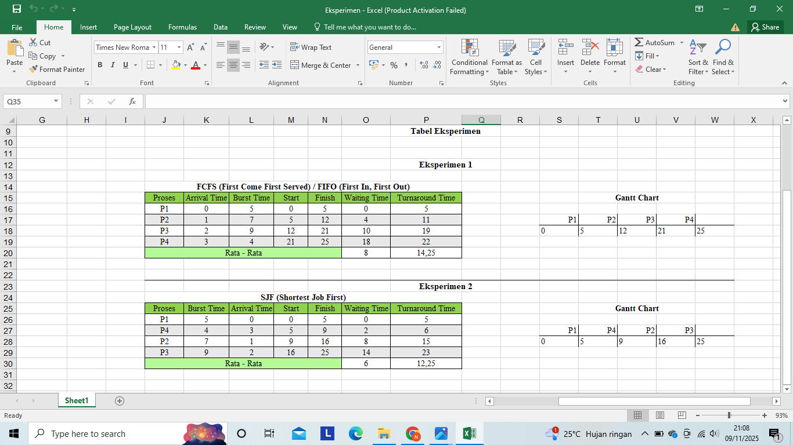
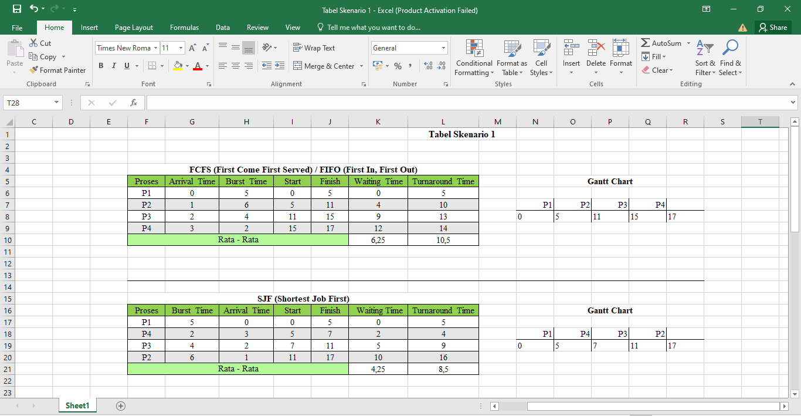
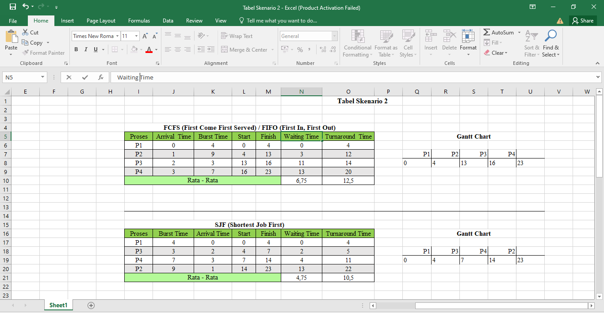

# Laporan Praktikum Minggu 5
Topik: Penjadwalan CPU – FCFS dan SJF

---

## Identitas
- **Nama**  : Nanang Apriyanto  
- **NIM**   : 250202957 
- **Kelas** : 1IKRA

---

## Tujuan
Tujuan praktikum minggu ini.  
  
> 1. Mahasiswa mampu menghitung waiting time dan turnaround time untuk algoritma FCFS dan SJF.
> 2. Mahasiswa mampu menyajikan hasil perhitungan dalam tabel yang rapi dan mudah dibaca.
> 3. Mahasiswa mampu membandingkan performa FCFS dan SJF berdasarkan hasil analisis.
> 4. Mahasiswa mampu menjelaskan kelebihan dan kekurangan masing-masing algoritma.
> 5. Mahasiswa mampu menyimpulkan kapan algoritma FCFS atau SJF lebih sesuai digunakan.


---

## Dasar Teori
- Penjadwalan CPU adalah cara sistem operasi mengatur urutan proses yang akan dijalankan oleh prosesor supaya semua proses bisa mendapat giliran dengan adil dan sistem berjalan lancar. Tujuan utamanya agar CPU selalu digunakan dengan baik dan waktu tunggu setiap proses bisa dikurangi.

- Algoritma FCFS (First Come, First Served) bekerja seperti sistem antrian di loket proses yang datang lebih dulu akan dikerjakan lebih dulu juga. Metode ini sangat sederhana dan mudah diterapkan, tetapi bisa menyebabkan proses lain menunggu lama kalau ada proses dengan waktu eksekusi yang panjang.

- Algoritma SJF (Shortest Job First) menjalankan proses yang punya waktu kerja paling singkat terlebih dahulu. Dengan cara ini, rata-rata waktu tunggu bisa menjadi lebih cepat. Namun, sistem perlu tahu atau memperkirakan berapa lama proses akan berjalan, dan hal ini tidak selalu mudah dilakukan.

- Dua hal penting untuk menilai apakah penjadwalan CPU sudah efisien adalah waiting time (waktu tunggu) dan turnaround time (waktu penyelesaian). Waktu tunggu adalah berapa lama proses menunggu di antrian sebelum dijalankan, sedangkan waktu penyelesaian adalah total waktu dari proses mulai masuk sampai selesai dikerjakan.

- Secara umum, FCFS cocok untuk sistem yang sederhana dan stabil, sedangkan SJF lebih bagus digunakan kalau proses-proses yang dijalankan punya waktu kerja yang bisa diprediksi. Pemilihan algoritma tergantung pada kebutuhan sistem, apakah lebih butuh cara yang sederhana, efisien, atau cepat rata-ratanya.

---

## Langkah Praktikum
1. Langkah-langkah yang dilakukan. 

1.) Buka Aplikasi Excel/Google Sheets untuk membuat perhitungan otomatis.

2.) **Siapkan Data Proses**
   Gunakan tabel proses berikut sebagai contoh (boleh dimodifikasi dengan data baru):
   | Proses | Burst Time | Arrival Time |
   |:--:|:--:|:--:|
   | P1 | 5 | 0 |
   | P2 | 7 | 1 |
   | P3 | 9 | 2 |
   | P4 | 4 | 3 |

3.) **Eksperimen 1 – FCFS (First Come First Served)**
   - Urutkan proses berdasarkan *Arrival Time*.  
   - Hitung nilai berikut untuk tiap proses:
     ```
     Waiting Time (WT) = waktu mulai eksekusi - Arrival Time
     Turnaround Time (TAT) = WT + Burst Time
     ```
   - Hitung rata-rata Waiting Time dan Turnaround Time.  
   - Buat Gantt Chart sederhana.
     
4.) **Eksperimen 2 – SJF (Shortest Job First)**
   - Urutkan proses berdasarkan *Burst Time* terpendek (dengan memperhatikan waktu kedatangan).  
   - Lakukan perhitungan WT dan TAT seperti langkah sebelumnya.  
   - Bandingkan hasil FCFS dan SJF pada tabel.

5.) Screenshot hasil perhitungan dan simpan di:
  ```bash
  praktikum/week5-scheduling-fcfs-sjf/screenshots/
  ```
6.) Kemudian melakukan commit dan push ketika sudah selesai.

2. Perintah yang dijalankan.
   ```bash
   Waiting Time (WT) = waktu mulai eksekusi (Start) - Arrival Time
   Turnaround Time (TAT) = Waiting Time (WT) + Burst Time
   Rata-rata Waiting Time = Total Waiting Time
                            ___________________
                               Jumlah Proses
   Rata-rata Turnaround Time = Total Turnaround Time
                               ______________________
                                  Jumlah Proses
   ```
3. File dan kode yang dibuat. 

laporan.md,
Tabel-Eksperimen.png,
Tabel_Skenario-1.png,
Tabel_Skenario-2.png

4. Commit message yang digunakan -> **Minggu 5 - CPU Scheduling FCFS & SJF**

---

## Kode / Perintah

 ```bash
   Waiting Time (WT) = waktu mulai eksekusi (Start) - Arrival Time
   Turnaround Time (TAT) = Waiting Time (WT) + Burst Time
   Rata-rata Waiting Time = Total Waiting Time
                            ___________________
                               Jumlah Proses
   Rata-rata Turnaround Time = Total Turnaround Time
                               ______________________
                                   Jumlah Proses
   ```

---

## Hasil Eksekusi





---
## Analisis Eksperimen
 1. Eksperimen 1 – FCFS (First Come First Served)
  - Urutkan proses berdasarkan *Arrival time*. 
  - Hitung nilai Waiting Time (WT), dan Turnaround Time (TAT) untuk tiap proses serta hitung rata-rata Waiting Time dan Turnaround Time.
    
  | Proses | Arrival Time | Burst Time | Start | Finish | Waiting Time | Turnaround Time |
   |:---:|:--:|:--:|:--:|:--:|:--:|:--:|
   | P1 | 0 | 5 | 0 | 5 | 0 | 5 |
   | P2 | 1 | 7 | 5 | 12 | 4 | 11 |
   | P3 | 2 | 9 | 12 | 21 | 10 | 19 |
   | P4 | 3 | 4 | 21 | 25 | 18 | 22 |
   |**Rata - rata** |  | | | | 8|14,25 |

   - Gantt Chart sederhana:  
     ```
     | P1 | P2 | P3 | P4 |
     0    5    12   21   25
     ```
 2. Eksperimen 2 – SJF (Shortest Job First)
   - Urutkan proses berdasarkan *Burst Time* terpendek (dengan memperhatikan waktu kedatangan).  
   - Lakukan perhitungan WT dan TAT seperti langkah sebelumnya.

   | Proses | Burst Time | Arrival Time | Start | Finish | Waiting Time | Turnaround Time |
   |:---:|:--:|:--:|:--:|:--:|:--:|:--:|
   | P1 | 5 | 0 | 0 | 5 | 0 | 5 |
   | P4 | 4 | 3 | 5 | 9 | 2 | 6 |
   | P2 | 7 | 1 | 9 | 16 | 8 | 15 |
   | P3 | 9 | 2 | 16 | 25 | 14 | 23 |
   |**Rata - rata** |  | | | | 6|12,25 |
   
   - Gantt Chart sederhana:  
     ```
     | P1 | P4 | P2 | P3 |
     0    5    9   16   25
     ```
   - Tabel perbandingkan hasil FCFS dan SJF

     | Algoritma | Avg Waiting Time | Avg Turnaround Time | Kelebihan | Kekurangan |
     |------------|------------------|----------------------|------------|-------------|
     | FCFS | 8 | 14,25 | Sederhana dan mudah diterapkan | Tidak efisien untuk proses panjang |
     | SJF | 6 | 12,25 | Optimal untuk job pendek | Menyebabkan *starvation* pada job panjang |

---
## **Analisis**
   - Bandingkan hasil rata-rata WT dan TAT antara FCFS & SJF.

   Dari hasil perhitungan dapat dilihat bahwa:

   -> **Rata-rata Waiting Time (WT)** pada algoritma SJF yaitu **6**  lebih kecil dibandingkan FCFS yaitu **8**.

   -> **Rata-rata Turnaround Time (TAT)** pada SJF yaitu **12,25** juga lebih rendah dibandingkan FCFS yaitu **14,25**.  

   Hal ini menunjukkan bahwa SJF lebih efisien dibandingkan FCFS, karena mampu menyelesaikan proses dengan waktu rata-rata yang lebih cepat.
   
   - Jelaskan kondisi kapan SJF lebih unggul dari FCFS dan sebaliknya. 

   **SJF (Shortest Job First)** lebih unggul saat proses memiliki waktu kerja yang berbeda-beda, algoritma ini memilih proses dengan waktu kerja paling pendek untuk dijalankan lebih dulu. Metode ini lebih efisien saat proses memiliki lama kerja yang berbeda-beda, karena proses cepat bisa langsung diselesaikan tanpa harus menunggu proses panjang. Dengan cara ini, waktu tunggu rata-rata semua proses menjadi lebih pendek, dan sistem terasa lebih cepat serta efisien. Contohnya di tabel yang saya buat pada **P4**, begitu P1 selesai, CPU “memeriksa” semua proses yang sudah tiba (ready queue) pada saat itu. Dari proses yang tersedia (P2, P3, P4), P4 kebetulan memiliki burst time paling pendek (4 unit). Maka SJF memilih P4 untuk dijalankan terlebih dahulu, meskipun P4 datang belakangan dibanding P2 atau P3. Sedangkan pada FCFS harus menunggu P1,P2,P3 selesai terlebih dahulu sebelum menjalankan P4. Jadi P4 harus menunggu lebih lama. Jenis penjadwalan ini cocok digunakan pada sistem yang sudah mengetahui lama waktu eksekusi setiap prosesnya, Misalnya di pemrosesan data otomatis atau batch scheduling yang durasi tugas bisa diprediksi sejak awal.

   Sedangkan **FCFS (First Come First Served)** lebih unggul digunakan saat proses memiliki waktu kerja yang hampir sama. Algoritma penjadwalan ini mengeksekusi proses berdasarkan urutan kedatangannya, siapa datang lebih dulu, dia yang dijalankan lebih dulu. Ini ideal saat durasi proses hampir seragam. Urutan kedatangan tidak terlalu berpengaruh ke hasil akhir. FCFS dianggap adil dan mudah diterapkan, contohnya **P2** dengan (burst 7, arrival 1) dijalankan segera setelah P1 selesai, tidak tertunda oleh proses pendek seperti P4 dengan (burst 4, arrival 3). Sedangkan pada SJF, jika ada proses pendek lain yang sudah tiba saat P1 selesai seperti P4, P2 harus menunggu lebih lama. Jenis penjadwalan ini biasanya digunakan pada sistem yang sederhana atau tidak membutuhkan respon cepat, Seperti mesin fotokopi yang mencetak dokumen sesuai urutan permintaan pengguna.


 - **Jadi kesimpulannya**, Pemilihan algoritma tergantung pada situasi dan kebutuhan sistem. Kedua algorima tersebut memiliki kelebihan dan kekurangan masing-masing.  SJF lebih bagus dipakai kalau waktu kerja tiap proses berbeda, karena proses yang cepat bisa langsung dijalankan duluan sehingga semuanya selesai lebih cepat, Namun proses yang durasinya lebih lama bisa tertunda kalau ada proses yang lebih cepat. Sedangkan FCFS lebih cocok kalau semua proses butuh waktu yang hampir sama, karena cara kerjanya simpel dan adil, walau bisa jadi lambat kalau ada proses yang lama di awal antrean.
   
---

## Kesimpulan
- Dari praktikum ini terlihat bahwa SJF (Shortest Job First) lebih efisien karena memproses tugas pendek lebih dulu, sehingga rata-rata waktu tunggu dan penyelesaian lebih rendah, walaupun tugas panjang bisa menunggu lama.

- FCFS (First Come First Served) lebih sederhana dan adil karena memproses sesuai urutan datang, tetapi bisa lambat jika ada tugas panjang di awal antrian.

- Pilihan algoritma sebaiknya disesuaikan dengan kebutuhan sistem: SJF cocok untuk tugas yang waktunya sudah bisa diprediksi, sedangkan FCFS cocok untuk sistem sederhana yang tidak memerlukan respon cepat.

---
## Tugas & Quiz
### Tugas
1. Hitung *waiting time* dan *turnaround time* dari minimal 2 skenario FCFS dan SJF.  
- Tabel Skenario 1

--> FCFS (First Come First Served) / FIFO (First In, First Out)						
| Proses | Arrival Time | Burst Time| Start | Finish | Waiting Time | Turnaround Time |
   |:---:|:--:|:--:|:--:|:--:|:--:|:--:|
   | P1 | 0 | 5 | 0 | 5 | 0 | 5 |
   | P2 | 1 | 6 | 5 | 11 | 4 | 10 |
   | P3 | 2 | 4 | 11 | 15 | 9 | 13 |
   | P4 | 3 | 2 | 15 | 17 | 12 | 14 |
   |**Rata - rata** |  | | | | 6,25 |10,5 | 

--> SJF (Shortest Job First)						
| Proses | Burst Time | Arrival Time | Start | Finish | Waiting Time | Turnaround Time |
   |:---:|:--:|:--:|:--:|:--:|:--:|:--:|
   | P1 | 5 | 0 | 0 | 5 | 0 | 5 |
   | P4 | 2 | 3 | 5 | 7 | 2 | 4 |
   | P3 | 4 | 2 | 7 | 11 | 5 | 9 |
   | P2 | 6 | 1 | 11 | 17 | 10 | 16 |
   |**Rata - rata** |  | | | | 4,25 | 8,5 | 

- Tabel Skenario 2

--> FCFS (First Come First Served) / FIFO (First In, First Out)
| Proses | Arrival Time | Burst Time | Start | Finish | Waiting Time | Turnaround Time |
   |:---:|:--:|:--:|:--:|:--:|:--:|:--:|
   | P1 | 0 | 4 | 0 | 4 | 0 | 4 |
   | P2 | 1 | 9 | 4 | 13 | 3 | 12 |
   | P3 | 2 | 3 | 13 | 16 | 11 | 14 |
   | P4 | 3 | 7 | 16 | 23 | 13 | 20 |
   |**Rata - rata** |  | | | | 6,75 | 12,5 | 

--> SJF (Shortest Job First)			

| Proses | Burst Time | Arrival Time | Start | Finish | Waiting Time | Turnaround Time |
   |:---:|:--:|:--:|:--:|:--:|:--:|:--:|
   | P1 | 4 | 0 | 0 | 4 | 0 | 4 |
   | P3 | 3 | 2 | 4 | 7 | 2 | 5 |
   | P4 | 7 | 3 | 7 | 14 | 4 | 11 |
   | P2 | 9 | 1 | 14 | 23 | 13 | 22 |
   |**Rata - rata** |  | | | | 4,75 | 10,5 | 

2. Sajikan hasil perhitungan dalam tabel perbandingan (FCFS vs SJF).  

--> **Tabel Perbandingan FCFS vs SJF**

|  **Skenario**  | **Algoritma** | **Rata-rata Waiting Time** | **Rata-rata Turnaround Time** | **Keterangan**                                                                                                 |
| :------------: | :-----------: | :------------------------: | :---------------------------: | :-------------------------------------------------------------------------------------------------------------------------------- |
| **1** |    **FCFS**   |            6,25            |              10,5             | Proses dikerjakan sesuai urutan datangnya. Karena ada proses yang butuh waktu lama di awal, proses lain jadi menunggu lebih lama. |
|                |    **SJF**    |            4,25            |              8,5              | Proses yang waktunya paling cepat dikerjakan lebih dulu, jadi waktu tunggu dan waktu selesainya lebih singkat.                    |
| **2** |    **FCFS**   |            6,75            |              12,5             | Proses dijalankan berdasarkan siapa yang datang duluan. Akibatnya, kalau proses panjang datang dulu, proses lain ikut tertunda.   |
|                |    **SJF**    |            4,75            |              10,5             | Proses dengan waktu paling pendek diprioritaskan, jadi rata-rata waktu tunggu dan selesai jadi lebih cepat.                       |


| **Aspek**                     | **FCFS (First Come First Served)**                                                   | **SJF (Shortest Job First)**                                                  |
| :---------------------------- | :----------------------------------------------------------------------------------- | :---------------------------------------------------------------------------- |
| **Cara Kerja**                | Menjalankan proses sesuai urutan datangnya, seperti sistem antrian.                  | Menjalankan proses yang punya waktu paling cepat terlebih dahulu.             |
| **Kecepatan**                 | Bisa lambat kalau proses pertama memiliki waktu eksekusi lama.                       | Lebih cepat karena proses yang singkat dikerjakan duluan.                     |
| **Hasil dari Kedua Skenario** | Rata-rata waktu tunggu dan penyelesaian lebih tinggi.                                | Rata-rata waktu tunggu dan penyelesaian lebih rendah.                         |
| **Kesimpulan**          | FCFS cocok untuk sistem yang sederhana dan tidak terlalu mementingkan kecepatan.     | SJF lebih efisien dan cocok jika ingin mempercepat waktu penyelesaian proses. |

3. Analisis kelebihan dan kelemahan tiap algoritma.  

| Algoritma                           | Kelebihan                                                                                                                                                                | Kekurangan                                                                                                                                                                                              |
| ----------------------------------- | ------------------------------------------------------------------------------------------------------------------------------------------------------------------------ | ------------------------------------------------------------------------------------------------------------------------------------------------------------------------------------------------------- |
| **FCFS (First Come First Served)** | - Sederhana dan mudah digunakan.<br>- Proses dijalankan sesuai urutan datang, sehingga semua mendapat giliran secara adil.<br>- Cocok untuk pekerjaan yang jarang butuh respon cepat.                         | - Proses yang spendek bisa lama menunggu kalau ada proses yang panjang di depan. <br>- Kurang efisien kalau banyak proses dijalankan bersamaan.<br>- Tidak cocok untuk sistem yang butuh respon cepat. |
| **SJF (Shortest Job First)**        | - Proses selesai lebih cepat secara rata-rata.<br>- Bisa menyelesaikan lebih banyak proses dalam waktu yang sama.<br>- Cocok kalau pengguna tahu perkiraan waktu setiap proses. | - Proses yang lama bisa terus menunggu jika banyak proses pendek datang.<br>- Sulit diterapkan karena perlu perkiraan waktu eksekusi.<br>- Kurang adil untuk proses yang butuh waktu lama.                 |


### Quiz
1. Apa perbedaan utama antara FCFS dan SJF?  
**Jawaban:**

Perbedaan utama antara FCFS dan SJF terletak pada cara penjadwalannya. FCFS (First Come First Served)  jalankan proses berdasarkan urutan saat mereka datang. Itu mirip dengan antrian biasa di kehidupan sehari-hari, sederhana dan mudah diterapkan. Tapi, bisa jadi kurang efisien kalau proses yang panjang  datang lebih awal. Sedangkan SJF (Shortest Job First) mengeksekusi proses dengan durasi paling pendek terlebih dahulu, sehingga proses pendek bisa selesai lebih cepat. Penggunaan CPU juga terasa lebih efisien secara keseluruhan. Meski begitu, proses yang panjang harus menunggu lebih lama lagi walaupun proses tersebut datang lebih awal.

2. Mengapa SJF dapat menghasilkan rata-rata waktu tunggu minimum?  
**Jawaban:**

Sistem ini selalu memprioritaskan proses yang sedikit paling cepat dulu. Jadi, proses kecil tidak harus menunggu lama sampai proses besar itu selesai terlebih dahulu.

Dengan cara begitu, antrian menjadi lebih lancar bergerak maju. Proses-proses lain pun bisa segera dijalankan tanpa hambatan berlebih. Intinya, karena yang cepat dikerjakan lebih awal, proses kecil tidak lagi terjebak menunggu di belakang yang besar. Akibatnya, dapat menghasilkan rata-rata waktu tunggu minimum.

3. Apa kelemahan SJF jika diterapkan pada sistem interaktif? 

**Jawaban:**
- Sulit menebak berapa lama proses akan berjalan, karena SJF perlu tahu lama durasi sebuah proses itu, untuk menentukan urutan eksekusinya. Di penggunaan sebenarnya, hal seperti ini memang susah dilakukan. Apalagi di sistem interaktif, di mana durasi proses sangat bergantung pada cara pengguna menggunakan sistem.

- Kurang cocok untuk sistem yang sering berubah, karena algoritma ini hanya bekerja optimal kalau semua proses dan durasinya sudah jelas dari awal. Saat proses datang secara terus-menerus, urutan eksekusinya bisa jadi berantakan.

- Proses besar bisa tertunda terlalu lama, karena  SJF selalu memprioritaskan proses yang durasinya lebih pendek. Kalau proses kecil terus berdatangan, proses besar bisa tertunda cukup lama.

---

## Refleksi Diri
Tuliskan secara singkat:
- Apa bagian yang paling menantang minggu ini?  Pada saat memahami materi tentang algoritma FCFS dan SJF. 
- Bagaimana cara Anda mengatasinya?  Mencari materi yang ingin di pelajari di google dan youtube serta sumber sumber yang terkait.

---

## Referensi
1. Abraham Silberschatz, Peter Baer Galvin, Greg Gagne. *Operating System Concepts*, 10th Edition, Wiley, 2018.  
2. Andrew S. Tanenbaum, Herbert Bos. *Modern Operating Systems*, 4th Edition, Pearson, 2015.  
3. OSTEP – *Operating Systems: Three Easy Pieces*, 2018.  
4. Linux Manual Pages – *Scheduling & Process Control*.  

---

**Credit:**  
_Template laporan praktikum Sistem Operasi (SO-202501) – Universitas Putra Bangsa_
