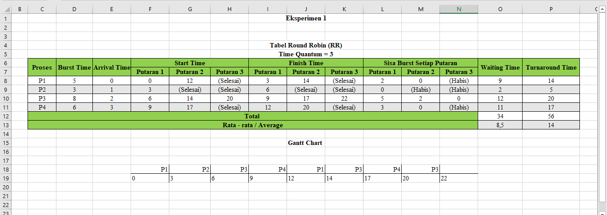
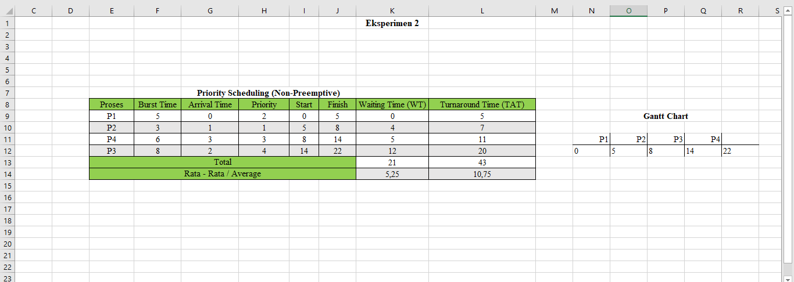
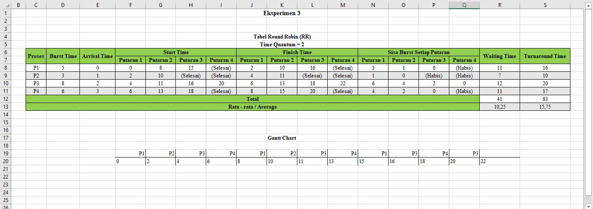
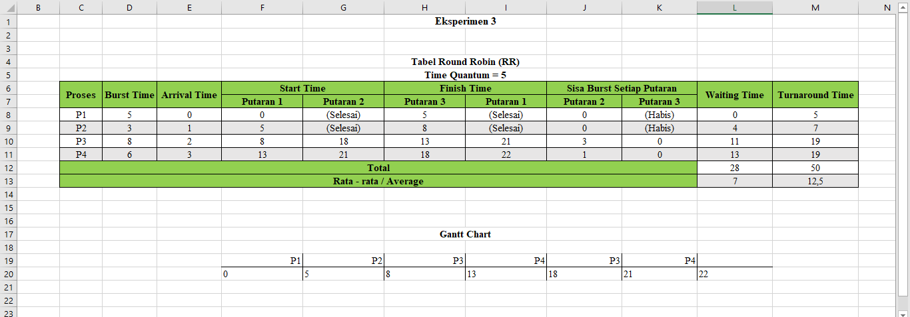

# Laporan Praktikum Minggu 6
Topik: Penjadwalan CPU – Round Robin (RR) dan Priority Scheduling

---

## Identitas
- **Nama**  : Nanang Apriyanto 
- **NIM**   : 250202957 
- **Kelas** : 1IKRA

---

## Tujuan
Setelah menyelesaikan tugas ini:

> 1. Mahasiswa mampu menghitung waiting time dan turnaround time pada algoritma RR dan Priority.
> 2. Mahasiswa mampu menyusun tabel hasil perhitungan dengan benar dan sistematis.
> 3. Mahasiswa mampu membandingkan performa algoritma RR dan Priority.
> 4. Mahasiswa mampu menjelaskan pengaruh time quantum dan prioritas terhadap keadilan eksekusi proses.
> 5. Mahasiswa mampu menarik kesimpulan mengenai efisiensi dan keadilan kedua algoritma.

---

## Dasar Teori
   1. Penjadwalan CPU adalah mekanisme sistem operasi yang menentukan urutan proses yang akan dijalankan oleh CPU agar penggunaan sumber daya menjadi efisien dan adil.

   2. Algoritma Round Robin (RR) memberikan waktu eksekusi (time quantum) yang sama kepada setiap proses secara bergantian. Jika waktu habis dan proses belum selesai, proses tersebut akan kembali ke antrian untuk menunggu giliran berikutnya.

   3. Algoritma Priority Scheduling mengeksekusi proses berdasarkan tingkat prioritasnya. Proses dengan prioritas lebih tinggi akan dijalankan terlebih dahulu dibandingkan proses dengan prioritas rendah.

   4. Ukuran time quantum berpengaruh terhadap kinerja sistem. Jika terlalu kecil, sistem sering berpindah proses sehingga tidak efisien; jika terlalu besar, proses lain akan menunggu terlalu lama.

   5. Kelemahan Priority Scheduling adalah bisa menyebabkan starvation, yaitu ketika proses dengan prioritas rendah terus tertunda karena selalu kalah dengan proses berprioritas tinggi.

---

## Langkah Praktikum
1. Langkah-langkah yang dilakukan. 

1.) Buka Aplikasi Excel/Google Sheets untuk membuat perhitungan.

2.)**Siapkan Data Proses**

   Gunakan contoh data berikut (boleh dimodifikasi sesuai kebutuhan):
   | Proses | Burst Time | Arrival Time | Priority |
   |:--:|:--:|:--:|:--:|
   | P1 | 5 | 0 | 2 |
   | P2 | 3 | 1 | 1 |
   | P3 | 8 | 2 | 4 |
   | P4 | 6 | 3 | 3 |

3.) Mengerjakan **Eksperimen 1 – Round Robin (RR)**
   - Gunakan *time quantum (q)* = 3.  
   - Hitung *waiting time* dan *turnaround time* untuk tiap proses.  
   - Simulasikan eksekusi menggunakan Gantt Chart (manual atau spreadsheet).  
   - Catat sisa *burst time* tiap putaran.

4.) Mengerjakan **Eksperimen 2 – Priority Scheduling (Non-Preemptive)**
   - Urutkan proses berdasarkan nilai prioritas (angka kecil = prioritas tinggi).  
   - Lakukan perhitungan manual.
   - Buat tabel perbandingan hasil RR dan Priority.

5.) Mengerjakan **Eksperimen 3 – Analisis Variasi Time Quantum (Opsional)**
   - Ubah *quantum* menjadi 2 dan 5.  
   - Amati perubahan nilai rata-rata *waiting time* dan *turnaround time*.  
   - Buat tabel perbandingan efek *quantum*.

6.) Melakukan Dokumentasi
   - Simpan semua hasil tabel dan screenshot ke:
     ```
     praktikum/week6-scheduling-rr-priority/screenshots/
     ```
   - Buat tabel perbandingan seperti berikut:

     | Algoritma | Avg Waiting Time | Avg Turnaround Time | Kelebihan | Kekurangan |
     |------------|------------------|----------------------|------------|-------------|
     | RR | ... | ... | Adil terhadap semua proses | Tidak efisien jika quantum tidak tepat |
     | Priority | ... | ... | Efisien untuk proses penting | Potensi *starvation* pada prioritas rendah |

7.) Kemudian melakukan commit dan push ketika sudah selesai.
    
2. Perintah yang dijalankan.  
```bash
Round Robin :
- Waiting Time  
1. Waiting Time = Finish Time - Arrival Time - Burst Time
2. Waiting Time = Turnaround Time - Burst Time

- Turnaround Time 
1. Turnaround Time = Waiting Time + Burst Time
2. Turnaround Time = Finish Time - Arrival Time

Priority Scheduling (Non-Preemptive):
WT[i] = waktu mulai eksekusi - Arrival[i]
TAT[i] = WT[i] + Burst[i]


   Rata-rata Waiting Time = Total Waiting Time
                            ___________________
                               Jumlah Proses
   Rata-rata Turnaround Time = Total Turnaround Time
                               ______________________
                                   Jumlah Proses
```
3. File dan kode yang dibuat.  

laporan.md, Hasil_Experimen-1.png, Hasil_Eksperimen-2.png, Hasil_Experimen-3_q=2.png, Hasil_Experimen-3_q=5.png

4. Commit message yang digunakan --> **Minggu 6 - CPU Scheduling RR & Priority**

---

## Kode / Perintah
Potongan kode atau perintah utama:
```bash
Round Robin :
- Waiting Time  
1. Waiting Time = Finish Time - Arrival Time - Burst Time
2. Waiting Time = Turnaround Time - Burst Time

- Turnaround Time 
1. Turnaround Time = Waiting Time + Burst Time
2. Turnaround Time = Finish Time - Arrival Time

Priority Scheduling (Non-Preemptive):
WT[i] = waktu mulai eksekusi - Arrival[i]
TAT[i] = WT[i] + Burst[i]


   Rata-rata Waiting Time = Total Waiting Time
                            ___________________
                               Jumlah Proses
   Rata-rata Turnaround Time = Total Turnaround Time
                               ______________________
                                   Jumlah Proses
```

---

## Hasil Eksekusi
Sertakan screenshot hasil percobaan atau diagram:





---

## Analisis Eksperimen

1.  **Eksperimen 1 – Round Robin (RR)**

   1.) Gunakan *time quantum (q)* = 3.  

   2.) Hitung *waiting time* dan *turnaround time* untuk tiap proses.  

   Tabel Round Robin --> Time Quantum = 3

   | Proses | Burst Time | Arrival Time | Start Time | Start Time  | Start Time | Finish Time | Finish Time  | Finish Time | Sisa Burst Time | Sisa Burst Time   | Sisa Burst Time  | Waiting Time  | Turnaround time  | 
   |:--:|:--:|:--:|:--:|:--:|:--:| :--:|:--:|:--:|  :--:|:--:|:--:| :--:|:--:| 
   | |  |  | Putaran 1 | Putaran 2 | Putaran 3 |  Putaran 1 | Putaran 2 | Putaran 3 |  Putaran 1 | Putaran 2 | Putaran 3 |  |  |
   | P1 | 5 | 0 | 0 | 12 | (Selesai) | 3 | 14 | (Selesai) | 2 | 0 | (Habis) | 9 | 14 |
   | P2 | 3 | 1 | 3 | (Selesai) | (Selesai) | 6 | (Selesai) | (Selesai) | 0 | (Habis)  | (Habis)  | 2 | 5 |
   | P3 | 8 | 2 | 6 | 14 | 20 | 9 | 17 | 22 | 5 | 2 | 0 | 12 | 20 |
   | P4 | 6 | 3 | 9 | 17 | (Selesai) | 12 | 20 | (Selesai) | 3 | 0 | (Habis)  | 11 | 17 |
   | **Total** |  |  |  |  | |  |  | |  |  |  | 34  | 56 |
   | **Rata-rata** |  |  |  |  | |  |  | |  |  |  | 8,5  | 14 |


   3.) Simulasi eksekusi menggunakan Gantt Chart :
   ```
     | P1 | P2 | P3 | P4 | P1 | P3 | P4 | P3 | 
     0    3    6    9   12   14   17   20    22
   ``` 
   4.) Sisa *burst time* tiap putaran.

   --> **Putaran 1:**
   
   - P1 --> (0-3)  = 5 - 3 = **sisa 2**
   - P2 --> (3-6)  = 3 - 3 = **sisa 0** -> Finish --> **6**
   - P3 --> (6-9)  = 8 - 3 = **sisa 5**
   - P4 --> (9-12) = 6 - 3 =  **sisa 3**

  --> **Putaran 2:**
   
   - P1 --> (12-14)  = 2 - 2 = **sisa 0** -> Finish --> **14**
   - P2 --> (habis **0** -> Finish --> **6**)
   - P3 --> (14-17)  = 5 - 3 = **sisa 2**
   - P4 --> (17-21)  = 3 - 3 = **sisa 0** -> Finish --> **21**
   
  --> **Putaran 3:**
   
   - P1 --> (habis **0** -> Finish --> **14**)
   - P2 --> (habis **0** -> Finish --> **6**)
   - P3 --> (21-23)  = 2 - 2 = **sisa 0** -> Finish --> **23**
   - P4 --> (habis **0** -> Finish --> **21**)

2. **Eksperimen 2 – Priority Scheduling (Non-Preemptive)**
   - Urutkan proses berdasarkan nilai prioritas (angka kecil = prioritas tinggi).  

   | Proses |  Priority | Burst Time | Arrival Time | Start | Finish | Waiting Time | Turnaround Time |
   |:---:|:--:|:--:|:--:|:--:|:--:|:--:|:--:|
   | P1 | 2  | 5 | 0 | 0 | 5 | 0 | 5 |
   | P2 | 1  | 3 | 1 | 5 | 8 | 4 | 7 |
   | P4 | 3  | 6 | 3 | 8 | 14 | 5 | 11 |
   | P3 | 4  | 8 | 2 | 14 | 22 | 12 | 20 |
   |**Total** |   |  | | | | 21 | 43 |
   |**Rata - rata** |   |  | | | | 5,25 | 10,75 |

   - Perhitungan manual :
     ```
     WT[i] = waktu mulai eksekusi - Arrival Time[i] 
             P1 = 0 - 0 = 0
             P2 = 5 - 1 = 4
             P4 = 8 - 3 = 5
             P3 = 14 - 2 = 12

     TAT[i] = Waiting Time (WT[i]) + Burst Time[i]
              P1 = 0  + 5 = 5
              P2 = 4  + 3 = 7
              P4 = 5  + 6 = 11
              P3 = 12 + 8 = 20
     ```
   - Tabel perbandingan hasil Round Robin (RR) dan Priority (Non-Preemptive).


   |           Algoritma           | Total Waiting Time | Rata-rata Waiting Time | Total Turnaround Time | Rata-rata Turnaround Time |
   | :---------------------------: | :----------------: | :--------------------: | :-------------------: | :-----------------------: |
   |    **Round Robin (RR)**    |         34         |         8,5       |           56          |           14          |
   | **Priority (Non-Preemptive)** |         21         |        5,25        |           43          |         10,75        |


3. **Eksperimen 3 – Analisis Variasi Time Quantum (Opsional)**
   - Ubah *quantum* menjadi 2 dan 5.  

   Tabel Round Robin 
   --> Time Quantum = 2
   | Proses | Burst Time | Arrival Time | Start Time | Start Time  | Start Time | Start Time | Finish Time | Finish Time  | Finish Time | Finish Time | Sisa Burst Time | Sisa Burst Time   | Sisa Burst Time  | Sisa Burst Time  | Waiting Time  | Turnaround time  | 
   |:--:|:--:|:--:|:--:|:--:|:--:|:--:|:--:|:--:|:--:|:--:|:--:| :--:|:--:|:--:|:--:|:--:|
   | |  |  | **Putaran 1** | **Putaran 2** | **Putaran 3** | **Putaran 4**| **Putaran 1** | **Putaran 2** | **Putaran 3** | **Putaran 4**| **Putaran 1** | **Putaran 2** | **Putaran 3** | **Putaran 4**|  |  |
   | P1 | 5 | 0 | 0 | 8 | 15 | (Selesai) | 2 | 10 | 16 | (Selesai) | 3 | 1 | 0 | (Habis)  | 11 | 16 |
   | P2 | 3 | 1 | 2 | 10 | (Selesai) | (Selesai) | 4 | 11 | (Selesai) | (Selesai)  | 1  | 0 | (Habis) | (Habis) | 7 | 10 |  
   | P3 | 8 | 2 | 4 | 11 | 16 | 20 | 6 | 13 | 18 | 22 | 6 | 4 | 2 | 0 | 12 | 20 |  
   | P4 | 6 | 3 | 6 | 13 | 18 | (Selesai) | 8 | 15 | 20 | (Selesai) | 4  | 2  | 0 | (Habis) | 11 | 17 |  
   | **Total** |  |  |  |  | |  |  | |  |  |  |  |  |  | 41  | 63 |
   | **Rata-rata** |  |  |  |  |  |  |  | |  |  | |  |  |  | 10,25 | 15,75 |

   Gantt Chart:
   ```
     | P1 | P2 | P3 | P4 | P1 | P2 | P3 | P4 | P1 | P3 | P4 | P3 |  
     0    2    4    6    8   10   11   13    15   16   18   20   22
   ``` 


   --> Time Quantum = 5
   | Proses | Burst Time | Arrival Time | Start Time  | Start Time | Finish Time  | Finish Time | Sisa Burst Time   | Sisa Burst Time  | Waiting Time  | Turnaround time  | 
   |:--:|:--:|:--:|:--:|:--:|:--:| :--:|:--:|:--:|  :--:|:--:| 
   | |  |  | **Putaran 1** | **Putaran 2** | **Putaran 1** | **Putaran 2** | **Putaran 1** | **Putaran 2** |  |  |
   | P1 | 5 | 0 | 0 | (Selesai) | 5 | (Selesai) | 0 | (Habis) | 0 | 5 |
   | P2 | 3 | 1 | 5 | (Selesai) | 8 | (Selesai) | 0 | (Habis)  | 4 | 7 |
   | P3 | 8 | 2 | 8 | 18| 13 | 21 | 3 | 0 | 11 | 19 |
   | P4 | 6 | 3 | 13 | 21 | 18| 22 | 1| 0  | 23 | 19 |
   | **Total** |  |  |  |  | |  |  |  | 28  | 50 |
   | **Rata-rata** |  |  |  |  | |  |  |  | 7  | 12,5 |

   Gantt Chart:
   ```
     | P1 | P2 | P3 | P4 | P3 | P4 | 
     0    5    8    13   18   21   22   
   ```

   - Perubahan nilai rata-rata *waiting time* dan *turnaround time*.

   |  | Time Quantum = 2 | Time Quantum = 3 | Time Quantum = 5 |
   |:--:|:--:|:--:|:--:|
   | **Waiting Time** | 10,25 | 8,5 | 7 |
   | **Turnaround Time** | 15,75 | 14 | 12,5 |
   | **Keterangan** | Nilai paling tinggi karena sering berganti proses. | Nilai menurun karena quantum lebih seimbang. | Nilai paling rendah karena proses berjalan lebih lama sebelum ganti. |

   Time Quantum 3 → 2:
   Waiting time dan turnaround time meningkat.

   Time Quantum 2 → 5:
   Waiting time dan turnaround time menurun.

   Time Quantum 3 → 5:
   Waiting time dan turnaround time menurun .

   - Tabel perbandingan efek *quantum*.


| Quantum        | Waiting & Turnaround Time                                  | Response Time                         | Throughput                                          | Keadilan (*Fairness*)                          | Context Switching | **Keterangan**                                                                                                                           |
| -------------- | ---------------------------------------------------------- | ------------------------------------- | --------------------------------------------------- | ---------------------------------------------- | ----------------- | ------------------------------------------------------------------------------------------------------------------------------------------------------- |
| **2 (Kecil)**  | Biasanya lebih besar karena proses sering dihentikan   | Cepat | Bisa turun karena CPU sering ganti-ganti proses |  Adil, semua proses mendapat giliran lebih cepat.   | Sering | Quantum kecil membuat CPU terlalu sering berpindah proses. Akibatnya sistem berjalan lebih lambat akibat sering berpindah proses, namun semua proses tetap mendapat giliran dengan cepat.                               |
| **3 (Sedang)** | Cukup stabil, tidak terlalu besar                      | Cukup cepat                 | Stabil                                          | Cukup adil                                 | Sedang        | Quantum sedang tidak terlalu cepat ganti proses, tapi juga tidak terlalu lama menunggu. Hasilnya jadi lebih seimbang.                  |
| **5 (Besar)**  | Biasanya lebih kecil karena proses berjalan lebih lama | Lebih lambat | Bisa naik karena jarang mengganti proses.      | Kurang adil, proses besar bisa mendominasi | Jarang        | Quantum besar membuat CPU fokus di satu proses lebih lama, jadi proses tersebut lebih cepat selesai, tapi proses lain harus menunggu lebih lama untuk mendapat giliran. |

---


4. **Eksperimen 4 – Dokumentasi**

   Tabel Perbandingan
   | Algoritma | Avg Waiting Time | Avg Turnaround Time | Kelebihan | Kekurangan |
     |------------|------------------|----------------------|------------|-------------|
     | Round Robin (RR) | 8,5 | 14 | Adil terhadap semua proses | Tidak efisien jika quantum tidak tepat |
     | Priority | 5,25 | 10,75 | Efisien untuk proses penting | Potensi *starvation* pada prioritas rendah |

---

## Analisis
Round Robin (RR) memberikan giliran yang adil untuk semua proses karena setiap proses mendapat kesempatan yang sama untuk dijalankan dalam jangka waktu tertentu (time quantum). Namun, jika quantum terlalu kecil, CPU sering berganti proses sehingga proses-proses jadi menunggu lebih lama. Sedangkan Priority Scheduling (Non-Preemptive) menjalankan proses berdasarkan prioritas, jadi proses penting bisa selesai lebih cepat, tapi proses dengan prioritas rendah bisa lama atau bahkan tidak jalan sama sekali (starvation).

Dari hasil percobaan, Priority lebih cepat menyelesaikan proses dengan rata-rata waiting time 5,25 dan turnaround time 10,75, sedangkan RR sedikit lebih lambat dengan WT 8,5 dan TAT 14. Perubahan time quantum di RR juga memengaruhi hasil: quantum kecil (contoh q = 2) membuat proses sering berhenti dan menunggu, quantum sedang (contoh q = 3) lebih seimbang, dan quantum besar (contoh q = 5) membuat proses selesai lebih cepat tapi kurang adil untuk proses lain.

Secara umum, RR cocok kalau pengguna ingin semua proses mendapat giliran yang adil, misalnya di sistem yang banyak berinteraksi dengan pengguna atau yang butuh respons cepat. Priority lebih cocok kalau proses penting harus cepat selesai, misalnya di sistem yang menangani tugas penting atau proses prioritas tinggi. Jadi, pilihan algoritma tergantung tujuan yaitu RR untuk memastikan giliran proses merata atau adil, Priority untuk cepat dan efisien.


---

## Kesimpulan
- Hasil algoritma sangat dipengaruhi oleh parameternya. Pada Round Robin, perubahan pada time quantum saja bisa membuat waktu tunggu berubah cukup besar, sedangkan pada Priority Scheduling, perbedaan nilai prioritas langsung memengaruhi lama proses menunggu.

- Masing-masing algoritma punya kelebihan dan kekurangan sendiri. Round Robin memang lebih adil karena semua proses dapat giliran, tetapi performanya bisa turun kalau quantum tidak sesuai. Sementara itu, Priority Scheduling dapat memberikan layanan lebih cepat pada proses penting, namun proses dengan prioritas rendah cenderung menunggu lebih lama dan bisa menyebabkan starvation.

- Pada algoritma Round Robin ukuran quantum harus dipilih sesuai kebutuhan sistem. Karena Quantum kecil (contoh time quantum 2) bisa membuat sistem jadi sibuk karena terlalu sering mengganti proses, sementara quantum besar (contoh time quantum 5) membuat proses lain menunggu lebih lama sehingga sistem terasa kurang responsif.

---

## Tugas & Quiz
### Tugas
- Perhitungan *waiting time* dan *turnaround time* serta Gantt Chart untuk algoritma RR dan Priority.  

 1.) Tabel Round Robin --> Time Quantum = 3

   | Proses | Burst Time | Arrival Time | Start Time | Start Time  | Start Time | Finish Time | Finish Time  | Finish Time | Sisa Burst Time | Sisa Burst Time   | Sisa Burst Time  | Waiting Time  | Turnaround time  | 
   |:--:|:--:|:--:|:--:|:--:|:--:| :--:|:--:|:--:|  :--:|:--:|:--:| :--:|:--:| 
   | |  |  | Putaran 1 | Putaran 2 | Putaran 3 |  Putaran 1 | Putaran 2 | Putaran 3 |  Putaran 1 | Putaran 2 | Putaran 3 |  |  |
   | P1 | 5 | 0 | 0 | 12 | (Selesai) | 3 | 14 | (Selesai) | 2 | 0 | (Habis) | 9 | 14 |
   | P2 | 3 | 1 | 3 | (Selesai) | (Selesai) | 6 | (Selesai) | (Selesai) | 0 | (Habis)  | (Habis)  | 2 | 5 |
   | P3 | 8 | 2 | 6 | 14 | 20 | 9 | 17 | 22 | 5 | 2 | 0 | 12 | 20 |
   | P4 | 6 | 3 | 9 | 17 | (Selesai) | 12 | 20 | (Selesai) | 3 | 0 | (Habis)  | 11 | 17 |
   | **Total** |  |  |  |  | |  |  | |  |  |  | 34  | 56 |
   | **Rata-rata** |  |  |  |  | |  |  | |  |  |  | 8,5  | 14 |

   --> Perhitungan :
 
 ```
 - Waiting Time = Finish Time - Arrival Time - Burst Time
             P1 = 14 - 0 - 5 = 9
             P2 = 6  - 1 - 3 = 2
             P3 = 22 - 2 - 8 = 12
             P4 = 20 - 3 - 6 = 11

- Turnaround Time = Waiting Time + Burst Time
               P1 = 9  + 5 = 14
               P2 = 2  + 3 = 5
               P3 = 12 + 8 = 20
               P4 = 11 + 6 = 17
 ```

  --> Gantt Chart :
   ```
     | P1 | P2 | P3 | P4 | P1 | P3 | P4 | P3 | 
     0    3    6    9   12   14   17   20    22
   ```  

  2.) Tabel Priority Scheduling (Non-Preemptive)

   | Proses |  Priority | Burst Time | Arrival Time | Start | Finish | Waiting Time | Turnaround Time |
   |:---:|:--:|:--:|:--:|:--:|:--:|:--:|:--:|
   | P1 | 2  | 5 | 0 | 0 | 5 | 0 | 5 |
   | P2 | 1  | 3 | 1 | 5 | 8 | 4 | 7 |
   | P4 | 3  | 6 | 3 | 8 | 14 | 5 | 11 |
   | P3 | 4  | 8 | 2 | 14 | 22 | 12 | 20 |
   |**Total** |   |  | | | | 21 | 43 |
   |**Rata - rata** |   |  | | | | 5,25 | 10,75 |

   - Perhitungan :
     ```
     WT[i] = waktu mulai eksekusi - Arrival Time[i] 
             P1 = 0 - 0 = 0
             P2 = 5 - 1 = 4
             P4 = 8 - 3 = 5
             P3 = 14 - 2 = 12

     TAT[i] = Waiting Time (WT[i]) + Burst Time[i]
              P1 = 0  + 5 = 5
              P2 = 4  + 3 = 7
              P4 = 5  + 6 = 11
              P3 = 12 + 8 = 20
     ```
   --> Gantt Chart :
   ```
     | P1 | P2 | P4 | P3 | 
     0    5    8    14   22   
   ```  
 3.) Tabel Round Robin 
   --> Time Quantum = 2
   | Proses | Burst Time | Arrival Time | Start Time | Start Time  | Start Time | Start Time | Finish Time | Finish Time  | Finish Time | Finish Time | Sisa Burst Time | Sisa Burst Time   | Sisa Burst Time  | Sisa Burst Time  | Waiting Time  | Turnaround time  | 
   |:--:|:--:|:--:|:--:|:--:|:--:|:--:|:--:|:--:|:--:|:--:|:--:| :--:|:--:|:--:|:--:|:--:|
   | |  |  | **Putaran 1** | **Putaran 2** | **Putaran 3** | **Putaran 4**| **Putaran 1** | **Putaran 2** | **Putaran 3** | **Putaran 4**| **Putaran 1** | **Putaran 2** | **Putaran 3** | **Putaran 4**|  |  |
   | P1 | 5 | 0 | 0 | 8 | 15 | (Selesai) | 2 | 10 | 16 | (Selesai) | 3 | 1 | 0 | (Habis)  | 11 | 16 |
   | P2 | 3 | 1 | 2 | 10 | (Selesai) | (Selesai) | 4 | 11 | (Selesai) | (Selesai)  | 1  | 0 | (Habis) | (Habis) | 7 | 10 |  
   | P3 | 8 | 2 | 4 | 11 | 16 | 20 | 6 | 13 | 18 | 22 | 6 | 4 | 2 | 0 | 12 | 20 |  
   | P4 | 6 | 3 | 6 | 13 | 18 | (Selesai) | 8 | 15 | 20 | (Selesai) | 4  | 2  | 0 | (Habis) | 11 | 17 |  
   | **Total** |  |  |  |  | |  |  | |  |  |  |  |  |  | 41  | 63 |
   | **Rata-rata** |  |  |  |  |  |  |  | |  |  | |  |  |  | 10,25 | 15,75 |

   --> Perhitungan :
 
 ```
 - Waiting Time = Finish Time - Arrival Time - Burst Time
             P1 = 16 - 0 - 5 = 11
             P2 = 11 - 1 - 3 = 7
             P3 = 22 - 2 - 8 = 12
             P4 = 20 - 3 - 6 = 11

- Turnaround Time = Waiting Time + Burst Time
               P1 = 11 + 5 = 16
               P2 = 7  + 3 = 10
               P3 = 12 + 8 = 20
               P4 = 11 + 6 = 17
 ```
   --> Gantt Chart:
   ```
     | P1 | P2 | P3 | P4 | P1 | P2 | P3 | P4 | P1 | P3 | P4 | P3 |  
     0    2    4    6    8   10   11   13    15   16   18   20   22
   ``` 
 4.) Tabel Round Robin  --> Time Quantum = 5

   | Proses | Burst Time | Arrival Time | Start Time  | Start Time | Finish Time  | Finish Time | Sisa Burst Time   | Sisa Burst Time  | Waiting Time  | Turnaround time  | 
   |:--:|:--:|:--:|:--:|:--:|:--:| :--:|:--:|:--:|  :--:|:--:| 
   | |  |  | **Putaran 1** | **Putaran 2** | **Putaran 1** | **Putaran 2** | **Putaran 1** | **Putaran 2** |  |  |
   | P1 | 5 | 0 | 0 | (Selesai) | 5 | (Selesai) | 0 | (Habis) | 0 | 5 |
   | P2 | 3 | 1 | 5 | (Selesai) | 8 | (Selesai) | 0 | (Habis)  | 4 | 7 |
   | P3 | 8 | 2 | 8 | 18| 13 | 21 | 3 | 0 | 11 | 19 |
   | P4 | 6 | 3 | 13 | 21 | 18| 22 | 1| 0  | 23 | 19 |
   | **Total** |  |  |  |  | |  |  |  | 28  | 50 |
   | **Rata-rata** |  |  |  |  | |  |  |  | 7  | 12,5 |

 --> Perhitungan :
 
 ```
 - Waiting Time = Finish Time - Arrival Time - Burst Time
             P1 = 5  - 0 - 5 = 0
             P2 = 8  - 1 - 3 = 4
             P3 = 21 - 2 - 8 = 11
             P4 = 22 - 3 - 6 = 13

- Turnaround Time = Waiting Time + Burst Time
               P1 = 0  + 5 = 5
               P2 = 4  + 3 = 7
               P3 = 11 + 8 = 19
               P4 = 13 + 6 = 19
 ```
   --> Gantt Chart:
   ```
     | P1 | P2 | P3 | P4 | P3 | P4 | 
     0    5    8    13   18   21   22   
   ```

- Perbandingan performa dan pengaruh *time quantum* serta prioritas.  

1. **Round Robin (RR) –> Performa dan Pengaruh Time Quantum**

Semakin kecil time quantum, proses akan lebih sering bergantian, sedangkan semakin besar time quantum, proses akan jalan lebih lama sebelum ganti proses lainnya.

a. Time Quantum = 2

- Proses sangat sering berganti karena jatah waktunya kecil.

- Banyak terjadi perpindahan proses (context switching).

- Proses lebih adil (semua dapat giliran cepat) 

- Hasil :

   --> Waiting Time tinggi -> 10,25

   --> Turnaround Time tinggi -> 15,75

- Cocok untuk sistem yang butuh respon cepat, tapi kurang bagus untuk kerjaan yang berat.

b. Time Quantum = 3

- Pergantian tidak sesering Q=2, tetapi masih cukup sering.

- Keseimbangan antara keadilan dan efisiensi lebih baik.

- Hasil:

  --> Waiting time lebih rendah  -> 8,5
  
  --> Turnaround time lebih rendah -> 14

- Hasil ini biasanya dianggap nilai tengah yang ideal.

c. Time Quantum = 5

- Proses bisa berjalan lebih lama sebelum diganti dengan proses lain.

- Pergantian lebih sedikit, sehingga lebih efisien.

- Tapi proses kecil bisa menunggu lebih lama, jadi kurang adil.

- Hasil:

  --> Waiting time lebih rendah -> 7

  --> Turnaround time juga turun -> 12,5

- Cocok untuk sistem dengan beban besar atau proses yang butuh waktu eksekusi panjang.

d. Tabel perbandingan performa dan pengaruh *time quantum* pada Round Robin:

| Time Quantum | Keadilan    | Efisiensi            | Waiting Time | Turnaround |
| ------------ | ----------- | -------------------- | ------------ | ---------- |
| **Q = 2**    |  Adil | Tidak efisien | Tinggi       | Tinggi     |
| **Q = 3**    | Seimbang    | Cukup efisien        | Sedang       | Sedang     |
| **Q = 5**    | Kurang adil | Efisien       | Rendah       | Rendah     |


**2. Priority Scheduling (Non-Preemptive) -> Performa dan Pengaruh Prioritas**
 
 Proses yang prioritasnya lebih tinggi (angka kecil) akan dikerjakan duluan. Sedangkan proses yang prioritasnya lebih rendah (angka besar) akan menunggu proses prioritas lebih tinggi selesai.

a. Prioritas Tinggi di Awal (banyak proses prioritas tinggi)

Proses dengan prioritas tinggi akan langsung diproses lebih dulu.
Akibatnya:

- Proses penting selesai cepat.
- Proses prioritas rendah bisa menunggu sangat lama.
- Tidak ada pergantian di tengah proses (karena non-preemptive), jadi proses yang sudah jalan akan terus berlanjut sampai selesai.

b. Prioritas Sedang / Merata

Jika mayoritas proses punya prioritas yang tidak terlalu jauh berbeda:

- Proses tetap antri berdasarkan prioritas, Antrian masih cukup seimbang, meskipun tidak benar-benar merata.
- Waktu tunggu dan waktu selesai lebih stabil.
- Tidak terlalu merugikan proses dengan prioritas rendah.
- Bisa dianggap kondisi paling “seimbang”.


c. Banyak Proses Prioritas Rendah

Jika banyak proses punya prioritas rendah dan hanya sedikit yang prioritas tinggi:

- Proses rendah sering tertunda.
- Jika terus muncul proses prioritas tinggi, proses rendah bisa starvation.
- Efisiensi tetap baik karena tidak ada perpindahan proses, tapi ada proses yang sangat lama menunggu karena prioritas lebih rendah.


**3. Perbandingan Semua Algoritma**

| Algoritma    | Rata-rata Waiting | Rata-rata Turnaround | Kelebihan          | Kekurangan                      |
| ------------ | ----------------- | -------------------- | ------------------ | ------------------------------- |
| **RR Q=2**   | 10,25             | 15,75                | Respon cepat, adil | Terlalu sering ganti proses     |
| **RR Q=3**   | 8,5               | 14                   | Seimbang           | Masih sering ganti proses         |
| **RR Q=5**   | 7                 | 12,5                 | Paling efisien     | Proses kecil bisa menunggu lama |
| **Priority** | 5,25          | 10,75            | Paling cepat       | Tidak adil, risiko starvation   |


### Quiz
1. Apa perbedaan utama antara Round Robin dan Priority Scheduling?  
   
   **Jawaban**: Perbedaan utama antara Round Robin (RR) dan Priority Scheduling (PS) terletak pada cara penjadwalannya. 
   
   Round Robin (RR) melakukan waktu eksekusi yang sama pada setiap proses secara bergiliran berdasarkan *quantum*. Kalau batas waktunya sudah lewat, proses tersebut langsung dipindah ke bagian belakang antrian untuk menunggu giliran selanjutnya. Algoritma ini adil karena semua proses mendapat kesempatan yang sama, tapi bisa jadi lambat kalau waktu gilirannya (quantum) terlalu singkat.

   Sementara itu, Priority Scheduling (PR) menjalankan proses berdasarkan tingkat prioritas. Yang punya angka terkecil priority adalah prioritas tertinggi dan akan diprioritaskan untuk dieksekusi duluan, sedangkan proses dengan prioritas rendah atau yang memiliki priority dengan angka lebih besar harus menunggu giliran. Algoritma ini cocok untuk sistem yang butuh penanganan cepat pada proses penting, namun bisa membuat proses prioritas rendah bisa terhambat cukup lama.

2. Apa pengaruh besar/kecilnya *time quantum* terhadap performa sistem?  

   **Jawaban**:

   Besar kecilnya time quantum berpengaruh pada cara kerja sistem. Kalau time quantum terlalu kecil, proses akan sering bergantian dan sistem jadi terasa lambat karena terlalu sering berpindah dari satu proses ke proses lain.Sebaliknya, kalau time quantum terlalu besar, satu proses bisa berjalan terlalu lama dan proses lainnya harus menunggu. Karena itu, time quantum harus pas, supaya sistem bisa bekerja dengan cepat dan tetap adil untuk semua proses.

3. Mengapa algoritma Priority dapat menyebabkan *starvation*?  

   **Jawaban**:

   Algoritma Priority Scheduling bisa menyebabkan starvation karena proses yang punya prioritas rendah bisa terus tertunda dan tidak dijalankan. Ini terjadi kalau selalu ada proses dengan prioritas lebih tinggi yang datang, sehingga CPU lebih memilih menangani yang penting itu dulu. Yang prioritas rendah pun terabaikan begitu saja. Pada akhirnya, proses rendah harus menunggu waktu yang sangat panjang. Bahkan, proses mungkin tidak sempat berjalan.

---

## Refleksi Diri
Tuliskan secara singkat:
- Apa bagian yang paling menantang minggu ini? Pada saat melakukan perhitungan algoritma Round Robin.
- Bagaimana cara Anda mengatasinya? Lebih teliti dalam melakukan perhitungan algoritma Round Robin.

---
 
 ## Referensi
1. Abraham Silberschatz, Peter Baer Galvin, Greg Gagne. *Operating System Concepts*, 10th Edition, Wiley, 2018.  
2. Andrew S. Tanenbaum, Herbert Bos. *Modern Operating Systems*, 4th Edition, Pearson, 2015.  
3. OSTEP – *Operating Systems: Three Easy Pieces*, 2018.  
4. Linux Manual Pages – *Scheduling & Process Control*.  

---

**Credit:**  
_Template laporan praktikum Sistem Operasi (SO-202501) – Universitas Putra Bangsa_
