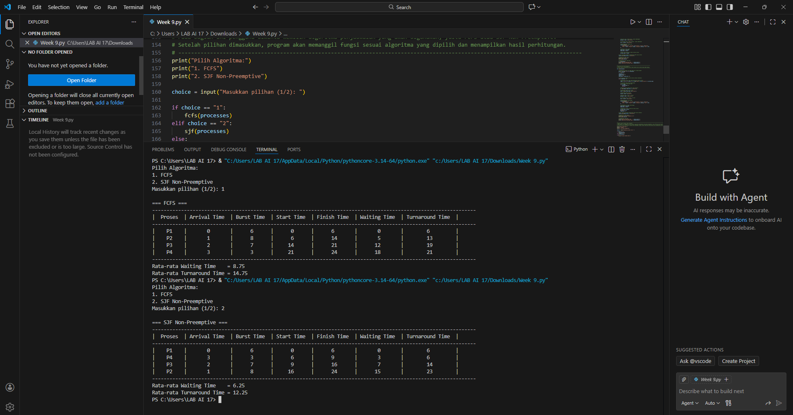
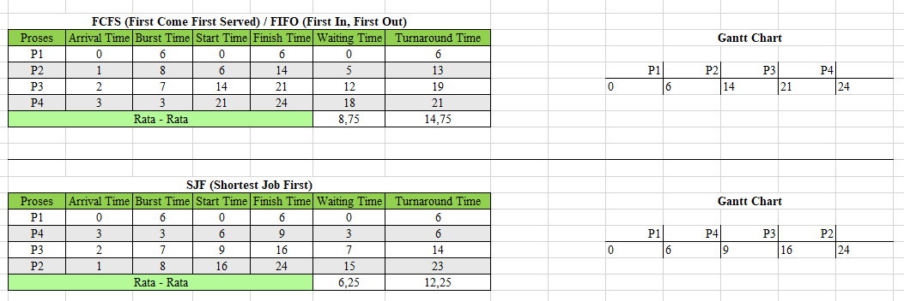

# Laporan Praktikum Minggu 9
Topik: Simulasi Algoritma Penjadwalan CPU

---

## Identitas
- **Nama**  : Nanang Apriyanto  
- **NIM**   : 250202957 
- **Kelas** : 1IKRA

---

## Tujuan
Tujuan praktikum minggu ini:  
> 1. Mahasiswa mampu membuat program simulasi algoritma penjadwalan FCFS dan SJF.
> 2. Mahasiswa mampu menjalankan program dengan dataset uji yang diberikan atau dibuat sendiri.
> 3. Mahasiswa mampu menyajikan output simulasi dalam bentuk tabel atau grafik.
> 4. Mahasiswa mampu menjelaskan hasil simulasi secara tertulis.
> 5. Mahasiswa mampu mengunggah kode dan laporan ke Git repository dengan rapi dan tepat waktu.

---

## Dasar Teori
Penjadwalan CPU adalah mekanisme dalam sistem operasi yang berfungsi mengatur urutan eksekusi proses oleh prosesor. Karena CPU merupakan sumber daya terbatas sementara jumlah proses yang harus dilayani cukup banyak, sistem operasi perlu menentukan proses mana yang dijalankan terlebih dahulu agar pemanfaatan CPU menjadi optimal.

Algoritma penjadwalan CPU merupakan aturan yang digunakan untuk memilih proses yang akan dieksekusi dari kumpulan proses yang berada dalam keadaan siap (ready queue). Beberapa algoritma penjadwalan yang umum digunakan antara lain First Come First Served (FCFS) dan Shortest Job First (SJF). Setiap algoritma memiliki cara kerja yang berbeda dalam menentukan urutan eksekusi proses.

Simulasi algoritma penjadwalan CPU adalah metode untuk memodelkan cara kerja algoritma penjadwalan dalam lingkungan yang terkontrol. Simulasi digunakan untuk meniru proses kedatangan dan eksekusi tanpa harus menerapkannya langsung pada sistem operasi nyata. Dengan simulasi, perilaku algoritma dapat dipelajari secara lebih jelas dan terstruktur.

Dalam simulasi penjadwalan CPU, setiap proses direpresentasikan oleh beberapa parameter, seperti arrival time dan burst time. Parameter ini digunakan sebagai dasar dalam menentukan urutan eksekusi proses serta menghitung nilai kinerja sistem, seperti waiting time dan turnaround time. Parameter-parameter tersebut menjadi bagian penting dalam analisis algoritma penjadwalan.

Penggunaan simulasi dalam penjadwalan CPU didasarkan pada kebutuhan untuk memahami karakteristik dan kinerja algoritma secara teoritis. Melalui simulasi, perbandingan antar algoritma penjadwalan dapat dilakukan secara objektif berdasarkan data yang sama, sehingga membantu dalam mempelajari konsep dasar sistem operasi.

---

## Langkah Praktikum
1. Langkah-langkah yang dilakukan.  

1.) **Menyiapkan Dataset**

   Buat dataset proses minimal berisi:

   | Proses | Arrival Time | Burst Time |
   |:--:|:--:|:--:|
   | P1 | 0 | 6 |
   | P2 | 1 | 8 |
   | P3 | 2 | 7 |
   | P4 | 3 | 3 |

2.) **Implementasi Algoritma**

   Program harus:
   - Menghitung *waiting time* dan *turnaround time*.  
   - Mendukung minimal **1 algoritma (FCFS atau SJF non-preemptive)**.  
   - Menampilkan hasil dalam tabel.

   (**Keterangan:** Di Minggu ini saya menggunakan bahasa pemrograman **python** di **Visual Studio Code** untuk mengimplementasikan Algoritma.)

3.) **Eksekusi & Validasi**

   - Menjalankan program menggunakan dataset uji.  
   - Pastikan hasil sesuai dengan perhitungan manual minggu sebelumnya.  
   - Menyimpan hasil eksekusi (screenshot).

4.) **Analisis**

   - Jelaskan alur program.  
   - Bandingkan hasil simulasi dengan perhitungan manual.  
   - Jelaskan kelebihan dan keterbatasan simulasi.


2. Perintah yang dijalankan.  
```bash
processes = [
    {"name": "P1", "arrival": 0, "burst": 6},
    {"name": "P2", "arrival": 1, "burst": 8},
    {"name": "P3", "arrival": 2, "burst": 7},
    {"name": "P4", "arrival": 3, "burst": 3},
]

def print_table(results):
    line = "-" * 112
    print(line)
    print(f"| {'Proses':^8} | {'Arrival Time':^13} | {'Burst Time':^11} | {'Start Time':^11} | {'Finish Time':^12} | {'Waiting Time':^13} | {'Turnaround Time':^16} |")
    print(line)
    for r in results:
        print(f"| {r['name']:^8} | {r['arrival']:^13} | {r['burst']:^11} | {r['start']:^11} | {r['finish']:^12} | {r['waiting']:^13} | {r['turn']:^16} |")
    print(line)

def fcfs(processes):
    procs = sorted(processes, key=lambda x: x["arrival"])
    current_time = 0
    results = []
    total_wait = total_turn = 0

    for p in procs:
        start = max(current_time, p["arrival"])
        finish = start + p["burst"]
        waiting = start - p["arrival"]
        turn = finish - p["arrival"]

        results.append({
            "name": p["name"],
            "arrival": p["arrival"],
            "burst": p["burst"],
            "start": start,
            "finish": finish,
            "waiting": waiting,
            "turn": turn
        })

        total_wait += waiting
        total_turn += turn
        current_time = finish

    results.sort(key=lambda x: x["start"])

    print("\n=== FCFS ===")
    print_table(results)

    n = len(results)
    print(f"Rata-rata Waiting Time    = {total_wait / n}")
    print(f"Rata-rata Turnaround Time = {total_turn / n}")

def sjf(processes):
    procs = [p.copy() for p in processes]
    n = len(procs)
    completed = 0
    current_time = 0
    results = []
    total_wait = total_turn = 0

    while completed < n:
        ready = [p for p in procs if not p.get("done") and p["arrival"] <= current_time]

        if not ready:
            current_time += 1
            continue

        p = min(ready, key=lambda x: x["burst"])
        start = max(current_time, p["arrival"])
        finish = start + p["burst"]
        waiting = start - p["arrival"]
        turn = finish - p["arrival"]

        results.append({
            "name": p["name"],
            "arrival": p["arrival"],
            "burst": p["burst"],
            "start": start,
            "finish": finish,
            "waiting": waiting,
            "turn": turn
        })

        total_wait += waiting
        total_turn += turn
        current_time = finish
        p["done"] = True
        completed += 1

    results.sort(key=lambda x: x["start"])

    print("\n=== SJF Non-Preemptive ===")
    print_table(results)

    print(f"Rata-rata Waiting Time    = {total_wait / n}")
    print(f"Rata-rata Turnaround Time = {total_turn / n}")

print("Pilih Algoritma:")
print("1. FCFS")
print("2. SJF Non-Preemptive")

choice = input("Masukkan pilihan (1/2): ")

if choice == "1":
    fcfs(processes)
elif choice == "2":
    sjf(processes)
else:
    print("Pilihan tidak valid.")

```
3. File dan kode yang dibuat.  

laporan.md, Hasil_Simulasi_Program.png, Hasil_Simulasi_Manual.png, dataset.csv, Week 9.py

4. Commit message yang digunakan. --> **Minggu 9 - Simulasi Scheduling CPU**

--- 

## Kode / Perintah

```bash
# ------------------------------------------------------------------------------------------------------------------------------------------------------
# CPU Scheduling: FCFS & SJF Non-Preemptive
# Program ini digunakan untuk menghitung Waiting Time dan Turnaround Time berdasarkan dua algoritma penjadwalan CPU, yaitu FCFS dan SJF Non-Preemptive.
# ------------------------------------------------------------------------------------------------------------------------------------------------------

# Dataset proses yang digunakan dalam simulasi
processes = [
    {"name": "P1", "arrival": 0, "burst": 6},
    {"name": "P2", "arrival": 1, "burst": 8},
    {"name": "P3", "arrival": 2, "burst": 7},
    {"name": "P4", "arrival": 3, "burst": 3},
]


# ------------------------------------------------------------
# Fungsi untuk menampilkan hasil perhitungan dalam bentuk tabel
# ------------------------------------------------------------
def print_table(results):
    line = "-" * 112
    print(line)
    print(f"| {'Proses':^8} | {'Arrival Time':^13} | {'Burst Time':^11} | {'Start Time':^11} | {'Finish Time':^12} | {'Waiting Time':^13} | {'Turnaround Time':^16} |")
    print(line)
    for r in results:
        print(f"| {r['name']:^8} | {r['arrival']:^13} | {r['burst']:^11} | {r['start']:^11} | {r['finish']:^12} | {r['waiting']:^13} | {r['turn']:^16} |")
    print(line)


# ------------------------------------------------------------
# Algoritma FCFS (First Come First Served)
# Proses dieksekusi berdasarkan urutan kedatangan
# ------------------------------------------------------------
def fcfs(processes):

    # Proses diurutkan berdasarkan arrival time
    procs = sorted(processes, key=lambda x: x["arrival"])

    current_time = 0
    results = []
    total_wait = total_turn = 0

    # Perhitungan dilakukan untuk setiap proses
    for p in procs:

        # Proses mulai dieksekusi ketika CPU sudah idle
        start = max(current_time, p["arrival"])

        # Waktu selesai adalah waktu mulai + burst time
        finish = start + p["burst"]

        # Waiting time = waktu mulai - waktu kedatangan
        waiting = start - p["arrival"]

        # Turnaround time = waktu selesai - waktu kedatangan
        turn = finish - p["arrival"]

        # Menyimpan hasil dalam list
        results.append({
            "name": p["name"], "arrival": p["arrival"], "burst": p["burst"],
            "start": start, "finish": finish, "waiting": waiting, "turn": turn
        })

        # Akumulasi total waktu
        total_wait += waiting
        total_turn += turn

        # Waktu CPU berpindah ke waktu selesai proses
        current_time = finish

    # Hasil diurutkan kembali berdasarkan waktu mulai proses
    results.sort(key=lambda x: x["start"])

    # Menampilkan tabel hasil
    print("\n=== FCFS ===")
    print_table(results)

    # Menghitung nilai rata-rata
    n = len(results)
    print(f"Rata-rata Waiting Time    = {total_wait/n}")
    print(f"Rata-rata Turnaround Time = {total_turn/n}")


# ------------------------------------------------------------------------------
# Algoritma SJF Non-Preemptive
# Proses dipilih berdasarkan burst time terkecil dari proses yang sudah datang.
# ------------------------------------------------------------------------------
def sjf(processes):

    # Menggunakan salinan list agar data asli tidak berubah
    procs = [p.copy() for p in processes]
    n = len(procs)

    completed = 0
    current_time = 0
    results = []
    total_wait = total_turn = 0

    # Loop berjalan hingga seluruh proses selesai dieksekusi
    while completed < n:

        # Menentukan proses yang sudah datang dan belum selesai
        ready = [p for p in procs if not p.get("done") and p["arrival"] <= current_time]

        # Jika belum ada proses yang datang,
        # maka waktu sistem akan maju
        if not ready:
            current_time += 1
            continue

        # Memilih proses dengan burst time terkecil
        p = min(ready, key=lambda x: x["burst"])

        # Menentukan waktu mulai proses
        start = max(current_time, p["arrival"])

        # Menentukan waktu selesai
        finish = start + p["burst"]

        # Waiting time = start - arrival
        waiting = start - p["arrival"]

        # Turnaround time = finish - arrival
        turn = finish - p["arrival"]

        # Menyimpan hasil perhitungan
        results.append({
            "name": p["name"], "arrival": p["arrival"], "burst": p["burst"],
            "start": start, "finish": finish, "waiting": waiting, "turn": turn
        })

        # Menambahkan ke total perhitungan
        total_wait += waiting
        total_turn += turn

        # Memperbarui waktu sistem dan status proses
        current_time = finish
        p["done"] = True
        completed += 1

    # Hasil akhir diurutkan berdasarkan waktu mulai eksekusi
    results.sort(key=lambda x: x["start"])

    # Menampilkan tabel hasil
    print("\n=== SJF Non-Preemptive ===")
    print_table(results)

    # Menampilkan rata-rata
    print(f"Rata-rata Waiting Time    = {total_wait/n}")
    print(f"Rata-rata Turnaround Time = {total_turn/n}")


# -------------------------------------------------------------------------------------------------------------------------------
# Bagian Utama Program (Main Program)
# Pada bagian ini pengguna diminta memilih algoritma penjadwalan yang akan digunakan, yaitu FCFS atau SJF Non-Preemptive.
# Setelah pilihan dimasukkan, program akan memanggil fungsi sesuai algoritma yang dipilih dan menampilkan hasil perhitungan. 
# -------------------------------------------------------------------------------------------------------------------------------
print("Pilih Algoritma:")
print("1. FCFS")
print("2. SJF Non-Preemptive")

choice = input("Masukkan pilihan (1/2): ")

if choice == "1":
    fcfs(processes)
elif choice == "2":
    sjf(processes)
else:
    print("Pilihan tidak valid.")

```

---

## Hasil Eksekusi
Screenshot hasil percobaan atau diagram:



**Eksekusi & Validasi**

-> Menjalankan program menggunakan dataset uji. ✓

-> Pastikan hasil sesuai dengan perhitungan manual minggu sebelumnya.  ✓

-> Menyimpan hasil eksekusi (screenshot). ✓

---

## Analisis
 - **Penjelasan alur program.**  

1. Program mempersiapkan data proses

   * Setiap proses memiliki atribut: nama proses, arrival time, dan burst time.

2. Program menampilkan menu pilihan algoritma penjadwalan CPU

   * Pengguna dapat memilih algoritma FCFS atau SJF Non-Preemptive.

3. Pengguna memasukkan pilihan algoritma

   * Input dibaca oleh program.
   * Jika pilihan valid, program melanjutkan ke tahap perhitungan.
   * Jika pilihan tidak valid, program menampilkan pesan kesalahan.

4. Program menjalankan algoritma yang dipilih

   * Jika FCFS dipilih:

     1. Proses diurutkan berdasarkan arrival time.
     2. Program menentukan start time tiap proses.
     3. Program menghitung finish time, waiting time, dan turnaround time.
   * Jika SJF Non-Preemptive dipilih:

     1. Program memilih proses yang sudah datang dan memiliki burst time terkecil.
     2. Program menentukan start time proses tersebut.
     3. Program menghitung finish time, waiting time, dan turnaround time.

5. Program menyimpan hasil perhitungan dalam tabel

   * Tabel memuat kolom:
     Proses, Arrival Time, Burst Time, Start Time, Finish Time, Waiting Time, Turnaround Time.

6. Program menghitung nilai rata-rata

   * Rata-rata waiting time
   * Rata-rata turnaround time

7. Program menampilkan tabel hasil dan nilai rata-rata ke layar.
8. Program selesai dijalankan.

 - **Perbandingan hasil simulasi dengan perhitungan manual.**  
 1. FCFS (First Come First Served)
    
   | Proses | Arrival Time | Burst Time | Start Time | Finish Time | Waiting Time | Turnaround Time |
   |:---:|:--:|:--:|:--:|:--:|:--:|:--:|
   | P1 | 0 | 6 | 0 | 6 | 0 | 6 |
   | P2 | 1 | 8 | 6 | 14 | 5 | 13 |
   | P3 | 2 | 7 | 14 | 21 | 12 | 19 |
   | P4 | 3 | 3 | 21 | 24 | 18 | 21 |
   |**Rata - rata** |  | | | | 8,75|14,75 |

   - Gantt Chart sederhana:  
     ```
     | P1 | P2 | P3 | P4 |
     0    6    14   21   24
     ```

2. SJF non-preemptive
   
   | Proses | Arrival Time | Burst Time | Start Time | Finish Time | Waiting Time | Turnaround Time |
   |:---:|:--:|:--:|:--:|:--:|:--:|:--:|
   | P1 | 0 | 6 | 0 | 6 | 0 | 6 |
   | P4 | 3 | 3 | 6 | 9 | 3 | 6 |
   | P3 | 2 | 7 | 9 | 16 | 7 | 14 |
   | P2 | 1 | 8 | 16 | 24 | 15 | 23 |
   |**Rata - rata** |  | | | | 6,25|12,25 |

   - Gantt Chart sederhana:  
     ```
     | P1 | P4 | P3 | P2 |
     0    6    9   16   24
     ```

4. Perbandingan :
   
| Algoritma | WT Manual | WT Simulasi | Sama/Tidak Sama | TAT Manual | TAT Simulasi | Sama/Tidak Sama |
| --------- | --------: | ----------: | :---: | ---------: | -----------: | :---: |
| FCFS      |      8,75 |        8,75 |   Sama(✓)   |      14,75 |        14,75 |   Sama(✓)   |
| SJF non-preemptive      |      6,25 |        6,25 |   Sama(✓)   |      12,25 |        12,25 |   Sama(✓)   |

Berdasarkan hasil pengujian, nilai Start Time, Finish Time, Waiting Time, dan Turnaround Time yang dihasilkan oleh program Python untuk algoritma FCFS dan SJF Non-Preemptive sepenuhnya sama dengan hasil perhitungan manual.

Begitu juga nilai rata-rata Waiting Time dan rata-rata Turnaround Time yang diperoleh dari simulasi menunjukkan hasil yang sama dengan perhitungan manual

 - **Penjelasan kelebihan dan keterbatasan simulasi.**

 -> Kelebihan Simulasi

Melalui simulasi yang dilakukan menggunakan program Python, terdapat beberapa kelebihan yang dapat diperoleh. Pertama, simulasi ini sangat membantu dalam memeriksa kembali hasil perhitungan manual. Program menghitung waiting time dan turnaround time secara otomatis sehingga dapat meminimalkan terjadinya kesalahan hitung. Kedua, simulasi juga mempermudah pemahaman terhadap alur kerja algoritma penjadwalan CPU, karena urutan eksekusi proses serta start time dan finish time dapat terlihat jelas dalam bentuk tabel.

Selain itu, simulasi ini dinilai lebih efisien apabila jumlah proses yang dihitung semakin banyak. Perhitungan yang mungkin memakan waktu jika dilakukan secara manual dapat diselesaikan dengan cepat oleh program. Hasil yang diperoleh juga bersifat konsisten karena program selalu menggunakan logika yang sama. Di samping itu, simulasi ini masih dapat dikembangkan lebih lanjut, misalnya dengan menambahkan algoritma penjadwalan lain sesuai kebutuhan.

-> Keterbatasan Simulasi

Meskipun memberikan banyak manfaat, simulasi ini tetap memiliki beberapa keterbatasan. Hasil simulasi sangat bergantung pada kebenaran logika program. Apabila terdapat kesalahan pada penulisan kode, maka seluruh hasil perhitungan juga akan ikut salah. Selain itu, simulasi ini masih bersifat sederhana dan belum sepenuhnya menggambarkan kondisi sistem operasi yang sesungguhnya, misalnya belum mempertimbangkan context switching, interrupt, maupun aktivitas I/O.

Kemudian, program yang digunakan hanya mensimulasikan algoritma FCFS dan SJF Non-Preemptive, sehingga belum mencakup algoritma penjadwalan lainnya. Simulasi ini juga masih berfokus pada satu prosesor, sehingga belum merepresentasikan lingkungan multiprosesor. Hasil simulasi sangat bergantung pada dataset yang digunakan, sehingga interpretasi tetap perlu dilakukan secara hati-hati.

---

## Kesimpulan
Berdasarkan hasil simulasi yang telah dilakukan, baik dengan algoritma FCFS maupun SJF Non-Preemptive, diperoleh nilai waiting time dan turnaround time yang sama dengan hasil perhitungan manual. Hal ini menunjukkan bahwa program Python yang dibuat sudah berjalan sesuai dengan konsep teori penjadwalan CPU.

Dari hasil pengujian, algoritma SJF Non-Preemptive memberikan rata-rata waiting time dan turnaround time yang lebih rendah dibandingkan FCFS pada dataset yang digunakan. Dengan demikian, dapat disimpulkan bahwa SJF lebih efisien ketika menangani proses dengan burst time yang berbeda-beda.

Selain itu, penggunaan simulasi berbasis program komputer sangat membantu dalam mempercepat proses perhitungan, terutama jika jumlah proses cukup banyak. Namun, hasil simulasi tetap perlu dibandingkan dengan perhitungan manual agar dapat dipastikan bahwa logika algoritma yang digunakan sudah benar dan sesuai dengan teori.

---

## Quiz
1. Mengapa simulasi diperlukan untuk menguji algoritma scheduling?

**Jawaban:**

Simulasi diperlukan karena algoritma scheduling tidak selalu bekerja dalam kondisi yang sederhana. Terdapat banyak faktor yang memengaruhi jalannya penjadwalan, seperti waktu kedatangan proses, lama eksekusi proses, serta urutan eksekusi proses di CPU. Melalui simulasi, pengguna dapat melihat bagaimana suatu algoritma scheduling bekerja dalam berbagai kondisi tanpa harus diterapkan langsung pada sistem operasi yang sebenarnya.

Selain itu, pengujian langsung pada sistem nyata memiliki risiko seperti penurunan kinerja sistem atau ketidakstabilan. Dengan simulasi, pengujian dapat dilakukan secara aman dan terkontrol. Simulasi juga memudahkan pengguna dalam membandingkan performa beberapa algoritma scheduling menggunakan dataset yang sama, sehingga kita dapat menilai algoritma mana yang lebih efisien berdasarkan parameter seperti waiting time dan turnaround time.

2. Apa perbedaan hasil simulasi dengan perhitungan manual jika dataset besar?
**Jawaban:**

Hasil simulasi jika dataset besar biasanya lebih rapi dan konsisten. Nilai waiting time dan turnaround time yang dihasilkan cenderung tepat karena semua proses dihitung otomatis oleh program dengan aturan algoritma yang sama. Karena tidak melibatkan perhitungan manual, hasil simulasi jarang meleset dan lebih bisa diandalkan meskipun jumlah datanya banyak.

Sebaliknya, ketika dataset besar dihitung secara manual, hasilnya sering kali kurang konsisten. Banyaknya proses membuat perhitungan jadi panjang dan mudah terjadi kesalahan kecil, seperti salah urutan proses atau salah menjumlah waktu. Kesalahan kecil ini bisa berdampak pada hasil akhir, sehingga nilai waiting time dan turnaround time yang diperoleh bisa berbeda dari hasil yang seharusnya.

3. Algoritma mana yang lebih mudah diimplementasikan? Jelaskan. 
**Jawaban:**

Algoritma yang lebih mudah diimplementasikan adalah First Come First Served (FCFS).

Karena FCFS bekerja dengan konsep paling sederhana, yaitu proses dijalankan sesuai urutan kedatangannya. Jadi selama kita tahu arrival time, kita tinggal memasukkan proses ke antrian dan mengeksekusinya satu per satu.

Berbeda dengan algoritma lain seperti SJF yang perlu membandingkan burst time antar proses, FCFS tidak memerlukan logika tambahan seperti pengurutan atau pemilihan proses tertentu. Karena itu, dari sisi implementasi program, FCFS lebih mudah dibuat, lebih minim kesalahan, dan cocok digunakan sebagai algoritma awal dalam simulasi penjadwalan CPU.

---

## Refleksi Diri
Tuliskan secara singkat:
- Apa bagian yang paling menantang minggu ini? Ketika membuat program simulasi penjadwalan CPU pada saat menerapkannya dalam bentuk kode program.
- Bagaimana cara Anda mengatasinya?  Mencari serta mempelajari materi yang ingin di pelajari di google dan youtube serta sumber/referensi yang terkait agar memperoleh pemahaman yang lebih jelas mengenai konsep algoritma penjadwalan dan cara menerapkannya dalam bentuk kode program.

---

## Referensi
1. Silberschatz, A., Galvin, P., Gagne, G. *Operating System Concepts*, 10th Ed.  
2. Tanenbaum, A. *Modern Operating Systems*, 4th Ed.  
3. OSTEP – Scheduling.

---
**Credit:**  
_Template laporan praktikum Sistem Operasi (SO-202501) – Universitas Putra Bangsa_
